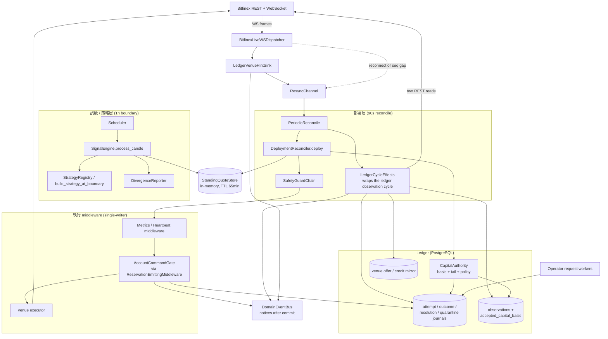
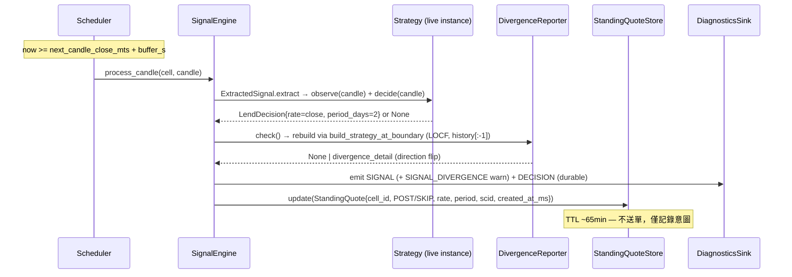
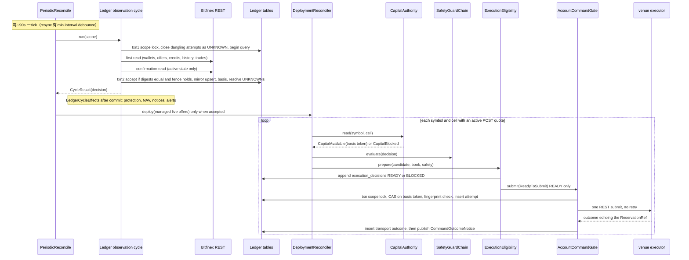
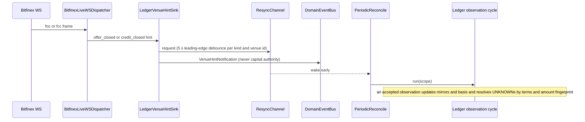

# bfx-funding-bot 後端架構（Python / backend）

> Bitfinex 自動放貸 bot 的現行後端（`backend/`，Python 3.13）。本文件描述一個**長駐 daemon**：資金紀錄是 PostgreSQL 裡的 **ledger**——bot 自己才知道的事實（attempt、transport outcome、resolution、quarantine）寫進 insert-once journal，venue 的事實（餘額、offer、credit）以**已接受的完整觀測**為準；透過 standing-quote 解耦「訊號決策」與「資金部署」，由 DeploymentReconciler 單一寫入者經 command gate 控制 venue 提交，並以週期性觀測對帳作為正確性骨幹。
>
> Go `backend/` 已封存，本文件完全不涵蓋。所有路徑相對於 `backend/src/bfx_funding_bot/`。

---

## 1. Overview

bfx-funding-bot 在 Bitfinex 的 funding（放貸）市場上自動掛單放貸閒置資金。系統不是「來一根 candle 就送一張單」的反應式 bot，而是把整條 pipeline 拆成兩個解耦的時間軸：

- **訊號層（signal layer）**：每小時 candle boundary 觸發一次，由策略產生「該不該放、用什麼 rate、放幾天」的 **意圖（StandingQuote）**，寫進 in-memory store，**不送單**。
- **部署層（deployment layer）**：每 ~90 秒一次，先跑 observation cycle（REST 讀 venue，被接受才繼續），再在 ledger 的 `spendable` 內、依各 cell 的 `max_new_offer` 決定新 offer 金額，套用 safety chain 後才送單。

核心架構原則：

1. **真相按事實擁有者切分**：bot 事實（送單前的 attempt、transport outcome、UNKNOWN 的 resolution、quarantine）寫進 DB trigger 強制 insert-once 的 journal 表；venue 事實（wallet、offer、credit）的權威是被接受的完整觀測，venue offer／credit 鏡像在接受的同一 transaction 直接 upsert。資金是 `f(最新 accepted basis, basis 之後的 attempts, 未解 uncertainty, applied policy)` 的純函式，沒有由 log 投影出來的授權狀態。
2. **訊號 / 部署解耦（standing quote）**：rate 決策在 1h 尺度上穩定，資金分配在 90s 尺度上靈敏；StandingQuote 以 ~65 分鐘 TTL 橋接兩者。
3. **單一寫入者曝險（single-writer exposure）**：`DeploymentReconciler` 是 venue 提交的唯一寫入者；訊號層不送單。
4. **Reconcile 即正確性骨幹（reconcile-as-correctness-backbone）**：venue（透過 REST）是曝險真相的權威來源；90s 週期的觀測 cycle 保證 ledger 收斂。WebSocket 只產生 venue hint（要求提早 reconcile），不寫任何資金狀態。

部署形態：單一長駐 daemon，以 `asyncio.TaskGroup` 並行跑多個 sub-task；全 stack 自托於單一 Oracle Cloud VM（下稱 `<vm-host>`；docker compose：`bfx-bot`/`bfx-webapi`/`bfx-postgres`(PG 18)/`bfx-redis`/`bfx-frontend`）。Koyeb/Neon/Upstash 為歷史平台（2026-05-31 Koyeb cutover、2026-06-23 Neon/Vercel 歸零）。

### Release 0 web API containment and Halt 1 identity

Release 0 沒有 self-service signup；所有 private `/api/v1` route 仍僅接受
`BFX_OPERATOR_USER_ID` 指定的 Better Auth user，且 JWT role 必須是 `admin`
（`BFX_OPERATOR_ROLE=admin`）。operator ID 缺失或空白、user ID 不符、或 role
不符時一律 fail closed；不得 fallback 到第一個 user、環境變數 realm 或 user
profile。

Halt 1 後，money-domain 的 aggregate root 是 immutable
`ExchangeAccount.id`（UUID），不是登入 user、credential row 或 process-global
realm。private account routes 必須使用
`/api/v1/exchange-accounts/{exchange_account_id}/...`，dependency 依序驗證
JWT operator、UUID path、membership/lifecycle，再進入 handler；不存在的帳號與
沒有 membership 的帳號都回 non-enumerating 404。daemon 只接受
`BFX_EXCHANGE_ACCOUNT_ID`，啟動時載入 active account、credential 與 config
draft；缺少、未知、retired 或 halted account 都 fail closed。

`account_id` text 欄位在 Halt 1 contract migration 後只保留為 immutable
legacy/audit provenance；新讀寫的 owner/filter 是 `exchange_account_id`。credentials
的 AEAD AAD 一律是 canonical UUID，絕不使用 user id 或舊 realm。

FastAPI 的 process liveness 與 database readiness 是兩個獨立契約：

- `GET /health`：process 仍能服務 request 時永遠回 `200 {"status":"ok"}`，不做 DB probe。因此 DB 初始化失敗後 lifespan 保留 app serving，liveness 仍可用。
- `GET /ready`：僅在 `app.state.session_factory` 存在、以獨立 read-only session 成功執行 `SELECT 1`，且 `alembic_version` 的 revision set 與 image 內 `alembic.ini` migration graph 的所有 head 完全相等時回 `200 {"status":"ready","checks":{"database":"ok"}}`。factory 缺失、migration table 缺失／空值／stale／多餘 head、SQLAlchemy/timeout/socket error 或 migration graph 無法讀取，均回 `503 {"status":"not_ready","checks":{"database":"failed"}}`，不洩漏 connection string。probe session 一律關閉、不 commit application data；timeout 由 `BFX_READINESS_TIMEOUT_SECONDS` 控制，預設 2.0 秒，最大固定為 10 秒（超過時 clamp）。

---

## 2. Layered Architecture



依賴方向重點：訊號層**只寫** StandingQuoteStore；部署層在每個被接受的觀測 cycle 之後**讀** quote 與 capital authority（最新 accepted basis＋其後的 attempts＋policy）才提交；送單唯一經 command gate，attempt 與 outcome 寫進 journal；venue 事實只由觀測 cycle 寫入。WS 與 venue hint 只要求提早 reconcile；bus 只在寫入 commit 之後發通知，永遠不是資金來源。

---

## 3. Data Flow

### 3a. 1h Boundary Path（訊號 → StandingQuote）



### 3b. 90s Deployment Path（observation cycle → accepted basis → capital read → safety → command gate）



### 3c. Venue hints 與 UNKNOWN 結案



WS 與 REST 都不再以 delta 改寫任何資金數字：fill、撤單、credit 結束都等下一個被接受的觀測寫進 mirror 與 basis。WS 只讓那個觀測提早發生；WS 完全靜默時，90s cycle 仍讓 ledger 收斂——這就是「reconcile 即正確性骨幹」的含義。

### 3d. Observation cycle 規則（`ledger/wiring.py::_LedgerObservationCycle`、`execution/periodic_reconcile.py`）

- **兩次觀測、fence 與接受**：cycle 先在 scope lock 下開一個 query（`ledger_observation_query`，記下 command clock 的 `start_revision`）；scope 內有無 outcome 的 attempt 時拒絕開始（`query_admission_refused`）。venue I/O 在 transaction 外：主觀測（wallets、offers、credits／loans、offer／credit history、funding trades）之後，再做一次時間上不重疊、只含 active state 的 confirmation（`execution/venue_observation.py`，兩者共用一個 request budget，保留 confirmation 的配額）。兩者 coverage 完整且 digest 相等才進入接受，否則 `incomplete_or_unequal`、不寫列；這是這個 scope 的最新 query 且 command clock 沒有前進才 `accepted`，否則存成未接受的 observation（`fenced`）。fill 落在 offers 與 credits 兩個 request 之間會把同一筆錢算兩次，兩次相同觀測排除這種假象。
- **接受時同一 transaction 寫入**：observation 與其子表、venue offer／credit mirror、`accepted_capital_basis`（含每 symbol 的 conservation verdict），以及自動 UNKNOWN 結案（`ledger/_internal/resolver.py`）。mirror 區分「本次未見」（`present_in_latest_accepted_snapshot=false`）與「確證終結」（history 有 terminal 列才寫 `terminal_evidence_id`）；已確證終結的 id 又出現在 active → quarantine。
- **Grace**：`ledger.BOOT_GRACE_MS`=0、`RUNTIME_GRACE_MS`=120 000。無 outcome 的 attempt 早於 grace 就以 `unknown`（reason `unresolved_at_boot`）結束（`journal.close_dangling`）；同一個 grace 也用在無 provenance 的 venue offer 告警。boot 時持有 writer lock、沒有 in-flight 的 submit，所以 grace 0。
- **Boot（`Daemon._run_boot_recovery`）**：`query_admission_refused` 擲 `BootInvariantError`（grace 0 下所有無 outcome 的 attempt 都已關閉，不應發生）；`fenced`／`incomplete_or_unequal` 記 WARNING、`periodic_reconcile.note_boot(decision)` 並繼續（沒有 accepted basis，交易由 `snapshot_query_pending`／`snapshot_unavailable` 擋下）；`accepted` 繼續。
- **Boot 等待不可達的依賴（`Daemon._boot_until_observed`、`marketfeed/boot_wait.py`）**：boot observation 因 venue 不可達而失敗（`is_transient_dependency_error`，兩步判斷：先沿整條例外鏈——`__cause__` 與 `__context__`，連 `from None` 隱藏的 context 也看——找明確的拒絕，任何一環是拒絕就不重試、拒絕開機：`FatalError`、`ssl.SSLCertVerificationError`、`PermissionError`、venue 的回答（`BitfinexAPIError` 帶 `["error", CODE, …]` body 且 CODE 不是 rate limit 11010／maintenance 20060——見 `external/bitfinex/errors.TRANSIENT_VENUE_ERROR_CODES`，Bitfinex 以 HTTP 500 回 `apikey: invalid`、`nonce: small`——或 429 以外的 4xx）。所以 TLS 憑證驗證失敗即使被包成 `httpx.ConnectError`、再包成 status 0 的 `BitfinexAPIError`，仍是拒絕。沒有任何拒絕時，`raise ... from` 鏈上有一環是連不上才算 transient：status 0（transport 錯誤或 deadline）、沒有上述 body 的 429／5xx、連線層 `OSError`（`ConnectionError`、`socket.gaierror`、`TimeoutError`、網路 errno 或無 errno 的 plain `OSError`）、`httpx.TransportError`、`TransientError`、asyncpg 的 `CannotConnectNowError`／`ConnectionDoesNotExistError`、`connection_invalidated` 的 `DBAPIError`；其他一律拒絕開機）時，在 process 內以 1、2、4… 秒、上限 60 秒的 backoff 重試，不退出（退出只會重啟進同一個 outage、crash-loop）；每次記 WARNING，每段等待只發一次 `boot_waiting` 告警。等待期間 TaskGroup 尚未啟動，沒有任何會送單的 task；SIGTERM 設 stop event 即結束等待、乾淨退出。每次重試前以 `WriterLockWatch.check()` 確認仍持有 writer lock（斷線則重取，被別人持有則 `WriterLockLostError` 退出），所以 observation 只以 single writer 身分執行。因此資料庫在 boot observation 時不可達，並不會在這裡等：第一次重試前的 check 重取不到鎖 → `WriterLockLostError`（`daemon_fatal` 與 `boot_refused` 告警）→ 退出一次、container 重啟 → 新的 process 在 `wait_for_database` 等資料庫；這是 single-writer fencing，刻意保留。在這一步於 process 內等待的只有 venue 不可達。其他失敗（拒絕、401／403、invariant）照舊拒絕開機。`build_daemon` 第一次碰資料庫前同樣以 `wait_for_database`（`SELECT 1`）等資料庫可連線；非 transient 錯誤（密碼、資料庫不存在）照舊走 `_refuse_live_boot`。
- **未接受與失敗**：只有 `accepted` 的 cycle 之後才 deploy。連續未接受 → `HealthTarget.RECONCILE=DEGRADED`，連續數達 `max_consecutive_failures=3` 時發 `reconcile_not_accepted` 告警；下一個 accepted 清除。cycle 擲例外連續 3 次 → `HealthTarget.EXECUTOR=DOWN`，由 `AuthHealthGuard` 擋新單；失敗計數與 DOWN 只在下一個 accepted cycle 清除（fenced／incomplete／refused 不清）。reconcile 迴圈絕不讓例外打掛 daemon。
- **Resync 觸發**：`ResyncChannel` 是唯一的提早 reconcile 入口。authenticated WS（`external/bitfinex/auth_ws.py`）在非首次連線（`reconnect`，含 venue 以 20051/20061 要求重連後的那次）與 SEQ_ALL 序號 gap（`seq_gap`）時要求；ledger hint sink 在 WS `foc`／`fcc` 時要求（每個 `(kind, venue id)` 5 秒 leading-edge 窗口）。多次請求合併成一次，並受 `BFX_RESYNC_MIN_INTERVAL_S`（預設 10 s）debounce。首次連線由 boot cycle 涵蓋。

### 3e. Bot 組裝（`apps/bot_ports.py`）

ledger 是唯一的 capital authority（S1-8）。`capital_authority_epoch` 仍記錄它：每個行程（兩個 venue 的 bot、web API、`scripts/amend_capital_policy.py`）以 `core.authority.require_ledger_authority(session)` 在開機時讀一次，最新 epoch 不是 `ledger`（從未切換或還原到切換前）就拒絕。沒有 legacy 歷史（`event_log` 為空）的資料庫在 migration `b1c2d3e4f5a6`（genesis）直接取得 `ledger` epoch；有歷史的只經 S1-7 switch。`build_capital_ports(...)` 組出 bot 行程每個 consumer 綁定的 ledger adapter（web API 對應 `apps/read_models.build_read_models()`）。

- **Epoch 開機規則（`apps/authority_support.require_ledger_epoch`）**：只讀最新 epoch，不讀 scope、seed observation 或凍結的 legacy 表。真實 venue 的 bot 除了要求 `ledger`，還要求它的寫入者是 S1-7 switch（actor `ledger_seed:<run>-a<n>`；seed 與 epoch 在同一 transaction 寫入，seed 列 append-only，所以 epoch 在就代表 seed 在）或 genesis migration（actor `migration b1c2d3e4f5a6 genesis`，只在 `event_log` 全空時寫，venue 上原有的 offer 對 ledger 是 foreign）；其他寫入者 → 拒絕（`ledger_epoch_writer_unknown`，fail closed）。不逐 scope 檢查 seed：seed 已不能再跑，逐 scope 的檢查只會擋下切換後才加入的帳戶。它是 bot 開機的第一組檢查之一（schema head、realm 之後，account bootstrap 之前），拒絕走 `_refuse_live_boot`。simulated venue 只要求 `ledger`、不看寫入者（2026-10-06 之前 bootstrap 的模擬資料庫，epoch 的 actor 是 `bootstrap_simulation_db`；該腳本現在不寫 epoch，模擬 venue 借出的也從不在 legacy authority 之下）；web API 只讀，只要求 `ledger`。restore drill 的 boot check 套用同一條 Bitfinex 規則（`boot_epoch_writer_unknown`）。
- **Legacy archive（S1-8 D4b，migration `c2d3e4f5a6b7`）**：切換前只有 legacy authority 寫的 12 張表（`event_log`、`event_prefix_hashes`、`projection_heads`、`position_state`、`venue_offer_state`、`venue_credit_state`、`reconcile_observation`、`offer_claims`、`submission_attempts`、`execution_uncertainties`、`capital_snapshot_queries`、`capital_snapshots`；與 `e8f9a0b1c2d3` 凍結的同一組，`tests/architecture/test_legacy_freeze_tables.py`）整張搬到 `legacy_archive` schema（列、索引、sequence 與表間 FK 跟著搬；`uncertainty_resolution_requests.resolved_event_seq` 指向 `event_log` 的 FK 先拆掉；這個欄位與 `reconcile_event_seq` 兩個切換前證據欄位分兩個 release 收掉：`e4f5a6b7c8d9` 撤銷寫入權、`observation_id` NOT NULL、ORM 不再對應；`f5a6b7c8d9e0` 刪除兩欄與提到它們的 CHECK 分支及 request guard 欄位清單），非 owner 的權限全部撤銷（`legacy_archive.manifest` 記列數、內容 SHA-256 與撤銷的權限，downgrade 依此授回）。runtime 只剩 web API 的 archived history 讀 `event_log` 的 8 個欄位（`bfx_webapi`，欄位授權）；bot 不讀也不寫。switch scaffolding 經 `bfx_cutover_reader` 的欄位讀取已由 `d3e4f5a6b7c8`（S1-8 PR-D）撤銷。`e8f9a0b1c2d3` 那個依 epoch、放過 owner 的 freeze 換成與 `release_archive` 相同的 `archive_frozen`：12 張表與 manifest 對任何 role（含 owner）的 INSERT／UPDATE／DELETE／TRUNCATE 一律拒絕，是 REVOKE 之外的第二層；要寫只能明確 DISABLE TRIGGER。終局：dump 到 offsite 後 DROP（trigger：Will 放棄切換前的 History）。
- **`GET /executions`**：`ReadModels.execution_history` 讀 ledger journal（attempt → `RESERVATION_INTENT`，outcome → `RESERVATION_CLAIMED`／`RESERVATION_FAILED`／`SUBMIT_OUTCOME_UNKNOWN`，resolution → `UNCERTAINTY_*`），只取切換 epoch 的 `set_at_ms` 之後的列（seed 複製的 attempt 帶 legacy 時間，不重複），之後接 `legacy_archive.event_log`（`execution.archived_execution_history.ArchivedExecutionHistory`，plan Q4；它自帶只含 8 個授權欄位的 table 宣告，不經 legacy ORM）。cursor 與 `eventKey` 都是不透明字串（ADR 2026-10-02 D4）。`cid` 只有 archive 的列才有值，journal 的列一律為 null。fill 與 credit 結束不是 journal 事實：watermark 之後取自 ledger observation 存下的 venue 終態歷史，沿用 archive 的事件名——`ledger_observation_offer_history` 的 `executed` 列為 `ORDER_FILL`（amount＝`amount_original`，FRR 的 rate 為 NULL；只限本 scope 的 transport outcome 或 resolution 提到的 offer，與 archive 只記自己 claim 的 offer 一致，手動／外部／auto-renew 不顯示），`ledger_observation_credit_history` 中 `source_kind='credit'` 的 `closed` 列為 `CREDIT_CLOSED`（loan 不顯示，archive 也只有 fcc credit），時間都是 venue 的 `mts_update`；observation 互相重疊且 fenced 的也有存，所以讀該 scope 全部 observation、每個 venue key（offer id；`source_kind`＋credit id）只出一次，取最早 observation 的值。watermark 之前的留給 archive。web API 讀 credit history 的欄位授權見 migration `f9a0b1c2d3e4`（不含 `raw`）。

- **`CapitalPorts`**（`build_capital_ports`，沒有 `live` 或 `authority` 參數，venue 由 `apps/venue.py` 另外決定，兩個 venue 共用同一組 ports）：`capital_authority`、`scope_lock`、`policy_store`、`command_boundary`（journal + effects）、`operator_resolution`、`deployment_input`、`observation`（取得 venue 連線後建出 boot 與 runtime 兩個 sink，時間常數為 `ledger.BOOT_GRACE_MS`=0 / `RUNTIME_GRACE_MS`=120 000，attempt 與 foreign-offer grace 共用）、`uncertainty_reader`、`managed_offers`、`venue_hint_sink`（一個實例；`build_capital_ports` 收到先建好的 `ResyncChannel`，`PeriodicReconcile`、auth WS 與 ledger hint sink 共用它）。auth WS 是否組裝由 venue wiring 的 `VenueCapabilities.auth_ws` 決定，沒有 env flag。
- **唯一紀錄是 ledger 的表**：bot 行程裡沒有別的資金狀態（`apps/bot_ports.py` 模組說明）；bus 只在寫入 transaction commit 之後承載通知（§5）。observation sink 是 `ledger.wiring` 的 cycle 外包 `LedgerCycleEffects`（保護、NAV、告警）。封存表沒有 ORM；存取由 DB 權限與 `archive_frozen` 把關（`test_legacy_archive_schema`）。
- **Policy store（`ledger.PolicyStore`）**：`build_policy_ports(scope)`（bot、`scripts/amend_capital_policy.py`、`scripts/bootstrap_simulation_db.py` 共用；腳本先讀 epoch）給出 store 與 scope lock。唯一寫入者 `ledger.policy_write.write_policy_revision`，呼叫端持有 scope lock，store 不代鎖；讀寫 `capital_policy_heads` / `capital_policy_revisions`。boot 的 policy 預檢與 `CapitalPolicyRequestWorker`（經 `accounts.capital_amendment`）都走它。

---

## 4. 放貸演算法（End-to-End Lending Algorithm）

**Capital-policy live authority（2026-09）**：live 使用已套用且 versioned 的
`CapitalPolicy`、完整且 fresh 的 canonical venue snapshot 與未反映 commitments；
`CapitalBudget`（`modules/trading`）共用 Decimal authority，planner、guard、command
boundary、status 不各自重算 cap。帳戶 spendable 扣除 reserve 與 commitments；
cell_limit 為 `max(0, total_capital - reserve) ×0.70`，cell_headroom 扣除該 cell 的歸屬曝險（offers、未反映 commitments 與歸屬該 cell 的 active credits）；無法歸屬的 credits 只計入 total_capital，不計入任何 cell，單筆上限取
spendable/headroom 的最小值。只有一個 active cell 也不放寬為100%。USD 明確
disabled，但所有 USD wallet/offers/credits 仍納入 full-account reconciliation。
未知/過期 snapshot、pending query、缺少 policy 全部 block，無 env/YAML fallback。

**授權與稽核分離（2026-09-20）**：授權讀取（每筆決策、`capital_policy` guard，預算
`GUARD_EVAL_TIMEOUT_SECONDS=2.0s`）**結構上有界**（`ledger/_internal/capital_reader.py`）：scope 最新
query → 它的 observation → 它的 basis（不以時間挑 basis；最新 query 沒有 accepted basis 就是
`snapshot_query_pending`），command clock，該 symbol 的 basis 列與 cell 列，basis 之後開的 quarantine
（`opened_revision > accept_revision`），basis 的 `attempt_seq_high_water` 之後的 attempt（最多
`MAX_TAIL_ATTEMPTS`=256，多了 fail closed）及其 outcome／resolution，最後是該 symbol 的 policy head。
全部在一個 REPEATABLE READ READ ONLY transaction 內讀。

讀取能只看尾端，是因為歷史判斷在 **acceptance** 就做完並存在 basis：每筆被考慮的 attempt 的分類
（`reflected`／`settled`／`quarantined`／`unresolved`，`accepted_capital_basis_attempt`）、credit 的 cell 歸屬、
每 symbol 的 conservation verdict，以及無法歸屬的事實（每 symbol 的 `block`，綁不到 symbol 的進
`scope_block`）。acceptance 遇到這類事實時**記錄 block 而非拒絕觀測**，讀取以同一個原因 fail closed；
拒絕記錄觀測會連帶擋掉「解開該狀態所需的觀測」，會死鎖自己的復原。

**通則**：任何需要走訪歷史的判斷都在 acceptance 做完並存下結論，授權路徑只讀結論。
把這類判斷留在授權路徑上，等於讓工作量隨歷史成長，而 fail-closed timeout 會把它
**無聲地**變成「全部擋掉」——2026-09-20 即如此（`capital_policy` 2.31s vs 2.0s 預算，
每張單被擋，第一個訊號就是全面阻斷）。因此 guard 用掉 `GUARD_EVAL_WARN_FRACTION`
預算即記錄 `guard_slow` 並**仍放行**；timeout 是病態偵測，不是正確性邊界。

逐步流程（一個完整 decision-to-redeploy 週期）：

**訊號（每 1h candle boundary，每 cell 各一）**

1. Scheduler 在 `next_candle_close_mts + buffer_s` 觸發 `SignalEngine.process_candle`。buffer 是為了吸收 Bitfinex candle 落 DB 的延遲（否則讀到 0 列誤判 health degraded）。**buffer 不負責保證 candle 已定稿**——定稿由 `is_final` 認定（`CandleWriter` 見到更晚的 mts 才封存前一根），策略讀取路徑一律 final-only。2026-07-27 前靠 buffer 猜定稿時間（5s→30s），導致策略吃進成形中的值、live EMA 對 replay 漂移 4.1e-2（見 I-CI）。
2. `ExtractedSignal.extract` 呼叫 `strategy.observe(candle)` 更新狀態，再 `strategy.decide(candle)`：
   - **MeanReversionStrategy**：增量更新 EMA（`alpha = 2/(ema_span+1)`），`decide` 在 `close >= EMA - threshold_sigma * ratio_sigma` 時回 `LendDecision(rate=close, period_days=2)`，否則在下跌段暫停放貸。
   - **RatePercentileStrategy**：`observe` 把 `close` 推進 `deque(maxlen=lookback_hours)`，`decide` 在 window 填滿且 `close >= percentile(window, P)` 時放貸。
3. `DivergenceReporter.check()` 用 `build_strategy_at_boundary`（LOCF 重建，觀察 `history[:-1]`）重算 reference signal，與 live 比對 `signal_score` / `signal_direction` / `strategy_attributes`（含 EMA 等累加器內部 state，累加器欄位走 `_REL_TOL=1e-4` 相對容忍，其餘精確比對）。有差則 emit `SIGNAL_DIVERGENCE` warn。I-CI 之後 live 與 replay 應 byte-match，**觸發率脫離 100% 是這條修復的驗收指標**。
4. 結果寫成 `StandingQuote{cell_id, outcome=POST/SKIP, rate, period_days, signal_correlation_id, created_at_ms}` 進 `StandingQuoteStore`。**訊號層到此為止，零提交。**

**部署（每 ~90s，由 PeriodicReconcile 在 observation cycle 被接受後呼叫；cycle 失敗或未被接受則該 tick 不部署）**

`DeploymentReconciler.deploy`（`deployment/reconciler.py`）對每個設定的 symbol 依序：

5. **停止與不確定**：account HALTED 或該幣別 applied policy `enabled=false` → 撤掉本 bot 在該 symbol 的受管 offer，不送單（`_pull_if_stopped`）。有 open UNKNOWN（`SafetyGuardChain.evaluate_before_sizing`，或沒有該 hook 時讀 uncertainty reader）→ 不送單。
6. **定量**：active cell ＝ 該 symbol 中 `get_active(cell_id)` 有 quote 的 cell（須 POST 且未過 TTL）。讀 funding rule；在同一個 session 為每個 active cell 讀 `CapitalAvailable`（任一 `CapitalBlocked` → 該 symbol 不送單，可對應的 reason 會 trip protection）與使用中的金額 fingerprint；`min_fill = submit_amount(...)`；`allocate_capital(views=..., min_fill=...)`（`deployment/sizing.py`）：
   - 各 view 的 applied policy、basis token 與 `spendable` 必須一致，否則該 symbol 不分配；
   - **emptiest-first**：依各 cell 的 `cell_exposure` 由小到大，先填最空的；
   - 每筆上限是 `budget.max_new_offer`（policy 設了 `max_offer_amount` 時再取較小者），金額向下量化成 venue 金額；總分配 ≤ `spendable`；低於 `min_fill` 的丟棄。
7. 定量後、送單前跑 reprice sweep（見 7b）；沒有 fill 則換下一個 symbol。
7a. 逐 fill：（無 pre-sizing hook 時）重查 uncertainty，有 open UNKNOWN（或讀不到）即 `break`，該 symbol 剩下的 fill 都不送 → 重讀 `get_active(cell_id)`（過期則跳過）→ `choose_fingerprinted_amount` 選出不與使用中 fingerprint 衝突的金額（選不到則跳過）→ `SafetyGuardChain.evaluate` → 讀取該 symbol 的 book snapshot，以 `PeriodPricer` 對 **exact `period_days`** 定價（optimizer policy 另算候選，見 7c-ii）→ `ExecutionGate.prepare`（見 7c）→ `executor.submit`。只有 `acknowledged` 結果記為 submitted（`deployment_submitted`）；本 tick 得到 `unknown` 時記錄、emit 後 `continue`，之後的 fill 由 uncertainty guard 擋下（有 hook 時是 `SafetyGuardChain.evaluate` 內的 `uncertainty` guard，否則是上述重查）。scalar ticker 僅可作 telemetry，不能為 period-correct pricing 提供證據。

7b. **Reprice sweep（E1）**：只在設定了 reprice policy 且本 tick 帶有 venue offers 時執行；只有通過第 5 步與第 6 步讀取（funding rule、capital read）的 symbol 會跑到，被停止、有 UNKNOWN 或讀取失敗的 symbol 在此之前已 `continue`。在定量後、送單前（即使沒有 fill 也會跑），比對 venue snapshot 的 resting offers 與現行 active quote：offer rate 高於最高 active quote rate ×(1+`BFX_REPRICE_TOLERANCE_PCT`) 且齡 ≥ `BFX_REPRICE_MIN_AGE_S` → `executor.cancel`（每 tick ≤ `BFX_REPRICE_MAX_CANCELS_PER_TICK` 筆；`BFX_REPRICE_ENABLED=false` 時僅 log `reprice_would_cancel`）。release 由 WS foc / 下次 reconcile 收斂，釋放資金下一 tick 以新 quote 重掛。無 active quote 的 symbol 不砍（resting 高價單留作 spike option）。**參考價**由 `BFX_REPRICE_REFERENCE` 決定：`quote`（預設）＝該 symbol active quote 最高 rate；`book`＝以 `PeriodPricer` 對當下 exact-period book、同期限、該 offer 剩餘金額重定價，多個 quote 取最高，book 或對應期限 quote 不可用時不砍——送單價本來就由 book 定，參考價用 signal quote 會在市場沒動時把合法價位砍掉（live 自 2026-09-27 起用 `book`，見 `deploy/vm/live.env`）。

7c. **Execution eligibility（fail-closed）**：snapshot 必須具備交易所交付的**完整 book baseline**（WS subscribe 時的 snapshot，或一次成功的 REST reconcile——兩者都是同一個交易所的整本 book，地位相同）、自該 baseline 以來**未偵測到 sequence gap 或 checksum mismatch**、交易所最後一次確認（update／`cs`／heartbeat）在 `BFX_BOOK_MAX_AGE_SECONDS` 內、symbol 相符、存在 exact period level，且該 side 的絕對 depth 足以覆蓋 amount。任一條件不足，或 model/safety/audit 不可用，皆產生 `BlockedExecution`／`NoRecommendation` 並不送單；book 不可用時 reason 必須指明是 `book_not_initialized`／`book_sequence_invalid`／`book_checksum_invalid`／`book_stale` 中的哪一種，不得塌縮成單一值（塌縮正是 checksum 缺陷被誤讀成過期的原因）。不得重用 signal quote、ticker 值或 linear estimate。`book_guarded` 以 exact-period book 價格送單；`optimizer_shadow` 只記錄候選與評分，仍送 book-guarded rate；`optimizer_live` 僅在 empirical evidence、fee 與其餘依賴全部有效時才可選擇 optimizer rate。

7c-i. **Public funding-book 協定事實**（皆經 live 量測確認，2026-09-21）：

- **checksum token 是 `RATE:AMOUNT`，不含 PERIOD**；數值採 JSON number 的最短往返表示（整數不帶 `.0`）。bids（amount<0）依 rate 降冪、asks（amount>0）依 rate 升冪，各取 25 筆後 bid/ask 交錯，CRC32 取號誌值。任一處偏離都讓每一筆 `cs` 永久不符，book 因此永不可用。
- **`cs` frame 由交易所自行排程**，間隔極不規律（fUST 實測 240 秒內 4 筆：128.9s／30.9s／5.1s）。因此 checksum 是**事後稽核**，不是送單前置條件；把它當前置條件會讓 book 絕大多數時間不可用。
- **SEQ_ALL 的序號屬於整條連線**，跨所有已訂閱 channel 單調遞增（實測 fUSD:snap=1、fUST:snap=2、fUSD:hb=3、fUST:hb=4）。連續性必須在連線層級檢查；若按 symbol 各自檢查 +1，多幣別訂閱會把每隔一筆都讀成 gap。gap 代表整條連線漏訊息，所有 symbol 的 book 同時失效。
- **WS snapshot 只在 subscribe 當下送一次**。失效後要重新取得完整 book，只能靠 REST reconcile 或重新訂閱；要求「再來一次 WS snapshot」等於要求一個交易所不會自己送出的東西。
- **heartbeat 是「內容未變」的明示確認**。安靜的 funding book 可以數分鐘沒有 level 變動；book 年齡因此以「交易所最後一次確認」計，不以「內容最後改變」計。

7c-ii. **Optimizer 評分（`execution/deployment/rate_optimizer.py`，純函式）**：候選為 `signal`（signal rate）與可選的 `maker`／`taker`。maker／taker 帶的 fill evidence 若與 signal evidence scope 不同 → `evidence_scope_mismatch`。合格條件：有 fill evidence、rate 有限且 >0、且 **rate ≥ signal rate**（optimizer 只會往上加價，不會低於訊號）。每個候選只用**以自己價格估出的** evidence 計分：`score = rate × fill_prob × (1 − fee_rate)`（`fee_rate ∈ [0,1]`）。取 score 最大者；平手依序比 `fill_prob` 較高、再比 **rate 較低**（保守）。無合格候選 → `no_eligible_candidate`。`OptimizerNoRecommendation` 刻意與 execution 的 `NoRecommendation` 是不同型別，不可能被誤送單。

7d. **Audit ordering**：每個 allocation candidate 先 append 一筆不可變 `execution_decisions`（`ready`、`blocked` 或 `no_recommendation`）。只有 READY audit commit 成功，才建立 `ReadyToSubmit` 並交給 executor；audit 失敗一律 block。command gate 寫的 attempt（`submission_attempt_journal`）以 `execution_decision_id` 指回它（唯一），但 execution audit 不是 ledger 事實，也不改變 capital state。executor 的 closed outcome vocabulary 為 `acknowledged`、`rejected`、`unknown`、`not_sent`（journal 的 `kind` 為 `ack`／`rejected`／`unknown`／`not_sent`）；只有 `acknowledged` 記為 submitted，`unknown` 讓該 symbol 的 capital read 回 `execution_unknown`，`rejected`/`not_sent` 保持 capital-neutral。

**成交與重部署**

8. 成交與 credit 結束都由下一個被接受的觀測反映（WS `foc`／`fcc` 只讓它提早，見 3c）。credit 到期由 Bitfinex 自動觸發，**不需顯式 redeploy**：下一個 tick 的 capital read 讀到新 basis，被釋放的額度自然回到分配池。

**為什麼這樣設計（WHY）**

- **rate 慢、idle cost 連續**：策略 rate（EMA / percentile window）算起來「慢」且對 1h 尺度才有意義，但閒置資金每秒都在損失機會成本。把 rate 凍結成 ~65min TTL 的 standing quote，讓資金分配能以 90s 高頻運作而不必每次重算訊號。TTL 確保 rate regime 變動後過期的 quote 不會繼續部署。
- **greedy emptiest-first**：固定70% cell limit，不因只有一個 active cell 而放寬。各 cell 共用 account spendable，不能把各自 max_new_offer 加總當成帳戶權限。
- **cell exposure 只算可歸屬的部分**：funding credit 不帶 client id，venue 的 credit 不一定能歸屬到 cell。`CapitalSnapshot.cell_exposure` 取自已接受 basis 的 per-cell 總量（`SymbolCapital.cells`，含已歸屬的 credit），再加上該 cell 尚未被 basis 反映的 attempt；無法歸屬的 credit（`unattributed_credits`）只計入 C 與 total capital，不算進任何 cell，因此不會吃掉某個 cell 的 headroom；但它計入 total capital，所以會按固定比例放大每個 cell 的 limit 金額（`cell_limit=max(0,T-R)*0.70`）（`modules/trading/capital.py`、`evaluate_capital`）。

**參數總覽**

| 參數 | 值 | env |
|---|---|---|
| Live capital policy | fUST all_available；fUSD disabled | DB applied revision/digest；無 YAML/env money authority |
| Live reserve | 0（明確 applied policy） | reserve_amount；不接受 legacy buffer fallback |
| Local inferred min offer | USD150 ÷ current public UST→USD FX，門檻取最小8-decimal合法數；實際送單下限為該門檻 ×1.005（`funding_rules.submit_amount`，`RULE.submit_margin=0.005`：venue 會以自己的匯率再換算一次，剛好卡門檻會擲硬幣）；`validate_amount` 仍以精確門檻驗證；offer金額只向下量化 | adapter versioned rule；FX從request start起≤30000ms；非venue接受保證。舊153／env floor+buffer僅歷史simulation |
| Per-cell concentration | max(0, total_capital - reserve) ×0.70；單一 active cell 仍為70% | applied max_cell_fraction；舊100% relaxation已移除 |
| Standing quote TTL | 3,900,000 ms（~65min） | `BFX_QUOTE_TTL_MS` |
| Reconcile interval | ~90s（resync debounce 10s） | `BFX_RECONCILE_INTERVAL_S`, `BFX_RESYNC_MIN_INTERVAL_S` |
| Period | 2 天（兩策略皆 `period_days=2`） | — |
| Reprice sweep（E1） | enabled（canary 2026-07-07 起）；tolerance 10%；min age 30min；≤3 cancels/tick | `BFX_REPRICE_ENABLED`、`BFX_REPRICE_TOLERANCE_PCT`、`BFX_REPRICE_MIN_AGE_S`、`BFX_REPRICE_MAX_CANCELS_PER_TICK` |
| Execution policy | `book_guarded`、`optimizer_shadow`、`optimizer_live`；必須設定 book freshness/reconcile/down-bound，optimizer_live 另需 empirical artifact + fee | `BFX_EXECUTION_POLICY`、`BFX_BOOK_*`、`BFX_FILL_MODEL_ARTIFACT`、`BFX_OPTIMIZER_FEE_RATE` |

### 4a. 回測引擎契約（`modules/backtest/engine.py::run_backtest`）

- `strategy.observe()` 對**每一根** candle 都呼叫（含 cooldown 與 record window 外），讓累加器 warmup；`decide()` 只在 cooldown 結束且 `mts ∈ [record_start_mts, record_end_mts]` 時呼叫，只有 window 內的交易計入 n_trades／equity／sortino。
- 策略**看到**的序列與**定價**的序列分開：`market_candles`（依 mts 對齊）或 `market_series_by_agg`（依 lock 天期選 `p{period}`，否則退到 `a30` 聚合，兩者皆無則 KeyError；`resolve_market_series_key`）。兩者互斥。決策 mts 沒有 market print → `BacktestIncomplete("market_series_gap")`，絕不退回用觀測 candle 或假設 100% 成交。
- 市場利率只來自 `candle_close`（`market_rate_source`）；FRR 不是可換算的市場利率代理。
- `fill_model="empirical"` 時，fill model 必須存在、有 artifact、source ∈ {`candle`,`book`}、horizon 與 symbol／period_agg 與被定價序列一致，否則以 `fill_model_missing`／`fill_model_low_confidence`／`fill_model_scope_mismatch` 拒跑（preflight 在任何計算前）；不會靜默退化成 linear。`linear-baseline` 為明示的 baseline。

---

## 5. Ledger Model & Source-of-Truth

真相按事實擁有者切分（ADR 2026-09-28）：bot 事實寫 insert-once journal，venue 事實取已接受的完整觀測。表與 trigger 在 `modules/ledger/tables.py` 與 migration `b1e2d3a4c5f6`；journal 與觀測表的 UPDATE／DELETE／TRUNCATE 由 `reject_ledger_mutation` trigger 拒絕，可變的只有 command clock 與兩個 mirror（`guard_ledger_mirror`：不能刪、terminal evidence 一寫定終身、scope 不能改）。ledger 表的 runtime 寫入另受 epoch trigger 約束（最新 `capital_authority_epoch` 不是 `ledger` 時拒絕，migration `f6a7b8c9d0e1`）。每個 scope 的寫入者在 commit 前都持有 scope 的 transaction advisory lock（`ledger/_internal/clock.lock_scope`）。

**Command gate 與 boundary（`execution/command_gate.py`、`execution/command_boundary.py`）**：每筆 venue submit 只走一次這條路，沒有 retry：

1. **Admission（一個 transaction）**：scope lock → basis token 的 CAS（最新 query、command clock、basis 與該 symbol 的 policy head 都等於 capital read 當時；clock 移動時在同一 lock 內重讀一次，再不符回 `capital_snapshot_changed`）→ 鎖內預算 → locked guard（金額指紋在該 symbol 未解的承諾中唯一，再跑 safety chain）→ insert attempt（`submission_attempt_journal`：normalized payload 與其 SHA-256、`cell_id`、授權當下的 policy revision、`basis_id`、`attempt_seq`）並推進 clock（`journal.authorize_command`）。被拒回 `CommandRefused`、什麼都不寫。
2. **Transport（transaction 外）**：commit 之後再驗 trading state、book 有效期與金額規則，失敗就是 `not_sent`；通過才送一次 REST。venue executor port 必須收下 gate 的 `ReservationRef`（execution decision id＋signal correlation id）並原樣回傳；回傳的 reference 對不上 → `unknown`（`executor_result_identity_mismatch`）。funding submit 沒有 client id；venue 上唯一能對回 attempt 的是金額指紋。
3. **Outcome（另一個 transaction）**：`transport_outcome_journal` 每個 attempt 只能寫一次（`ack` 帶 venue offer id、`rejected`、`not_sent`、`unknown`）；寫入 commit 後才由 `LedgerCommandEffects` 發 `CommandOutcomeNotice`。outcome 寫不進去 → `SubmitOutcomeLostError`，行程退出；留下的無 outcome attempt 由下一個 cycle 的 `close_dangling` 記成 `unknown`。

撤單（`journal.admit_cancel`）同樣在 scope lock 下驗 provenance（只撤受管 offer）、該 symbol 沒有未解 uncertainty，再推進 clock；撤單不寫 journal 列。

**Observation cycle**：見 3d。被接受的觀測是 venue 事實的唯一來源：`ledger_observation` 與其 wallet／offer／credit／offer history／credit history／trade 子表存兩次相同讀取的內容，mirror 只在接受時 upsert，basis 在同一 transaction 由 `_internal/basis.py` 分類寫入。

**Provenance 與外來 offer（`_internal/provenance.py`）**：venue offer 的 provenance 是點名它的 `ack` outcome 或 `bound_to_venue` resolution → 那個 attempt（cell 取 attempt 的 `cell_id`）。沒有 provenance 是外來 offer；有兩種以上說法是 conflict（block），絕不因此當成外來或擇一。

**UNKNOWN 結案（`ledger/matching.py`、`_internal/resolver.py`）**：subject 是未解的 `unknown` attempt，證據是剛接受的那個觀測存下的列（讀回 DB，不用記憶體物件）。`match_unknown` 是 operator 與系統共用的規則：只在宣告抓過該 symbol history、history 窗口涵蓋 attempt 開始、每列可讀且同 id 的 identity 一致時才判；候選要求 symbol、原始金額（含指紋）、rate、period、offer type、flags 全等，且建立時間落在 attempt 開始（往前容忍 `VENUE_CLOCK_TOLERANCE_MS`）到 history 窗口結束之間。`decide_unknown` 再加系統自己的條件：觀測要在 attempt 開始 `UNKNOWN_SETTLE_MS`（120 s）之後、且在 UNKNOWN 記錄之後才開始；恰好一個候選、未被別的 attempt／quarantine 認領、也不被兩個 UNKNOWN 共用 → `bound_to_venue`；零候選、history 涵蓋到 settle 之後、也沒有同指紋金額的 near miss → `not_accepted`；其他一律留給 operator。結案寫 `execution_resolution_journal`（attempt 一筆，unique），commit 後由 `LedgerCycleEffects` 發 `UnknownResolutionNotice`。

**Quarantine（`_internal/quarantine.py`）**：`quarantine_opening` 與不可變的 `quarantine_member`，開在兩種情況：(a) 已 `ack`（或已綁定）的 attempt 的 offer 由完整證據證明不在 active、history 與 trades 裡（R6，`ack_unreflected`，`basis._can_quarantine`）；(b) mirror 上已確證終結的 offer／credit id 又出現在 active（`terminal_identity_reappeared`，同 symbol 已有未解的 plain quarantine（`source_attempt_id IS NULL`）就加成 member，否則另開；不併入 `ack_unreflected`）。quarantine 讓該 symbol 的 capital read 回 `execution_unknown`，只能由 operator 的 `manual` resolution 結束。

**Operator resolution outbox**：webapi 只 INSERT `uncertainty_resolution_requests` 的請求欄位（必須引用該 scope 最新的 accepted observation）；`prepare` 在 webapi role 以生成欄位做預覽比對（advisory），daemon 的 `UncertaintyResolutionWorker` 在 scope lock 內以 attempt payload（digest 重驗）重跑同一條 `match_unknown` 規則後寫 `execution_resolution_journal`（帶 `operator_request_id`），請求列再記下結果（`_internal/operator_resolution.py`、`execution/operator_requests.py`）。operator 的 bind 需要點名該 offer 的 exact match、not-accepted 需要 zero match，沒有 settle／near-miss／認領檢查；`manual` 只用於 quarantine。

**Bus 通知（`execution/events.py`、`command_boundary.py`、`ledger/__init__.py`）**：bus 不持久化任何東西，只在對應寫入 commit 之後發：`CommandOutcomeNotice`、`UnknownResolutionNotice`、`PositionReconciled`（每個 accepted cycle、每 symbol，取自該 cycle 自己的 basis，餵 NAV 告警）、`VenueHintNotification`（hint sink，無 DB 寫入），以及 audit 用的 `CancelRequested`／`CancelAcknowledged`。publish 失敗只記 log，不影響已 durable 的事實；任何通知都不是資金來源。

**Venue hints 邊界**：`execution/ws_dispatcher.py` 把 WS `foc`／`fcc` 交給 ledger 的 `VenueHintSink`（`_internal/venue_hints.py`），scope 在建構時綁定；它不讀寫 DB，只同步呼叫 `request_resync(reason)`（每個 `(kind, venue id)` 本機 monotonic clock 的 5 秒 leading-edge 窗口）並逐筆發布 `VenueHintNotification`。offer 通知以 `venue_offer_id` 為 key，credit close 只帶 `credit_id`。

**Account/環境隔離**：每筆讀寫都帶 `deployment_environment ∈ {prod, shadow, ci}`，所有 money query 以 `(exchange_account_id, deployment_environment)` 複合過濾；ledger 的 scope trigger（`guard_ledger_scope`）拒絕跨 scope 的參照。legacy `account_id` 不再選擇 request/daemon scope；單一 DB 內可並行跑 shadow/prod/CI 而無 cross-account 或 cross-environment 污染。

**Typed outcome unions**：pre-trade 結果是 `ReadyToSubmit | BlockedExecution | NoRecommendation`（`execution/contracts.py`）；venue submit 結果是封閉的 `SubmitOutcome = SubmitAcknowledged | SubmitRejected | SubmitOutcomeUnknown | SubmitNotSent`（`execution/submit_outcomes.py::classify_submit_response`）。transport 開始前的例外 → `SubmitNotSent`；transport 開始後的任何例外（timeout、network error、cancel）、5xx、缺 response 或無法辨識的 body 一律 `SubmitOutcomeUnknown`；只有明確 2xx 帶 venue offer id 才是 acknowledged、結構化拒絕才是 rejected。`transport_outcome_journal.kind` 的 CHECK 與此詞彙一一對應。

**Venue wire layout 單一定義**：Bitfinex funding-offer 陣列（REST `auth/r/funding/offers` 與 WS `fos`/`fon`/`fou`/`foc` 共用）只由 `external/bitfinex/funding_offer_row.py::parse_funding_offer_row` 解析；REST（`auth_rest.py`）與 WS（`auth_ws.py`）都必須由它建構 dataclass，不得各自假設 index（2026-05-26 事故根因即兩處 index 不一致）。

**歷史**：切換前的 event-sourced authority 及其表只剩 `legacy_archive`（3e、§7），由 `/executions` 讀取；切換與退場的理由見 `docs/adr/` 的 2026-09-28、2026-10-02 與兩份 2026-10-06 ADR。

---

## 6. Safety Model

**Guard chain（`SafetyGuardChain.evaluate`）**：依建構順序、由便宜到昂貴執行，**第一個 BLOCK 即短路**。每個 guard 套 2s timeout，timeout 或 exception 一律 **fail-closed**（`allowed=False`）並 emit `safety_trigger`（block → `level=warn`；internal error → `level=critical`）。每次 evaluate 在 `finally` 無條件記 `safety_chain` heartbeat。

評估時機：**deployment-time**——`DeploymentReconciler.deploy()` 對每一筆 fill 在 submit 前呼叫 chain。訊號層不評估 safety（它只寫 quote）。

**L1 hard guards（always-on，順序固定）**

1. `ManualKillGuard`（trading-state guard）— 已觸發但 HALTED 尚未寫入的自動保護、或 durable trading state 不是 `ACTIVE` 即擋新單，跑最前；讀不到 trading state、或從未記錄任何決策，一律視為 HALTED（fail-closed）。撤單不經過它（見下方 Trading state）。
2. `AuthHealthGuard` — executor health 為 `DOWN` 時擋（`DEGRADED` 為 soft warn 不擋）。
3. `HeartbeatGuard` — 只 watch dependency freshness：有 public WS 的 process watch `ws_data`（`MARKET_DATA_FRESHNESS`：這個 WS client 實際收到 frame 的時間，含 Bitfinex `hb`，`BitfinexWSClient.last_frame_age_ms`），沒有 public WS 的組裝（`skip_ws`，只用於測試）不 watch 任何 key。判斷規則與 threshold 只有一份：`core.health.dependency_is_stale`／`DEPENDENCY_THRESHOLDS`（`ws_data` 90 s，整數秒、等於門檻不擋），`/readyz` 用同一個函式；safety config 只剩 `heartbeat.enabled`（舊的 `sub_task_stale_threshold_seconds` 會被拒絕載入）。開機後從未記錄過的 key 視為過期、擋單，直到第一個 beat（fail-closed）。Bitfinex 斷線時由此擋單、不靠重啟。刻意**不** watch `executor`/`safety_chain`（reactive，靜市場時不跳動，誤判會造成 idle restart loop）。
4. `CapitalPolicyGuard` 與 `OfferEnvelopeGuard`：資金上限只來自已套用的 `CapitalPolicy`（沒有 `AllocationCapGuard` / `BuyingPowerGuard`，也沒有 safety config 的 `allocation_cap` / `buying_power` 區段）；鏈尾是 `WriterLockGuard`。

5. `OfferEnvelopeGuard`（`safety/pre_trade.py`，lending envelope ADR 2026-09-25 D1）— 每筆新 offer 對 applied `CapitalPolicy` 的包絡檢查：`max_offer_amount`、天期 [min,max]、同幣別 open 的受管 offer 數（手動單不佔名額）、利率下限 ＝ max(`min_rate_apr`/365, 即時 bid 中位數 × `rate_floor_ratio`)。policy 沒有包絡（schema 1/2）、讀不到、沒有新鮮 book 一律擋。包絡改動走 `scripts/amend_capital_policy.py`（dry run → digest → apply，新 revision）；`enabled` 平常由 UI 請求切換（見下方 Trading state）；撤單不經過它。送單節流 `CommandThrottle` 是平台設定（`pre_trade_limits.command_rate`），不在包絡裡。

**NAV-drop 告警（第 4 級，不擋單）**：`NavDropMonitor` 包住 `ReconcileNavTracker`（per-symbol，NAV＝available＋offered＋lent，原生單位），24h 虧損或 drawdown 超過 `nav_alerts` 門檻時發 `nav_drop` 告警一次。放貸只會少賺、不會讓 NAV 下降；會下降的是提領、轉帳、平台分攤損失，停止放貸補救不了，所以不再有 loss／drawdown guard。

**Trading state（ADR D4）**：`trading_state` 是帳戶層的停機權威，append-only，只有 `ACTIVE`／`HALTED`，cause 為 `operator`｜`auto`；DB trigger 只允許 operator 結束 HALTED，唯一例外是 `HALTED/auto` → `ACTIVE/auto`（見「自動保護」；migration `8e4b2f6a1c37`）（2026-09-25 前的列可能是 REDUCING／`material_deploy`，CHECK 為 NOT VALID 保留原樣，遷移時目前是 REDUCING 的 scope 已補一列 operator HALTED）。日常的單幣別停止是 policy 的 `enabled=false`：不掛新單，reconciler 撤掉該幣別的受管 offer（見下方「受管 offer 的收斂」），已成交借款照常到期。`enabled` 由 webapi 的 TOTP enable/disable 請求切換（`capital_policy_requests`，`CapitalPolicyRequestWorker` 經 `capital_amendment` → ledger `PolicyStore.apply_policy`（`write_policy_revision`）寫新 revision）；停用只看 operator 驗證，不看 build、trading state 或包絡；沒有包絡也可啟用（guard 照擋）。bfx_bot 對 policy 表只有這一種寫法：DB trigger 只准它寫「目前 head 的下一個 revision、除 `enabled` 外完全相同、`source.request_id` 指向一筆仍在等待、同幣別同方向、且 `public.operator_authorized` 仍通過的請求」並把 head 前進一格；偽造的 request id 無法讓 runtime role 自行擴大交易；owner（script）不受限。恢復只經 webapi 的 TOTP resume 請求，不帶任何限額期；static token 只有 `/admin/halt`。部署不寫 trading state；change class 已移除（`deployments.change_class` 由 migration `5b9e3d7a2f41` drop，舊列的 class 仍留在 `detail`）。

**受管與外來 offer（D2）**：有 provenance（點名它的 `ack` outcome 或 `bound_to_venue` resolution → attempt，§5）的才是受管。沒有的是外來（手動掛單、Bitfinex auto-renew）：capital classifier 記入 `foreign`、不算受管曝險（金額本來就不在 venue available 內），bot 不撤不重定價，`foreign_exposure` 告警一次。

**UNKNOWN 與金額指紋（D3a）**：funding submit 沒有 client id，planner 把每筆金額末 4 位小數編成同幣別唯一的指紋（`execution/deployment/fingerprinted_amount.py`，command gate 在 account lock 內再驗一次）。UNKNOWN 只隔離該幣別（第 2 級：capital read 對該 symbol 回 `execution_unknown`），不停機；settle 窗口（120s）後由被接受的觀測自動結案（§5「UNKNOWN 結案」）：恰好一筆同指紋、同條件、未被認領的 offer → `bound_to_venue`；history 完整涵蓋且沒有 → `not_accepted`；其他 → 維持隔離等 operator，30 分鐘後 `unknown_quarantine_aged` 告警，之後每 6 小時一次。

**自動保護（`safety/protection.py`，第 3 級）**：只有「bot 對自己的帳認知錯了」才寫 `HALTED/auto`：`unclassifiable_commitment`、`offer_amount_mismatch`、`identity_conflict`（classifier 的 provenance／attempt／evidence 衝突）、`venue_lent_above_ledger`、`command_rate_exceeded`（只數被拒的 submit；被拒的 cancel 等下一個 token，從不累計成停機）。觸發是同步記錄，guard 立即擋新單；受監督的 task 在鎖外寫 HALTED，就這樣，不碰 venue。自動 HALTED 在條件消失後自動解除（ADR 2026-09-26 auto-halt-resumes-when-condition-clears）：停滿 15 分鐘，且停機後連續 3 個被接受、沒有任何 trip 的 snapshot（`_protect` 回報 `observe_clean`；任何 trip 清空計數），同一個 task 寫 `ACTIVE/auto`（actor `auto-resume`，reason 帶 snapshot 序號）。DB trigger 以 DB 時鐘檢查 15 分鐘與「24 小時內最多 2 次」，超過就維持停機並發 `auto_resume_limit_reached`。operator 的 HALTED 一律寫新列蓋過 `HALTED/auto`（`restates()`），永不自動解除。classifier 衝突類在條件持續時每輪都會再觸發、snapshot 不被接受，所以維持停機；`venue_lent_above_ledger`（比相鄰 snapshot 的變化量，觸發後基準重設）與 `command_rate_exceeded`（停機時不送單）停機後無法重新觀測，實質是「未再發生」即恢復，靠 24 小時 2 次上限擋住反覆發生的 bug（ADR D5）。「借出額高於帳本」在 acceptance 以 venue id 對帳（`ledger/conservation.py`、`_internal/conservation_facts.py`）：新 basis 的每個 symbol 對上一個 accepted basis——新增借出 = 各筆借出（依 period＋opening，沒有則依 id；venue 把一筆 loan 換成同額 credits 不算新增）的增加量總和，借款結束／縮小不是異常也不抵銷增加；區間內開了又關的借出（不在上一個也不在這次的 active，但在這次 observation 的 credit history 且開始於上一個 query 之後）也計入新增借出，loan 與 credit 同樣算借出；成交 = 每個 offer id 在區間內成交量（上一個 observation 的剩餘，新 offer 則為原始額，減去這次的剩餘或 terminal history 的結束剩餘），並以這次 observation 的 funding trades 交叉檢查，兩者不一致，一律 fail-closed。offer 消失（P 在簿上、這次不在 active）且 history 沒有紀錄時：adapter 依 id 向 venue 點查（`{"id":[…]}`，每個 cycle 重試；offers 的 windowed history 依 MTS_UPDATE 分頁，兩者是兩份證據）。查得到 terminal 列就照常對帳。沒有 terminal 答案的原因不論是 `not_returned`、`request_failed`、`cap_exhausted`（共用 request budget 用完）或 `unparseable`，都走同一條路：120 秒 grace 內該 symbol 的 offer history 維持 incomplete（整個 observation 不被接受），grace 從本 process 第一次看到該 id 沒有答案起算，重啟重新計時；grace 過後該 id 不再是 incomplete，observation 帶 `unconfirmed_ends`（寫進 observation 的 evidence，basis 從 DB 讀回，同 `history_symbols`；不產生 terminal 列，mirror 不寫 terminal，缺席仍不證明 terminal），並發 `offer_end_unconfirmed` 告警（帶原因）。conservation 只以這次 observation 中該 OFFER_ID 的 funding trades 定它的成交量，且必須精確：trades 涵蓋 P 的起點、P 讀取前後的時鐘容忍帶內沒有 ambiguous trade（possible = certain）、成交量不超過 P 剩餘額；單純撤單沒有 trade，成交為 0。定得出來就照常算（可為 `conserved`），定不出來或不一致仍是 conflict → `unexplained_lending`。判決寫完後再發 `offer_end_judged`（explained／undeterminable、offer id、symbol、成交量與該 symbol 的 verdict），「trades 無法定案」的重評觸發量的就是它。Coverage 有兩種 offer 證據：windowed query（`history_requested_*`、`offer_history_pages`、`history_oldest/newest_mts_created` 只描述它；UNKNOWN matcher 與 R6 只讀這些），以及消失 id 的點查（只對該 id 是 terminal 證據，缺席不是證據，不擴大範圍、不計頁數）；`offer_history_complete` = windowed 抓到底，且每個消失 id 不是查到就是列入 `unconfirmed_ends`。`raw` 由 adapter 產生 JSON-safe 值（精確小數以 `format(v, "f")` 字串保存），ledger 的 `_validate` 拒絕任何非 JSON 值（含 Decimal），不轉換。`unexplained = 新增借出 − 成交`，|unexplained| > 0.01（任一方向）或有不一致即 `unexplained_lending`；否則外來 offer 成交 > 0.01 為 `foreign_lending`（只告警），其餘 `conserved`，首次或沒有前一筆則 `baseline`。判決連同 `lent_unexplained`（有號）、`foreign_executed`、`fill_conflicts` 存在 `accepted_capital_basis_symbol`，不在記憶體跨 snapshot 攜帶；`unexplained_lending` 讓該 symbol 的 capital read 回 `Blocked(venue_lent_above_ledger)`（對應 `VENUE_LENT_ABOVE_LEDGER` trigger），下一個 accepted basis 以它為新基準。writer lock 遺失不是交易決策：`WriterLockWatch` 拋 `WriterLockLostError` 讓 daemon 退出、container 重啟。拒絕開機（schema 不符、policy 讀不到）什麼都不寫、不碰 venue，只發 `venue_offers_may_remain` critical 告警後退出：停機狀態會比原因活得久，修好的下一版不該還要 resume。

**受管 offer 的收斂（`DeploymentReconciler._pull_if_stopped`）**：唯一撤受管 offer 的地方，level-triggered。每個 tick、每個幣別：帳戶 `HALTED`（任何 cause）或 policy `enabled=false` 時，這個幣別不規劃任何新單，並經 command gate 按 venue id 撤掉仍開著的受管 offer（`managed_cancel.ManagedOfferSweep`；受管＝有 provenance，§5）；某次撤單被拒或失敗，下一個 tick 再撤。外來 offer 與已成交借款從不碰。

**撤單資格**：`AccountCommandGate.cancel` 走 `SafetyGuardChain.evaluate_cancel`，只跳過 `chain._CANCEL_EXEMPT` 列名的 guard：`capital_policy`、trading-state guard、`offer_envelope` 與 `heartbeat`（market-data freshness：撤受管單不需要市場資料，WS 斷線或開機後尚未見過時，HALTED／policy 停用的 sweep 與 reprice 撤單照樣能做）；受管 provenance、同 scope 的新 UNKNOWN／讀取失敗仍在 admission 與每次 transport 前拒絕撤單。已寫入 attempt 的 submit 在 transport 前走 `evaluate_transport`，仍受 trading state 約束。

**Kill switch（`safety/kill_switch.py`）**：operator 專用（UI kill 請求、`POST /admin/halt`），是唯一的 venue cancel-all。先 commit `HALTED`（寫不進去就不呼叫 venue），再對每個幣別呼叫 `POST /v2/auth/w/funding/offer/cancel/all`，**連手動掛的 offer 一起撤**；幣別＝設定的 symbols，加上有 open uncertainty 或 mirror 上仍有 live offer（受管、外來或 conflict）的 symbols；只需 writer lock，不經 command gate；每次呼叫在 `funding_cancel_all_audit` 留 `requested` 與一筆終態；venue 失敗不回滾 HALTED，再 kill 一次即重試（`/admin/halt` 在未全數完成時回 502）。不依賴資料庫的 break-glass 是停掉 bot container。

**真錢 guard 不變式（`assert_live_guard_invariant`）**：`BFX_PHASE=live` 啟動時強制 trading-state/auth/heartbeat hard guards 全開，且必須有 `pre_trade_limits.command_rate`；每幣別的包絡在 DB policy，缺包絡的幣別由 `OfferEnvelopeGuard` 擋單。

**Config 不可熱載**：`SafetyConfig` 啟動時讀一次（`BFX_SAFETY_CONFIG`，預設 `configs/safety.live.yaml`），改 threshold 需 redeploy。

**/healthz liveness**：HTTP server（port 8080）是 daemon TaskGroup 裡的一個 task，跑在同一個 event loop 上。Liveness sub-task（own-loop progress，見下方 Heartbeat）staleness 致命 → daemon 自行退出，由 compose 的 `restart: unless-stopped` 重啟；Activity-class 與 dependency freshness 只發觀測事件、不致命。`bfx-deploy` 部署時以 `/healthz` 做 health wait（bot 300 s）。現行 `deploy/vm/docker-compose.app.yml` 沒有 Docker healthcheck，也沒有 autoheal label；`willfarrell/autoheal` sidecar 只存在於 `docker-compose.bot.yml` 的 `legacy-app` profile（歷史定義，不可用來啟動應用程式），因此 restart 只來自 process 退出，不來自外部探活；`/healthz` 對外只用於部署 health wait 與告警。會令 bot 退出（由 restart policy 重啟）的來源只有：liveness sub-task 超過 3 倍 threshold（`FatalError`）、event loop watchdog（`_exit(1)`）、writer lock 遺失（`WriterLockLostError`，含資料庫斷線撐過一次 refresh，見下方 Writer lock）、`ExecutorAuthError`（exit 78）、開機時拿不到 writer lock（exit 75）、其他 TaskGroup 例外，以及拒絕開機。venue 或資料庫連不上本身不是退出的理由。

**Event loop watchdog（`core/loop_watchdog.py`）**：event loop 被同步程式碼卡住時，`/healthz` 與 `scan_staleness` 都在同一個 loop 上、都不會執行，所以由 loop 外的計時器處理：`faulthandler.dump_traceback_later(T, exit=True)`（C thread，不需要 loop 也不需要 GIL），由 loop 上的 `LoopWatchdog.run` 每 T/4 重新上膛；loop 停滯超過 T 秒 → 把所有 thread 的 traceback 寫到 stderr 並 `_exit(1)`，由 container restart policy 重啟。`apps.bot._run` 在 `build_daemon` 之前啟動它（涵蓋 build 與 boot observation），它跟隨 daemon 的 stop event：stop 一被設定（SIGTERM／SIGINT、`BFX_RUN_DURATION_HOURS`）就 `cancel_dump_traceback_later`，graceful drain 再久也不會被殺；process 結束時一律取消。T 來自 `BFX_LOOP_WATCHDOG_S`（預設 120；非正數或非數字拒絕開機）。`bfx_event_loop_lag_seconds` 記錄最近一次重新上膛的等待比預期晚醒多少秒。

**Run 紀錄與不乾淨退出告警（`observability/bot_runs.py`，表 `bot_runs`，migration `8ac3b44460fc`）**：watchdog 的 `_exit`、OOM kill、SIGKILL、segfault、主機當機都來不及在 process 內發告警；Docker 沒有 bot 可讀的 socket，所以由下一次開機當觀察者（對應 k8s 的 restart 計數→Alertmanager、systemd `OnFailure=`）。`apps.bot._run_daemon` 在 `build_daemon` 之後（已持有 writer lock，只有 single writer 會寫）呼叫 `BotRunRecord.start`：同一個 transaction 裡把同 scope（帳戶＋環境）所有沒有結束紀錄的 run 標成 `unclean`，再插入自己這一列（run id、`started_at_ms`、`BFX_SOURCE_REVISION`、`BFX_IMAGE_DIGEST`、host、pid）；commit 後每個被標記的 run 發一次 `previous_run_unclean`（CRITICAL）告警。因為已標記，下一次開機不會重發。結束紀錄在 drain 完成之後、釋放 writer lock 之前寫入（`finish`）。退出路徑上碰資料庫的兩步——寫結束紀錄、`writer_lock.release()`——都經 `core/bounded.run_bounded` 各等最多 5 秒：工作在自己的 task 裡跑，逾時就 cancel 並放著不等它收尾（`asyncio.timeout` 只取消一次、還會等 rollback／close，資料庫停止回應但 socket 沒斷時會跟著卡住）；放掉的 writer lock 連線死掉時 server 會釋放 session lock。兩步加上 `alerts.shutdown` 的 5 秒都在 compose `stop_grace_period` 30 秒之內。結束原因：`daemon.run` 正常返回或被取消（SIGTERM／SIGINT、`BFX_RUN_DURATION_HOURS`、開機等待中被停止）→ `clean_stop`；`ExecutorAuthError` 與其他 TaskGroup 例外 → 已開機為 `fatal`、未開機為 `boot_refused`（這些路徑本來就發 `daemon_fatal`／`boot_refused`）。`build_daemon` 內的拒絕開機與 exit 75（拿不到 writer lock）發生在插入之前，不留紀錄。沒寫到結束紀錄的 run（watchdog、OOM、kill，或 `finish` 本身失敗，例如資料庫已斷線的 `WriterLockLostError` 退出）由下一次開機回報；後者是多一次告警，不是漏報。`start`／`finish` 失敗只記 log，不擋開機或退出。Grants：`bfx_bot` 只有 SELECT、INSERT 與兩個結束欄位的 UPDATE，web API 無權限；有 realm guard。每次重啟一列，沒有清理（repo 沒有這類 run 歷史的保留機制，量極小）。Docker restart count 拿不到（沒有 docker.sock），不記。

**`/readyz` trading readiness**：`/healthz` 只回答 process liveness；`/readyz` 回傳 `200 {"trading_ready": true, "reason": null}` 或 `503 {"trading_ready": false, "reason": <stable reason>}`。`TradingReadiness` 有兩個輸入：最近一次 execution decision（book、model 或 audit dependency 不可用 → `set_blocked`；READY → `set_ready`），以及 dependency freshness。這個 process 的依賴（有 public WS 時的 `ws_data`，以及 `db`）在建構時就是過期（開機後從未見過 = not ready）；`HealthMonitor.scan_staleness` 每 30 s 以 `dependency_is_stale` 標記過期者（`set_dependency_stale`），但從不清除；清除由依賴自己的成功回應立即完成（`Daemon._dependency_answered`：WS 收到 frame 的那次 poll、keepalive 成功的那次 ping）。keepalive 在開機時先 ping 一次、之後每 5 分鐘一次，所以資料庫恢復後最多晚一個 keepalive 間隔（5 分鐘）才回到 ready，這段延遲來自 keepalive 間隔，刻意保留。任何 dependency 過期時 snapshot 一律 not ready，reason `dependency_stale`、dependency 為過期者中名稱最小的一個，無論最近的 decision 為何。它供 operator status/metrics（`bfx_trading_ready`）告警，不會令 restart 發生；真正擋送單的是 per-submit 的 guard 與 gate。

**Execution observability**：固定 structured event names 為 `funding.execution.eligibility`、`funding.execution.blocked`、`funding.execution.submitted`、`funding.book.snapshot_invalid`、`funding.fill_model.unavailable` 與 `funding.optimizer.no_recommendation`。每筆帶 decision/reconcile id、policy、outcome、reason 與 bounded evidence；不含 secret 或未界定 exception text。Prometheus 使用 `bfx_execution_decisions_total{outcome,reason,policy}`、`bfx_execution_audit_persist_failures_total`、`bfx_funding_book_snapshots_total{result}`、`bfx_funding_book_snapshot_age_seconds`、`bfx_execution_gate_duration_seconds`、`bfx_trading_ready`。cell、symbol、candidate rate、artifact hash 與完整 book evidence 僅留在 logs/audit，絕不成為 metric label。

**Telemetry 與 diagnostics 分流**：operational telemetry（SIGNAL／HEALTH_CHECK／ORDER_SUBMIT／lifecycle 與上述 execution events）只寫 stdout 的 JSON line（`observability/stdout_sink.py`，logger `bfx_funding_bot.events`），由容器 log driver 收集，沒有第三方 log 平台 client；metrics 走 Prometheus，OTLP tracing（`observability/tracing.py`）預設關閉且 fail-open。forensic 的 DECISION／SAFETY_TRIGGER／CANCEL_AUDIT 由 `DiagnosticsSink`（`execution/diagnostics/sink.py`）寫 `diagnostics` 表：每筆**自己開一個 transaction**（`session_scope`，絕不搭 command transaction），失敗只記 log、永不往上拋，未列在 `_KIND_BY_EVENT_TYPE` 的事件直接丟棄。

**Writer lock（`core/writer_lock.py`）**：兩個 venue 的 daemon 開機時對 Postgres 取 session-level advisory lock，key 為 `blake2b("bfx-writer:{exchange_account_id}:{env}")` 的 signed int64（不用 process-salted `hash()`）；被別人持有 → `WriterLockUnacquired` → exit code 75（`EXIT_CODE_WRITER_LOCKED`）。ledger 寫入者的 per-transaction scope lock（`pg_advisory_xact_lock`，`ledger/_internal/clock.lock_scope`）用不同 namespace（`bfx-writer-xact`），兩者不互等。每筆真錢 submit 前 `WriterLockGuard.verify_held()` fail closed；`_writer_lock_liveness_loop` 每 30 s 以 `WriterLockWatch.check()` refresh（連線斷掉時重取），refresh 後仍未持有 → `WriterLockLostError`，daemon 退出、container 重啟；不寫 trading state。重啟後開機時若鎖仍被別人持有，`acquire` 以 exit 75 退出，由 restart policy 再啟動、再試，開機不會在 process 內等鎖。資料庫斷線撐過一次 refresh 也走這條（refresh 重取失敗）：這是 single-writer fencing（租約失去就立刻停止行動），刻意保留；重啟後由 `wait_for_database` 在 process 內等資料庫回來，不會 crash-loop。boot observation 重試前同樣先 `WriterLockWatch.check()`。

**Heartbeat：liveness vs activity vs dependency（`core/health.py`、`marketfeed/health_monitor.py`）**：每個 sub-task 只屬於一類（import 時 assert 三類互不重疊）。`LIVENESS_THRESHOLDS` 的 beat 只代表「這個 task 自己的迴圈完成了一輪」，從不代表「外部依賴有回應」：`ws` 90 s（WS freshness poller 每 15 s 一輪，`Daemon._ws_freshness_tick`）、`candle_writer` 65 min（每個取出的 candle，不論 upsert 成敗，及佇列空著時每 60 s）、`scheduler` 65 min（每一輪，不論 callback 成敗）、`health_check` 6 min、`db_keepalive` 7 min（每次 ping 嘗試，不論成敗）、`periodic_reconcile` 270 s（每個 tick 之後）。超過 3 倍 threshold → `FatalError` → TaskGroup 結束 → process 退出、由 container restart policy 重啟——這只發生在 task 卡在永不返回的 await；loop 本身被卡住由上方 event loop watchdog 處理。`DEPENDENCY_THRESHOLDS`（只在依賴有回應時跳動：`ws_data` 90 s＝這個 WS client 60 s 內實際收到過 frame、`db` 7 min＝keepalive `SELECT 1` 成功；過期判斷一律 `dependency_is_stale`，與 `HeartbeatGuard` 同一份）過期只發 degraded／down 觀測事件（只在 severity 轉換時）並令 `/readyz` not ready，永不致命、永不令 `/healthz` 503：重啟修不好 venue 或資料庫，只會在開機時再撞上同一個 outage。依賴斷線期間擋送單的是 `HeartbeatGuard`（`ws_data`）、book freshness gate（`BFX_BOOK_MAX_AGE_SECONDS`）與 execution gate 的 audit commit（資料庫不通 → `execution_audit_unavailable`）。`ACTIVITY_THRESHOLDS`（reactive，靜市場時合法不跳：`safety_chain`、`executor`、`writer_lock`）同樣只發轉換事件、永不致命——把 reactive task 接到 liveness 就是 2026-05-26 idle-market restart loop 的成因。auth WS 健康同樣只觀測、不驅動 restart。未登記的 sub-task 名稱在 `scan_staleness` 以預設 60 s 計、可致命，`/healthz` 不看。

---

## 7. DB Schema（key tables）

migration 只往前走：新 migration 的 `downgrade()` 預設拒絕，需要升級前狀態的測試在上一版 schema 上 seed 再升級（[ADR 2026-10-08](../docs/adr/2026-10-08-forward-only-migrations.md)）。

```
-- ledger（modules/ledger/tables.py；journal 與觀測表由 trigger 拒絕 UPDATE/DELETE/TRUNCATE）
capital_authority_epoch (insert-only；最新 epoch_seq 決定 authority ∈ {legacy, ledger})
  epoch_seq, authority, set_at_ms, actor, reason, evidence

capital_command_clock  (每 scope 一列，可 UPDATE 的單調計數；attempt、outcome、resolution、cancel 都推進它)
  PK (exchange_account_id, deployment_environment), revision

ledger_observation_query (每次 cycle 一列)
  PK query_id; UNIQUE (scope, query_revision); started_at_ms, start_revision

ledger_observation     (兩次相同讀取的結果；accepted 或 fenced)
  PK id; query_id UNIQUE FK; accept_revision, origin{venue|legacy_seed},
  *_complete coverage flags, history/trades requested ranges, first_digest = confirmation_digest,
  accepted, evidence
  + 子表 ledger_observation_wallet / _offer / _credit / _offer_history / _credit_history / _trade

venue_offer_mirror / venue_credit_mirror (可變；只在 accepted observation 的同一 txn upsert)
  PK (scope, venue id); last_accepted_observation_id,
  present_in_latest_accepted_snapshot, terminal_evidence_id, terminal_kind
  -- 缺席不證明終結：terminal 只來自 history 列，且一寫定終身。

submission_attempt_journal (每次 venue submit 一列，送單前寫入)
  PK attempt_id; execution_decision_id UNIQUE FK execution_decisions;
  scope, symbol, cell_id, attempt_seq (UNIQUE per scope), normalized_payload, payload_sha256,
  basis_id, policy_revision_id | seed_provenance (恰好一個), authorization_evidence, started_at_ms;
  generated: intended_amount, match_rate, match_period_days, match_offer_type, match_flags
transport_outcome_journal (每 attempt 至多一列)
  PK attempt_id FK; kind{ack|rejected|not_sent|unknown}, venue_offer_id, reason, completed_at_ms
execution_resolution_journal (UNKNOWN 或 quarantine 的結案)
  PK id; attempt_id | quarantine_id; action{bound_to_venue|not_accepted|manual},
  venue_offer_id, observation_id, actor_kind, actor_id, operator_request_id, resolved_at_ms
quarantine_opening / quarantine_member
  quarantine_id, symbol, intended_amount, opened_revision, source_attempt_id;
  member (source_kind{offer|credit|loan}, venue_object_id, observation_id, amount_at_join)

accepted_capital_basis (每個 accepted observation 一列，同 txn 寫入)
  PK id; observation_id UNIQUE; accept_revision, attempt_seq_high_water, scope_block, digest
  + accepted_capital_basis_symbol（含 block 與 conservation verdict）/ _cell / _credit /
    _credit_cell / _attempt（classification）/ _quarantine

uncertainty_resolution_requests (webapi→daemon 裁決請求；webapi 只 INSERT 請求欄位)
  request_id, scope, uncertainty_id, action, observation_id, venue_offer_id, decision,
  reason, requested_by, created_at_ms, state, ...

execution_decisions    (append-only pre-trade audit；不是 ledger 事實)
  decision_id, reconcile_id, exchange_account_id, deployment_environment,
  outcome, reason_code, failed_dependency, signal_rate, applied_rate,
  amount_usdt, period_days, market_snapshot_evidence, model_evidence,
  safety_result, execution_policy, service_version, config_hash,
  occurred_at_ms, recorded_at

trading_state          (append-only 交易狀態；帳戶層停機的唯一權威)
  PK id（insert trigger 在 scope lock 下指派，id 序即決策序）
  exchange_account_id (FK RESTRICT), deployment_environment,
  state{ACTIVE|HALTED}, cause{operator|auto}, actor, reason, created_at_ms, legacy_halt_id
  -- state/cause CHECK 為 NOT VALID：5b1e7c9d2a40 之前的列保留原本的 REDUCING／material_deploy。
  -- trigger 只准 operator 結束 HALTED，並拒絕 UPDATE/DELETE/TRUNCATE；bfx_bot SELECT/INSERT，bfx_webapi 只有 SELECT。
  -- legacy_halt_id 指向 release_archive.trading_halt 的來源列（無 FK）。

legacy_archive.*      (切換前 legacy authority 的 12 張凍結表；migration c2d3e4f5a6b7)
  event_log, event_prefix_hashes, projection_heads, position_state, venue_offer_state,
  venue_credit_state, reconcile_observation, offer_claims, submission_attempts,
  execution_uncertainties, capital_snapshot_queries, capital_snapshots
  -- 整張 SET SCHEMA（列、約束、索引、owned sequence、表間與指向 public 的 FK）；statement trigger
  -- archive_frozen 拒絕任何人（含 owner）的 INSERT/UPDATE/DELETE/TRUNCATE；
  -- 非 owner 權限全部撤銷：bfx_webapi 只有 USAGE＋event_log 8 欄 SELECT（archived history），
  -- bfx_cutover_reader 的欄位讀取由 d3e4f5a6b7c8 撤銷（群組一併 drop），bfx_bot 什麼都沒有。
  -- manifest：每表列數、to_jsonb 排序後的 SHA-256、撤銷的權限（downgrade 依此授回）；拒絕寫入。
  -- 終局：dump 到 offsite 後 DROP（trigger：Will 放棄切換前的 History）。

release_archive.*     (已退役 release ceremony 的真錢紀錄；migration c74d45a54e46)
  trading_halt, canary_command_permits, release_sessions, release_session_audit（c74d45a54e46）;
  deployment_approvals, trading_control_requests_v1, trading_state_probation（5b1e7c9d2a40）
  -- 原表連同欄位、約束、索引與指向 public 的 FK 整張移入（SET SCHEMA），statement-level
  -- trigger 拒絕任何寫入；manifest 記每表列數與依 PK 排序的 to_jsonb 內容 SHA-256，可重算驗證。
  -- 任何 app role 都沒有 schema USAGE；DB owner 直接以 SQL 查詢；downgrade 原樣搬回 public。

trading_control_requests (webapi→daemon 請求；webapi 只 INSERT 請求欄位)
  request_id, action{resume|kill}, reason, requested_by,
  created_at_ms, state{requested|applied|rejected|failed}, processed_at_ms,
  outcome_reason, trading_state_id
  -- 每個 scope 至多一筆 pending（kill 另有自己的一格）；請求欄位不可改，state 只能從 requested 轉一次終態。

capital_policy_requests (webapi→daemon 幣別啟停請求；migration 7d2a9c4e6b13)
  request_id, exchange_account_id, deployment_environment, symbol, action{enable|disable},
  reason, requested_by, created_at_ms, state{requested|applied|rejected|failed},
  processed_at_ms, outcome_reason, policy_revision_id (FK capital_policy_revisions)
  -- 同一幣別同一動作至多一筆 pending；applied 必帶當下生效的 revision（unchanged 時為原 revision）。
  -- 與 trading_control_requests 分表：kill 不與它共用佇列或 pending 格；kill 套用時把等待中的 enable 標
  -- superseded_by_kill，disable 照常套用。

capital_policy_revisions / capital_policy_heads (append-only 版本化 CapitalPolicy；head 是唯一可變指標)
  -- bfx_bot：revisions SELECT/INSERT、heads SELECT + UPDATE(revision_id, revision)，trigger
  -- guard_runtime_policy_revision／guard_runtime_policy_head 把非 owner 的寫入限縮成只切 enabled；
  -- bfx_webapi 只有 SELECT（overview 列出 policy 與包絡）。

funding_cancel_all_audit (append-only；kill switch 每次 venue cancel-all 的紀錄)
  PK id, exchange_account_id, deployment_environment, trading_state_id (FK),
  attempt_id, currency, phase{requested|acknowledged|rejected|failed|skipped},
  venue_status, detail, actor, occurred_at_ms
  -- 每個 attempt 一筆 requested、至多一筆終態（partial unique）。

diagnostics            (非 SoT forensic, prunable)
  exchange_account_id, deployment_environment, kind, payload(JSONB),
  occurred_at(TIMESTAMPTZ), recorded_at

funding_candles        (訊號層輸入)
  PK (symbol, timeframe, period_agg, mts)
  is_final, first_seen_at_ms, finalized_at_ms
  -- is_final=false 的列仍在成形中（venue 會用同一個 mts 反覆推送不同 close）。
  -- 只有 is_final=true 可餵策略；upsert 對已定稿列是 no-op（見 I-CI）。

funding_candle_revisions (append-only，定稿後被拒寫入的證據)
  PK (id)；索引 (symbol, timeframe, period_agg, mts)
  observed_at_ms(knowledge time), rejected_close, final_close
  -- 用來回答「venue 到底會不會修訂已收盤 bar」。長期為空 = bitemporal 層可降級。

config_regime          (非 SoT telemetry, prunable, 每次 daemon boot 一筆)
  PK (deployment_environment, exchange_account_id, recorded_at_ms)
  clamp_enabled (legacy telemetry; always false), reprice_enabled,
  git_sha
  用途：flag flip 需重啟（config boot-immutable），boot 即為 regime
  boundary；供 execution-quality（fill latency、realized APR）歸因對應
  的 flag regime，不必等 weekly window 累積。

exchange_accounts      (money-domain aggregate root；accounts/tables.py)
  PK id (UUID, immutable；ORM 拒絕改寫), venue, label,
  lifecycle_status{active|halted|retired}, created_at, retired_at
exchange_account_memberships
  PK (exchange_account_id FK RESTRICT, user_id), role
exchange_account_credentials (AEAD 加密；AAD = canonical account UUID)
  PK id (UUID), exchange_account_id FK RESTRICT, venue, api_key,
  secret_ciphertext/nonce, wrapped_dek/dek_nonce, key_version, lifecycle_status
  UNIQUE partial (exchange_account_id, venue) WHERE lifecycle_status = 'active'

funding_stats          (Bitfinex /v2/funding/stats/{symbol}/hist)
  PK (symbol, mts)；symbol 一律帶 `f` 前綴（`fUSD`/`fUST`）
  -- endpoint 實測上限 limit=250（≥500 回 HTTP 500，官方文件的 10000 是
  -- candles 的上限）；client 與 backfill 預設 page 250，回傳 < page 即到底。
fill_rate_stats        (fill-rate 學習結果；lending/tracking/tables.py)
  PK (source, symbol, period_agg, horizon_h, spread_bucket_bps)
  artifact_hash FK fill_rate_model_artifacts（source 不同的列不混用）
perp_funding_rates     (外部訊號；external_signals/tables.py)
  PK (venue, symbol, mts)
liquidations           (外部訊號)
  PK (venue, pos_id, mts, is_match, is_market_sold)

projection_audit.runs / rows / receipts (projection cutover 的不可變 archive；
                        migration f8c2d4e6a901，不在 runtime create_all)
  -- runs 必須以 complete=false 建立，只允許一次「→ complete」更新，且須在同一
  -- transaction 完成（deferred constraint trigger `complete_at_commit`）；rows 只能在
  -- run 未完成時 INSERT，receipts 只能在完成後 INSERT；任何 UPDATE/DELETE/TRUNCATE
  -- 皆由 trigger 拒絕；schema/table/function 對 PUBLIC REVOKE ALL。
  -- `core/schema_head.py` 把它列為跨 migration 契約（ARCHIVE_CONTRACT_BASE）。
```

**Alembic**：遷移在 `backend/alembic/versions/`。Halt 1 先套用 additive
revision `8a1b2c3d4e5f`，完成 identity cutover（一次性工具 `cutover_identity.py`，已用畢並在 S1-8 D4b
刪除）後才套用 contract revision `9b2c3d4e5f6a`。一般部署仍使用
`cd backend && uv run alembic upgrade head`；`alembic/env.py` 在套用前設
`lock_timeout=5s`、`statement_timeout=60s`，並以 `pg_try_advisory_lock` 序列化 migration
（已有另一個 migration 持鎖就立刻失敗，不排隊）；驗證無 drift 使用
`uv run alembic check`。contract revision 會在 DDL 前拒絕 NULL UUID、未映射
realm、孤兒 FK 或非零 legacy scaffold，且為 forward-only（rollback 使用
verified backup/PITR + venue reconcile，不使用 downgrade）。

### Projection audit archive

`projection_audit.runs` / `rows` / `receipts` 是 2026-09 projection cutover（Halt 2）的不可變
archive（ADR 2026-09-10）。產生與驗證它的一次性工具（`cutover_projection`、
`verify_projection_archive`、`projection_cutover/*`）已在 S1-8 D4b 隨 baseline drill 的 legacy
驗證刪除；表、trigger 與 ORM（`projection_cutover/tables.py`，alembic 比對用）保留。

### Offsite DR source of truth

PostgreSQL WAL archive 與 base backup 以 **pgBackRest** 寫入 private Cloudflare
R2 repository；tracked config 不含 endpoint、bucket、credential 或 cipher
passphrase。`status.sh`、`preflight.sh` 與 isolated restore drill 只產生 bounded、
redacted、`measured: true|false` evidence，供營運者與 freshness 告警核對 RPO、RTO 與
ledger 驗證（還原副本對 production 的有界 digest＋唯讀 boot check），而不是用設定存在或檔案存在推定可恢復。
DR 狀態不擋交易或 resume（ADR 2026-09-25 D6）。

Isolated restore 的 staged boundary 固定如下：Compose 只以 `restore-data` 作為
logical volume key，由 runner 注入 generated external volume name；production
`bfx_pgdata` 永不成為 restore target。`restore-db` 先同時加入 generated internal
network 與 temporary R2 egress network，healthcheck 後須以 SQL role `bfx` 在既有
baseline DB 確認 `pg_is_in_recovery()=false`（同一 global deadline），才斷開
R2 egress，核對 membership 恰好只含 generated internal network。
runner 透過 local socket 以 OS user `postgres`、SQL admin role `bfx`
連入 existing restored database，建立 ephemeral verifier role；verifier 不取得
R2 credential、application secret 或 Bitfinex connectivity。所有 container-side
pgBackRest/psql command 都使用 `--user postgres`，production PostgreSQL 則以
`archive_timeout=60s` 確保低寫入量時仍有 bounded WAL archive latency。

Stanza 固定 `pg1-user=bfx`；health/recovery/bootstrap/schema/capture 同用 SQL
`bfx`，不靠 DR `POSTGRES_*` initialization。所有 Compose subprocess 使用 sanitized
env，移除 ambient `DR_*`、`DATABASE_URL`、`POSTGRES_*`、`BFX_*`、`COMPOSE_*`，
保留 PATH／Docker transport。Verifier container 使用 generated name，啟動 attempt
前標記 cleanup eligibility；timeout 後仍須独立清理，先於 networks，整體 cleanup
仍受獨立 30 秒 deadline 約束。

pgBackRest 2.59.1 info 的 `timestamp.start/stop` 是 strict integer epoch；
stanza/repository `status.code` 必須為 integer 0。Smoke raw stdout/stderr 只進
trap-cleaned private temp，輸出固定 markers。Backup refresh 先失效舊 evidence；
atomic persistence 遇 ENOSPC 亦須 remove/truncate 舊綠燈，wrapper 失敗不得 cat 舊報告。

每次 measured restore 都驗 ledger（ADR 2026-10-06-ledger-restore-verification-replaces-prefix-test）：
W 取自還原副本，production 在 W 以內的 append-only ledger 列就是 baseline，不需要 operator
擷取 baseline 檔，也不需要停寫。每月與變更觸發的 `--restore-test` 還原最新 backup 到 archive
尾端；operator 的驗收演練（Halt 2、事故驗收）以 `--backup-label`（可加 `--target-time`）指定
backup 與 PITR target，跑同一套驗證，receipt 為 `restore.json`（`restore_test: false`）。操作見
[offsite DR](../docs/runbooks/offsite-dr.md#7-run-the-isolated-acceptance-drill)。
backup/restore evidence 必須有 strict `observed_at_ms`，讀取時不得在未來且不得
超過 900 seconds；missing、stale、ledger mismatch、egress 未斷開或 cleanup
failure 一律是 `measured: false`，舊 green report 不得沿用。只有完成真實 R2
stanza/check/full/diff/info/verify、disposable expire 與 staged isolated restore 的
新鮮量測，才能宣告 DR ready；offline green 不代表 R2、systemd 或 production
acceptance。

Isolated restore 只量測 generated resources 上的 data integrity，不會還原
production volume，也不是 **venue rollback**。任何 restore point 之後可能發生
的 venue mutation 仍須保持 halt、fresh full-account reconcile，再依
[offsite DR operator runbook](../docs/runbooks/offsite-dr.md) 與
[venue-write rollback runbook](../docs/runbooks/rollback-after-venue-write.md)
處理 adopt、manual resolution 與 forward-fix。

---

## 8. Phases & Deployment

**現行部署 phase（`shadow`／`live`）**

| Phase | 性質 | Realm | Venue | 備註 |
|---|---|---|---|---|
| `shadow` | 模擬校準 | `shadow` | simulated | 跑在 in-process 模擬 venue 上，只收 `ledger` authority，詳見下節「Venue 軸」；`paper` phase 與 echo executor 已刪除，`BFX_PHASE=paper` 在 `load_config` 直接拒絕並指向 `shadow` |
| `live` | **真錢能力** | `prod` | Bitfinex | `live.env`／`book_guarded`；資金只由已套用 CapitalPolicy 決定：fUST all_available、reserve0、max_cell_fraction0.70，fUSD disabled；能否掛新單看 trading state（ACTIVE）、該幣別 policy `enabled` 與包絡 guard（§6）；release flow／change class 已移除，部署不影響能否交易 |

**Venue 軸（`core/venue.py`、`apps/venue.py`）**：`Venue = "bitfinex" | "simulated"` 是 `MarketfeedConfig.phase` 的計算屬性（`live→bitfinex`、`shadow→simulated`），不儲存也不能單獨設定。`BFX_ALLOCATION_CAP_USDT`、`BFX_BALANCE_BUFFER_USDT`、`BFX_CONCENTRATION_PCT`、`BFX_VENUE_FLOOR_USD`、`BFX_MIN_OFFER_BUFFER_PCT`、`BFX_EXECUTOR` 任何 phase 設了都在 `load_config` 拒絕（資金上限是已套用 CapitalPolicy 的，venue 由 phase 決定）。兩個 venue 的開機順序相同：schema head → `database_realm` → authority（該 venue 的集合）→ 之後才碰 vault、憑證與任何 client。simulated 的任何拒絕都 dispose engine 並擲出（不寫、不碰 venue）；Bitfinex 路徑另走 `_refuse_live_boot` 告警。

`build_venue(config, ...)`（`apps/venue.py`，唯一 import `simulated_venue.wiring` 的地方，也是唯一決定 venue 差異的地方）對兩個 venue 回傳同形的 `VenueWiring`：憑證（來源也在此：Bitfinex 讀 vault，simulated 每次開機以 `secrets.token_hex` 產生，且 `BFX_VAULT_KEK` 出現在環境中就拒絕開機）、auth REST 與 executor（含 kill switch 的 cancel-all）使用的 `httpx` client、每個 process 一個 `AuthRequestGate`、`VenueCapabilities`（`auth_ws` required／forbidden；`build_executor` 檢查 capabilities，不比對 venue 字串）、venue 自己的 task 與 `aclose`（`Daemon.venue_tasks`／`venue_aclose`，開機時先啟動並等 ready）。`load_account_bootstrap` 只讀帳戶列與 config draft，憑證由 wiring 提供。架構測試禁止 `apps/venue.py` 以外的程式比對 venue 名稱。
- **bitfinex**：process 共用的真 client，requires auth WS（由 `VenueCapabilities.auth_ws` 決定，無 env flag）。
- **simulated**：`SqlVenueEventStore.open(engine)` 開在同一個資料庫（log 是 `sim_venue_event`），realm 必須是 `shadow`／`ci` 且 epoch 為 `ledger`；auth REST／executor 走 `httpx.AsyncClient(transport=<venue>)`，因此不會有任何 authenticated request 離開 process；公開 client 仍是真的（`FundingRules`、蠟燭、book）。沒有 auth WS（`VenueCapabilities.auth_ws="forbidden"`）；漏掉的 fill 靠週期 reconcile 與 resync 補上。`BFX_SIM_INITIAL_WALLETS=UST:1000,...` 只在 venue log 為空時以一次 append（`expected_seq=0`）入帳，重啟不重複入帳，賽跑輸家得 `ConcurrentAppendError`；Bitfinex wiring 設了它就拒絕。
- **兩者相同**：同一條 safety config（`configs/safety.live.yaml`）、同一條 guard chain（含 `CapitalPolicyGuard`、pre-trade guards、`WriterLockGuard`）、reconciler、`InterestLedgerSync`／`CreditHistorySync`、kill switch（`venue=executor`）；每個 symbol 都必須讀得到已套用的 ledger CapitalPolicy；capital ports 也是同一組（`build_capital_ports`，3e）。兩個 venue 的開機拒絕都走 `_refuse_live_boot` 告警（告警路由是設定，`AlertSink` 已加 realm 前綴）。

模擬 venue 的市場資料（`modules/simulated_venue/live_feed.py`，模組不 import `external`）：venue 在自己的 request lock 內讀 feed，所以 `book()`／`trades()`／`complete_through()` 只讀記憶體 buffer。book 來自第二個 `FundingBookStore`（獨立於 bot 的那份；WS 為主，沒有 baseline 時才 REST reconcile）。trades 以公開 WS `trades` 頻道為主（`external/bitfinex/funding_trades_ws.py`；只算 snapshot 與 `fte`，`ftu` 是同一筆的確認），REST `/v2/trades/f{SYM}/hist` 只在每次（重）連線後補缺口（從 watermark 停下的時間起，以 trade id 去重）；公開 REST 額度與 live bot 共用同一個 IP。每筆 trade 以 id 去重、只收一次。

事件時間 watermark（`MarketFeed.complete_through(symbol)`）：feed 只宣稱它能證明的完整性。連線中且該 symbol 沒有缺口時，每個 frame（含 heartbeat）在本地時間 T 證明完整到 `T - watermark_lag_ms`；斷線時 watermark 停住，缺口補完才繼續；首次補完前是 None。venue 只消費 `(market_through, min(now, watermark)]`，`market_through` 也只推進到那裡（None＝這次不消費、不動）；放單不會把它推過還沒消費的區間，晚到、發生在新 offer 放單之前的 trade 只算給當時就在簿上的 offer（`placed_ms`），而 fill 的時間戳不早於 venue 已經讓外界看過的時間。來源失敗只會讓 buffer 變舊：舊 book 得「no market data」（內部失敗），watermark 凍結，不會編造資料。

`internal_failures`／`unexpected` 是有上限的記憶體 log（最新 1000 筆）；soak 讀 Prometheus 計數器 `bfx_sim_venue_internal_failures_total{kind}`、`bfx_sim_venue_unexpected_requests_total`、`bfx_sim_venue_feed_failures_total{source}`（venue 只透過注入的 `VenueObserver` 回報，不 import metrics）。`Daemon.run` 先啟動 venue 的 task 並等第一批 book（最多 30 s）才啟動其餘 sub-task。simulated 組裝預設不帶 faults；soak 以 `BFX_SIM_FAULTS`（`apps/sim_faults.py`，例如 `unknown_5xx=0.01,unknown_placed_lost=0.005,history_error=0.005,seed=N`）打開種子化的 `FaultPlan`，Bitfinex 組裝見到它就拒絕開機，故障只在行程內的 transport 發生。機率規則以 `(seed, 規則, 目標, 請求 nonce)` 抽籤（nonce 持久且只增不減，重啟不重演）。每一次注入先以 `fault_injected` 事件（種類、目標、請求序號、nonce、時間；submit 另記 symbol／amount／rate／period）append 到 `sim_venue_event`，所以跨重啟存在；內部失敗與 unexpected request 也各以 `internal_failure_recorded`／`unexpected_request_recorded` 事件（有上限）持久化。事件 schema 版本是每個類型各自的（全部 v1，新類型不動既有 log，舊 reader 遇到未知類型就拒絕）。`scripts/sim_soak_report.py` 只靠 DB 區分注入與自然發生的 UNKNOWN（內容相同且時間落在 attempt 區間內），並讀這些持久事件算內部失敗。測試經 `VenueSeam`（`build_daemon(venue_seam=...)`）注入 feed 與 `FaultPlan`（優先於環境變數）。soak 另讀 `bfx_sim_venue_feed_stream_total{event}`（公開 trades WS 的連線與斷線）與 scrape 時計算的 `bfx_sim_venue_feed_watermark_lag_seconds{symbol}`（watermark 未知時沒有樣本）；live bot 的 `bfx_venue_rest_rate_limited_total` 是 HTTP 429 的專用計數（同時仍計入 `http_4xx`），abort rule 靠它。重啟後 feed 的第一次 trades backfill 從 venue 記錄的 `market_through`（只含仍有 resting offer 的 symbol）開始，不是固定 1 小時；沒有 resting offer 的 symbol 仍用固定的啟動視窗。一次補不完（fetcher 擲 `TradesTruncated`）時，watermark 只推到已取得的最後一筆之前，缺口保持開啟並從那裡接續（`source="trades_truncated"`）；停機超過 `retention_ms` 時從保留期下限開始並明講（`source="trades_beyond_retention"`），不悄悄截掉。soak 的執行步驟與判定見 `docs/runbooks/simulation-soak.md`，門檻（含活動下限）見 ADR 2026-10-03 的修訂。

時間：`SignalEngine`、command gate／middleware 的 `clock` 與 `BitfinexLiveExecutor`（`clock`、cancel 時間戳）都來自組裝時鐘 `now_ms_utc`；telemetry 的 ISO 時間戳仍是牆鐘。

`scripts/bootstrap_simulation_db.py`（owner 執行、冪等）：資料庫必須已 migrate 並 stamp 為 `shadow`（realm stamp 與各表的 realm trigger 是唯一權威，腳本不另外掃內容）；最新 epoch 必須已是 `ledger`（fresh 資料庫由 genesis migration 取得；腳本不寫 epoch），然後在同一個 transaction 內建立 `simulation` 帳戶（無 credential 列；label 只是描述）、在 scope lock 下宣告式寫入每個 symbol 的目標 `CapitalPolicy`（`--symbol` enabled，含單筆上限與五個包絡選項；`--disabled-symbol` disabled；與已套用的 digest 相同就不寫 revision；能不能 enabled 由 `write_policy_revision` 決定）。

**切換工具（已刪除，S1-8 PR-D）**：S1-7 切換（2026-10-05，run `switch-20261005T182054Z-fe1cc4`）用過的 legacy closure seed（`apps/ledger_seed.py`）、capture-point closure verifier、cutover comparison（`apps/capital_comparison*`、`modules/trading_shadow`、S0 shadow baseline）、comparison rehearsal（`restore_drill.py --rehearsal`）、主機端 `bfx_ledger_switch.py` 與 reader 群組 `bfx_cutover_reader` 都已刪除；seed 寫下的列（`origin='legacy_seed'` 的 observation 與其 basis、`seed_provenance`）照舊是 ledger 資料，開機規則見上方「Epoch 開機規則」。

**歷史相容性**：舊 `canary` phase、fUST cap10000／fUSD cap0、
`BFX_BALANCE_BUFFER_USDT` 與 env-based canary profile 已退役，不是現行資金 authority。
`canary` 已從 `Phase` 移除，`BFX_PHASE=canary` 在 `load_config` 直接拒絕；研究腳本改讀 `cells.live.yaml`。
每個 build 的四步 canary ceremony（release sessions、canary permit、halt epoch 續開、
Halt 2 DR 收據）已由 ADR 2026-09-25 的 release flow 取代並刪除，資料見 `release_archive`。

**Phase ⟷ Realm guard**（`load_config()`）：live 禁止 shadow realm；
production 使用 prod，ci 僅供測試。shadow 禁止 prod（模擬不可污染真錢分析）。
違規 `ValueError` fail-fast；webapi 必須明確設定與 daemon 相同的 realm。

**Cells**：`cells.yaml`（shadow，多對跨 fUSD/fUST 與 p2/p30/a30）；本輪
`cells.live.yaml` 只有兩個 armed mean_reversion fUST cells（a30/p2），fUSD
保持 dark；RatePercentile 與 p30 不在 live set。`shadow-p14` 專用
`cells.experimental-p14.yaml` 鎖定 AdaptivePeriod `p_mid=7`、`p_long=14`、`t1=0.5`、
`t2=1.5`，並且 profile 固定 `BFX_PHASE=shadow`、`BFX_DEPLOYMENT_ENV=shadow`、
`optimizer_shadow`；live profile 不得選用它。單筆送單金額不在 yaml 設定——由
deployment reconciler 在 ledger 的 `spendable` 內、依各 cell 的 `max_new_offer`（及 policy `max_offer_amount`）動態決定。

**基礎設施**

| 服務 | 平台 |
|---|---|
| Backend daemon | VM 自托（`<vm-host>`，Docker，Python 3.13 + uv；`bfx-bot`/`bfx-webapi`。Koyeb 已於 2026-05-31 cutover 至 VM） |
| Database | VM 自托 Postgres 18（`bfx-postgres`。Neon 已於 2026-06-23 棄用歸零） |
| Cache | VM 自托 Redis 7（`bfx-redis`；Better Auth session/rate-limit 用，daemon 不依賴） |
| Frontend | VM 自托（Next.js standalone，只綁 host loopback `127.0.0.1:3001`，由 VM 上的公開 ingress（TLS 443）反向代理；ingress 設定見 `docs/runbooks/`。Vercel 專案已刪） |

**跨 migration 的契約（`core/schema_head.py`）**：serialized projector 的 seeded cursor 與 projection archive 各由一個 migration 建立；之後每個 migration 以模組屬性 `ledger_contract = "preserved" | "changed"` 宣告是否改變它，契約成立的 revision 集合由此推導（從 head 往回到最近一個 changed，或到建立它的那個），不再有人工維護的清單。`tests/test_schema_head.py` 拒絕沒宣告的 migration 與多個 head。

**部署（`deploy/vm/ops/bfx_deploy.py`，ADR 2026-09-25 ci-registry-digest-deploy）**：CI 在綠燈的
`main` commit 建 arm64 image 並推到 GHCR；VM 只以 digest 拉取、從不建置；先備份再 migrate，
recreate 後查健康，失敗就回到前一個 digest，每次結果寫進 append-only `deployments` ledger。
部署閘門：target digest 必須是 `backend:main` 且與 `backend:sha-<rev>` 相同、`<rev>` 在 `origin/main` 上；
有 pending migration、diff 讀不到、或改到 DR 路徑（`DR_TRIGGER_PATTERNS`：`deploy/vm/pgbackrest/**`、
`deploy/vm/postgres/**`、`docker-compose.bot.yml`、`docker-compose.dr.yml`，寫死在執行中的工具裡，commit
無法關掉自己的觸發）時，先跑該版本 DR 腳本的 isolated restore test；有 migration 時先停 bot 並備份。
health wait：bot `/healthz` 300 s、webapi 120 s、frontend `127.0.0.1:3001` 120 s，再 60 s settle。
已套用 migration 後失敗不回滾（舊碼未必能跑新 schema），停 bot、roll forward。
部署工具注入 `BFX_IMAGE_DIGEST`／`BFX_SOURCE_REVISION`／`BFX_DEPLOYMENT_ID`：只用來標示每筆
execution audit 的 `config_hash`／`service_version` 與狀態報告，部署永遠不改變 trading state（§6）。
live daemon 開機時（讀憑證與任何交易之前）比對 image 內 `alembic/` 推導出的唯一 head（`core/schema_head.build_head`；多個 head 也拒絕開機）與資料庫的
`alembic_version`：不一致代表這個 build 不屬於這個 schema（例如回滾到較新的 schema 上）。
讀不到已套用的 CapitalPolicy 也一樣：`safety/boot_stop.py` 只發 critical 告警
`venue_offers_may_remain`，然後拒絕開機、由 supervisor 重啟。什麼都不寫（停機狀態會比原因活得久，
而部署從來不是交易決策，D5），也不碰 venue（拒絕開機的 process 沒有 command gate 能證明哪些 offer
是自己的，D2/D3）；要撤就用 operator kill。

**Application authority**：Overview 的 funding-status adapter 沿用 authenticated
account proxy/MFA，webapi 只需既有 membership/account SELECT grants，向 daemon
讀 canonical status＋dry-evaluate；不讀 auth.user、不推算另一套 budget。
缺 policy、disabled、halt 分別顯示；Decimal 保留字串，draft 不等於 applied。
**Operator requests（`execution/operator_requests.py`，ADR D4'）**：所有會改動執行狀態的人為操作——
uncertainty 裁決（bind-to-venue／mark-not-accepted／manual-resolution，`uncertainty_resolution_requests`）、
resume／kill（`trading_control_requests`）與幣別 enable／disable（`capital_policy_requests`）——走同一套 outbox 合約：webapi 只以
`insert_request` 寫該表的請求欄位（model 的 `REQUEST_COLUMNS`＝migration 的欄位級 INSERT grant）並回 202，
不取帳戶鎖（單一 pending 由 partial unique index 保證）；daemon 的 `OperatorRequestWorker` 子類
（`UncertaintyResolutionWorker`、`TradingControlWorker`、`CapitalPolicyRequestWorker`，各自一個 task）一次處理最舊的一筆，在帳戶鎖內的 savepoint 以
`operator_authorized`（SQL `public.operator_authorized`）重驗權限後才 apply，結果（applied／rejected＋原因碼／
failed＋根因）記回請求列；寫不進去的請求另以獨立交易標 failed，連這都失敗就由本 process 跳過，不擋佇列。
需要在鎖外觀測的資料以 `NeedsPreparation` → `prepare` 取得後再 apply。清單列帶最新一筆請求，前端只在有 pending 時輪詢清單。webapi 對 ledger
表零寫權限，授權與收回都在 migration（`1c435a35dcb4`、`5b1e7c9d2a40`、`7d2a9c4e6b13`）。
靜態 admin token 不能 resume live。TOTP 真實 enrollment／production acceptance
仍是人工作業，technical start/health 不等同 activation。

**關鍵 env vars**：`BFX_PHASE`、`BFX_DEPLOYMENT_ENV`、`DATABASE_URL`、
`BFX_EXCHANGE_ACCOUNT_ID`、`BFX_VAULT_KEK`、
`BFX_SIM_INITIAL_WALLETS`、`BFX_SIM_FAULTS`（simulated 專用，Bitfinex 組裝設了就拒絕開機）、
`BFX_RECONCILE_INTERVAL_S`、`BFX_QUOTE_TTL_MS`、`BFX_SCHEDULER_BUFFER_S`、
`BFX_SAFETY_CONFIG`、`BFX_CELLS_YAML`、`BFX_LOOP_WATCHDOG_S`（event loop watchdog 秒數，預設 120）。已退役、設了就拒絕開機：`BFX_EXECUTOR` 與舊資金 env（`BFX_ALLOCATION_CAP_USDT`、`BFX_BALANCE_BUFFER_USDT`、`BFX_CONCENTRATION_PCT`、`BFX_VENUE_FLOOR_USD`、`BFX_MIN_OFFER_BUFFER_PCT`）。
Bitfinex secret 不再從 `BFX_API_KEY`/`BFX_API_SECRET` 讀取；由 account-owned
credential vault 解密。public read model 另以明確的
`BFX_PUBLIC_EXCHANGE_ACCOUNT_ID` 綁定 UUID。

### 量測自動化（E3，2026-07-06）

- **Weekly chain**：VM systemd timer `bfx-weekly-report.timer`（Mon 04:17 UTC，unit 檔在 `deploy/vm/systemd/`）→ `bfx-weekly-report.service` 以主機工具的 `deploy/vm/ops/bfx_weekly_report.py` 跑 compose one-shot `weekly-report`（`deploy/vm/ops/docker-compose.weekly-report.yml`，隨每次部署安裝；image＝ledger 的 backend digest）：`ingest_funding_stats`（AlwaysFRR arm 資料）→ `run_weekly_attribution`（per-cell fee-adjusted APR → `attribution_weekly` 表，全量重算 delete-then-insert；2026-09-27 起來源是 bot 的 `CreditHistorySync` 每小時同步的 `funding_credit_history`／`funding_trades`（venue credit/loan history 的 實際持有時間（每筆自 max(MTS_OPENING, MTS_CREATE) 起算，loan 轉成的 credit 不重複計），以 (symbol, period, MTS_OPENING) 對到 MTS_CREATE 同一時刻的 trade（rate／amount／id 不是 key：credit rate 精度不同，loan 會轉成新 id、拆分金額的 credit），trade 的 OFFER_ID 對回 execution decision 的 cell，對不上歸 `unattributed`；authority 切到 ledger 後新 offer 只存在 ledger journal、open credit 只在 `venue_credit_mirror`，loader 經 `modules/ledger/attribution_reads.py`（公開讀 port，ack outcome 的 attempt → cell；mirror 的 open credit）與切換前 offer 的 cell 取聯集（切換前的 offer → cell 由 migration `a0b1c2d3e4f5` 在 epoch 為 `ledger` 後，從凍結的 `offer_claims`／`venue_offer_state`／`event_log` ORDER_FILL 經 `execution_decisions`／`diagnostics` 解析一次，寫進 attribution 自己的 `attribution_legacy_offer_cells`；同一 offer 解出多個 cell 則全部寫入、當 conflict；loader 不再讀 legacy 表與 diagnostics，`bfx_bot` 只有 SELECT），同一 offer 被 legacy 紀錄及／或 journal 放在多個 cell 則列入報告的 `OFFER CELL CONFLICTS` 並歸 `unattributed`，不擇一；offer 來源是 ledger 的 provenance＝ack outcome ∪ `bound_to_venue` resolution，同一 offer 多個 attempt 同 cell 合併、不同 cell 算 conflict；尚未進 history 的 credit 以 mirror 為準（opening 用 `mts_opening`，所以 loan 轉成的 credit 會落到原始 trade 的週與 cell；已結束但 history 未同步者以 `mts_updated` 為結束），G3 報告與 json 也列出 conflict），不再用 ORDER_FILL×held-to-term 或 CREDIT_CLOSED 的 rate/period/close；同一步輸出每週「credit 推得的 net 利息 vs `funding_interest_payments` 帳本」對帳 `<date>-attribution-reconciliation.md`，帳本窗 = credit 週往後平移一天（每日利息隔日 ~01:30Z 入帳），|diff| > max(5%, 0.01) 標 FLAG；規則見 `modules/live_validation/credit_attribution.py`）→ `report_interest`（帳本週報）→ `run_g3_live_validation`（報告 → VM `~/bfx/reports/<date>-g3-live-validation.{md,json}`；2026-09-27 起 active arm 同樣用 bot cell 的 venue credits × 實際持有時間（按日曆週切分；分到多個 cell 的 credit 依上述 amount 分配的比例計入各 cell），C = 帳本 funding wallet 餘額（`--capital` 可覆寫），信任 gate 由 deployment/NAV anchor 改為上述帳本對帳：只看最近 8 個已結算週，其中 FLAG → UNRELIABLE，除非 operator 以 `--ack-week YYYY-MM-DD=理由` 確認（加進 `deploy/vm/ops/docker-compose.weekly-report.yml` 的 G3 指令，隨部署生效並留在 git，報告回顯），更舊的 FLAG 只列出不擋；MR-alpha 每個 bot cell 對自己 period_agg 的市場利率序列、另有 total 列（缺序列的 cell 標 unavailable、不進 total，total 註明覆蓋的 capital-days 比例）；資料門檻 = 評估窗平均帳本錢包餘額 × 7 天；over-deploy clamp 移除改報 peak；此前的 G3 報告與之後不可比，報告內有 Methodology change 段。程式在 `modules/live_validation/{attribution_loader,g3,g3_report}.py`，scripts 只是 CLI）。報告不進本 repo。
- **研究重驗（Proposal E，2026-09-22）**：同一個 `weekly-report` 在 G3 之後接研究步驟，每步 `timeout` + fail-soft、絕不阻斷營運報告：外部訊號 topup（`ingest_perp_funding`、`ingest_liquidations`）→ `learn_book_fill_rate`（book-replay artifact，`source="book"`）→ `run_period_structure_backtest`（`--fill-model book` 與 linear 各一份）→ `run_oos_profitability` → `diff_research_report`（champion 漂移＝最近 12 窗中位數跌破全歷史 p25；challenger 反超＝配對 CI 下界連續 3 週 >0；只開 registry review，永不 auto-promote）。報告落 VM `~/bfx/reports/<date>-{period-structure-book,period-structure-linear,oos-profitability,weekly-research-*}.md`。systemd `TimeoutStartSec=5400`。
- **儀表**：webapi `GET /api/v1/exchange-accounts/{exchange_account_id}/attribution/weekly`（`bfx_webapi` 需 `GRANT SELECT ON attribution_weekly`，非 migration）→ FE `/attribution` 頁三線圖（bot net APR / always-close / AlwaysFRR）。webapi 與 weekly job 必須使用同一個 account UUID 與 `BFX_DEPLOYMENT_ENV`；不再依 process-global `BFX_ACCOUNT_ID` 選 scope。
- **歷史政策（per-symbol cap 加碼 gate，非現行 all_available authority）**：舊政策要求調高（已刪除的）`safety.canary.yaml` 的 `allocation_cap.caps[symbol]` 前，最新 weekly G3 verdict = PASS **且** AlwaysFRR benchmark spread 非負（`frr_benchmark` unavailable 時不加碼）。fUST 3000→10000（`aa4842c`）是在 INSUFFICIENT_DATA 上拉的；保留此失敗歷史與 G3 績效證據。現行沒有提高固定 cap 的操作，也不能把 policy conversion 或 canary 成功解讀為績效通過。
- **FRR 單位**：AlwaysFRR arm 的 rate = `funding_stats.frr × 365`（≈ ticker per-day FRR，2026-07-06 實測誤差 <0.5%；`live_attribution.FRR_ANNUALIZATION`），換算後必過 `assert_market_rate_band`。`funding_stats.frr` 原值仍非市場利率（ADR 2026-05-28 不變）。

---

## 9. Key Invariants

- **I-SW 單一寫入者曝險**：`DeploymentReconciler` 是 venue 提交的唯一寫入者；訊號層只寫 StandingQuote。每個 scope 的 ledger 寫入都持有 scope 的 transaction advisory lock；attempt、outcome、resolution、cancel 與 quarantine 的寫入推進同一個 command clock，query 只記下起始 revision、acceptance 只在 clock 未前進時成立（兩者都不推進 clock）；送單授權以 basis token 對 clock 做 CAS，不靠 in-memory 狀態。
- **I-VTA venue 即真相**：venue 事實只來自被接受的觀測：不帶 symbol filter 的 wallets、offers、credits／loans、history 與 trades，加上一次時間上不重疊、digest 相同的 active confirmation，且這期間 scope 的 query 與 command clock 都沒動。WS 只產生 venue hint；90s cycle 保證收斂。
- **I-CAP canonical capital authority**：每 account/environment/symbol 獨立計算。A=venue available，L=尚未證明反映於 snapshot 的 durable commitments，R=applied reserve，T=canonical available+offers+lent（去重），E_cell=該 cell 的 offers + unreflected commitments + 歸屬該 cell 的 active credits。credit 的歸屬在觀測接受時決定並寫進 basis（`accepted_capital_basis_credit_cell`），authorization read 只查表、不問 venue（`ledger/_internal/basis.py`）：以 (symbol, period, MTS_OPENING) 分組 active credits/loans（rate 精度與 trade 不同，loan 會轉成新 id／拆分金額的 credits，但 MTS_OPENING 不變）：(1) **trade**——該觀測自己的 funding trades 中 MTS_CREATE 等於該 opening（同 symbol/period）者，OFFER_ID → provenance → attempt 的 cell，組內每筆都計入所有這些 cell；(2) **carry**——上一個 accepted basis 已歸屬的同一組沿用（按組而非 id）；(3) **recent fill**——尚無 trade 也無 carry 的新 credit，歸給本觀測可見、可能產生它的我方成交（同 symbol、金額 ≤ 成交量、offer 建立不晚於 opening），候選有多個 cell 就每個都計入。新 opening 沒有 trades 涵蓋時該 symbol 以 `trades_range_uncovered` block。都不成立的是 unattributed credits（U）：只在 T 算一次、不計入任何 cell；外來 offer（D2）不進 T 也不進 E_cell；未知 attribution 不捏造 ownership。
- **I-SP spendable**：`spendable=max(0,A-L-R)`；每 tick 多 cells 共用此 pool。planner、command admission、status 共用 evaluator；command gate 在 scope lock 與同一 transaction 內以 CAS 重驗 query、clock、basis 與 policy head、重算預算並跑 guard，才 insert attempt；授權不讀任何 in-memory 狀態。
- **I-CC concentration**：`cell_limit=max(0,T-R)*0.70`，`cell_headroom=max(0,cell_limit-E_cell)`，`new_offer_amount≤min(spendable,cell_headroom)`；單一 active cell 也固定70%。reserve 增加或資金下降不召回貸款，只阻擋超限新單。金額向下量化並通過 adapter minimum/precision；不足 minimum 就 block，不增加金額跨越 headroom。
- **歷史／simulation 說明**：舊 `allocate_gap`（已刪除）、reserved-only tracker rescale、固定 cap 與153 dust threshold 不是 live authority；`0d29fc8` 的單 active cell100% relaxation 已移除。相關歷史及 G3 未通過結果保留，不作新命令授權。
- **I-BOOK original decision validity**：READY 綁定定價所用 immutable book snapshot、symbol、sequence/checksum consistency 與 provider freshness bound。account lock／identity hash／guard 等待完成後以 current clock 重查，adapter 在 request 前再檢查；失效落 durable `not_sent`，保留 attempt，不用另一份新 book 偷換原價格，不自動重送。
- **I-WAI write-ahead attempt**：transaction 1 insert attempt → REST（唯一非事務邊界）→ transaction 2 insert transport outcome；crash 於中間留下無 outcome 的 attempt，下一個 cycle 的 `close_dangling` 記成 `unknown`，絕不重送。transaction 永不跨 REST call。
- **I-IDEM insert-once**：journal 與觀測表由 trigger 拒絕 UPDATE／DELETE；outcome 與 resolution 以 PK／unique 限首次寫入，重複寫入擲 `OutcomeAlreadyRecorded`／`ResolutionAlreadyRecorded` 而不是當成冪等。
- **I-LS ledger 是唯一紀錄**：資金只由 basis、其後的 attempts、未解 uncertainty 與 policy 算出；bus publish 在 commit 之後、best-effort，任何 notice 都不是資金來源。切換前的 event log 只在 `legacy_archive`，runtime 唯一的讀者是 `/executions` 的 archived history。
- **I-UA ambiguous submit**：timeout、connection reset、5xx、malformed response、reference 對不上或 restart 後無 outcome 的 attempt 一律 `unknown`；不自動 retry，只隔離該幣別（capital read 回 `execution_unknown`）。只由被接受觀測的金額指紋比對（`ledger/matching.py`，D3a）或明確 operator resolution 結案。
- **I-FO foreign offers（lending envelope D2）**：active venue offer 沒有 provenance 時是外來 offer：記在 basis 的 foreign 量（它確實在 venue 上）、不算受管曝險、不合成 reference、不指派 strategy、bot 不撤不重定價，過了 grace 只發 `foreign_exposure` 告警。
- **Rollback after a venue write**：rollback 不得把 DB restore 當作 venue rollback：維持 halt、fresh full-account reconcile、adopt 精確 match 或 manual resolution，然後 forward-fix。DB restore 只在量測證明 no later venue mutation occurred 時才可能安全；UNKNOWN 永不 automatic retry。
- **I-CI candle 不可變**：進入 `strategy.observe()` 的 candle 必須 `is_final=true`，且定稿後其值永不改變——`upsert_candles` 的 UPDATE arm 帶 `where is_final = false`，對已定稿列無論來源（WS 重送、REST 回補）皆為 no-op，差異改寫進 `funding_candle_revisions`。封存有兩條互補路徑：(a) **寫入即判定**——`mts` 早於 `now` 所屬期者落地就是 final（REST backfill 寫的全是已結算歷史，若落地為未定稿，final-only 讀取會看不到，`fetch_and_store` 的寫後讀回也會回空）；(b) **期轉換時補封**——`CandleWriter` 見到同 series 更晚的 mts 就封存前一根，處理「寫入時還開著、之後才過期」的那根。都不是等固定秒數。**兩個讀取函數必須同規則**：`get_up_to` 與 `get_candles_in_range` 皆預設 `final_only=True`——只改前者時，warmup（走後者）會吸進形成中的 candle 而 replay 不會，兩臂差一次 `observe()` 就是 `ema_span=24` 下約 0.7% 的 EMA 位移。理由：決定性重放要求輸入不可變；輸入可變時 live 增量狀態與 replay 重建必然分歧，而 `LendDecision.rate` 直接取 `candle.close`，失真值會成為實際掛單利率（2026-07-27 實測 23/132 slot 被事後改寫、最大 -35.3%，掛單價偏離達 +54.6%）。
- **Submit outcome discipline**：先 durable 寫入 attempt 再發送 request；transport 前的本地驗證失敗是 `not_sent`，明確拒絕才是 `rejected`，timeout／transport ambiguity／malformed response 一律 `unknown` 並 fail closed，不得以 exception 直接推論 venue reject 或自動重試。只有 `ack` 記為 submitted。
- **fail-closed**：任何 guard timeout（2s）或 exception → `allowed=False` + `safety_trigger(critical)`。
- **TaskGroup 監督**：任何 sub-task 例外 → ExceptionGroup 傳播 → daemon 非零退出，無 silent task death。
- **I-RP reprice-down only**：sweep 只砍「高於現行 active quote 超過 tolerance 且夠老」的 offer；不砍低於 quote 的、不砍 spike 當小時的（min-age）、無 active quote 不砍。cancel 失敗 fail-safe（offer 留在 book）；`ExecutorAuthError` propagate。sweep 不直接改 ledger。
- **I-PUB public read model（`modules/api/public.py`）**：`/api/v1/public/proof-summary` 與 `/api/v1/public/funding-rates.csv` 不需驗證、不掛 per-user rate limiter，回應帶 `Cache-Control: public, max-age=3600`。只輸出百分比（週 APR、`close_apr_pct`），絕不輸出絕對金額（資金規模、利息金額、capital-days 只在內部加總用）；CSV 的 `symbol` 以 `Literal["fUST","fUSD"]` 白名單驗證（其他值 422），只讀 1h／`p2` candle。proof account 由 `BFX_PUBLIC_EXCHANGE_ACCOUNT_ID` 明確指定，未設定回 503，不 fallback。
- **I-EG execution eligibility**：只有已 audit 的 `ReadyToSubmit` 能到 executor。每個 live-capable candidate 都需 fresh、symbol-matched、**sequence/checksum-consistent**（有完整 baseline 且自該 baseline 起未偵測到 gap 或 mismatch，見 7c）的 exact-period book evidence；缺少 period、depth、model、safety 或 audit 時，產生 typed blocked outcome，絕不重用 signal quote、scalar ticker 或 linear estimate。

---

## 10. Related

設計決策紀錄（ADR）在 `docs/adr/`；本文件只記錄現行、由程式碼驗證過的規則。ledger 取代 event sourcing 的決策與切換見 `docs/adr/2026-09-28-ledger-journal-and-venue-mirror-replace-event-sourcing.md` 及其後的 ledger ADR。
