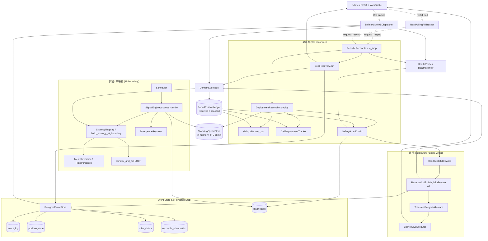
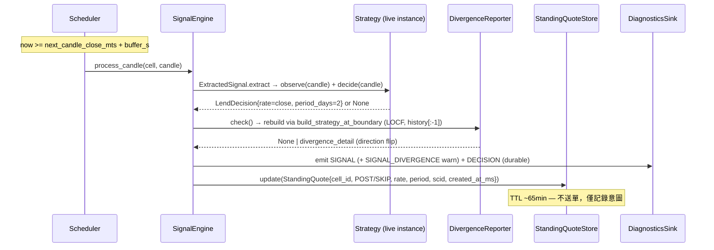
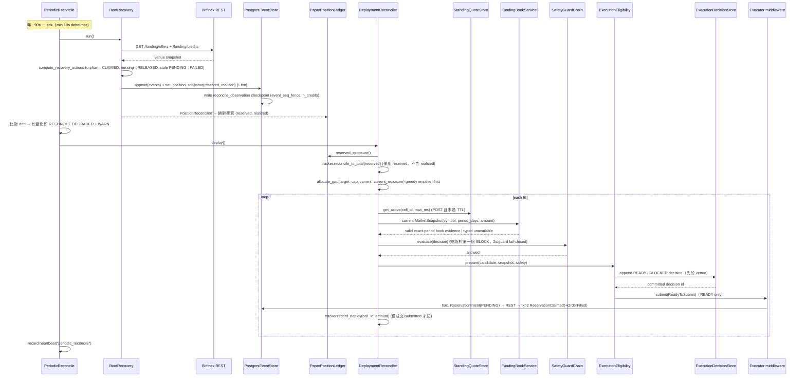
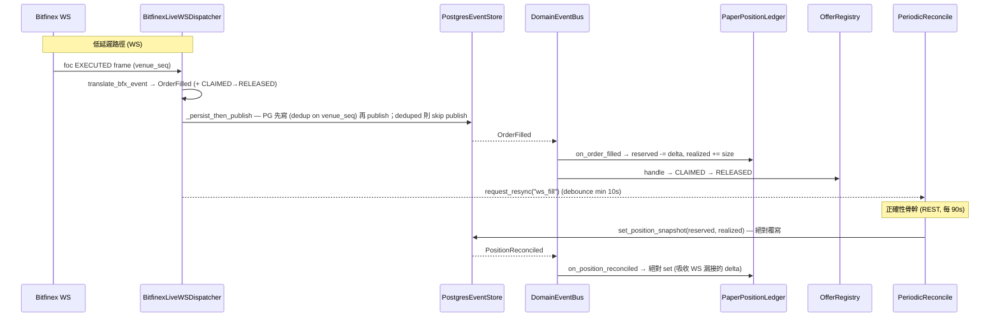

# bfx-funding-bot 後端架構（Python / backend_py）

> Bitfinex 自動放貸 bot 的現行後端（`backend_py/`，Python 3.13）。本文件描述的是 **事件溯源（event-sourced）的長駐 daemon**：以 PostgreSQL event log 為單一真相源（SoT），透過 standing-quote 解耦「訊號決策」與「資金部署」，由 DeploymentReconciler 單一寫入者控制 venue 提交，並以週期性 reconcile 對齊 venue 真相作為正確性骨幹。
>
> Go `backend/` 已封存，本文件完全不涵蓋。所有路徑相對於 `backend_py/src/bfx_funding_bot/`。

---

## 1. Overview

bfx-funding-bot 在 Bitfinex 的 funding（放貸）市場上自動掛單放貸閒置資金。系統不是「來一根 candle 就送一張單」的反應式 bot，而是把整條 pipeline 拆成兩個解耦的時間軸：

- **訊號層（signal layer）**：每小時 candle boundary 觸發一次，由策略產生「該不該放、用什麼 rate、放幾天」的 **意圖（StandingQuote）**，寫進 in-memory store，**不送單**。
- **部署層（deployment layer）**：每 ~90 秒一次，先用 REST 把 venue 真相抓回來校正 ledger，再依「目標曝險 − 目前曝險」的缺口（gap）把資金貪婪分配到各 cell，套用 safety chain 後才送單。

核心架構原則：

1. **Event-sourced execution，PG 為 SoT**：所有狀態變更（`ReservationIntent` / `ReservationClaimed` / `OrderFilled` / `ReservationReleased` / `ReservationFailed`）都 append 進不可變的 `event_log`。`position_state`、`offer_claims` 等都是可由 log 重算的投影（projection）。
2. **訊號 / 部署解耦（standing quote）**：rate 決策在 1h 尺度上穩定，資金分配在 90s 尺度上靈敏；StandingQuote 以 ~65 分鐘 TTL 橋接兩者。
3. **單一寫入者曝險（single-writer exposure）**：`DeploymentReconciler` 是 venue 提交的唯一寫入者；訊號層不送單。
4. **Reconcile 即正確性骨幹（reconcile-as-correctness-backbone）**：venue（透過 REST）是曝險真相的權威來源；90s 週期 reconcile 保證 ledger 收斂。WebSocket 只是延遲最佳化（latency optimization），不是正確性來源。

部署形態：單一長駐 daemon，以 `asyncio.TaskGroup` 並行跑多個 sub-task；全 stack 自托於 Oracle Cloud VM `oci-a1`（docker compose：`bfx-bot`/`bfx-webapi`/`bfx-postgres`(PG 18)/`bfx-redis`/`bfx-frontend`）。Koyeb/Neon/Upstash 為歷史平台（2026-05-31 Koyeb cutover、2026-06-23 Neon/Vercel 歸零）。

### Release 0 web API containment and Halt 1 identity

Release 0 沒有 self-service signup；所有 private `/api/v1` route 仍僅接受
`BFX_OPERATOR_USER_ID` 指定的 Better Auth user，且 JWT role 必須是 `admin`
（`BFX_OPERATOR_ROLE=admin`）。operator ID 缺失或空白、user ID 不符、或 role
不符時一律 fail closed；不得 fallback 到第一個 user、環境變數 realm 或 user
profile。

Halt 1 後，money-domain 的 aggregate root 是 immutable
`ExchangeAccount.id`（UUID），不是登入 user、credential row 或 process-global
realm。private account routes 必須使用
`/api/v1/exchange-accounts/{exchange_account_id}/...`，dependency 依序驗證
JWT operator、UUID path、membership/lifecycle，再進入 handler；不存在的帳號與
沒有 membership 的帳號都回 non-enumerating 404。daemon 只接受
`BFX_EXCHANGE_ACCOUNT_ID`，啟動時載入 active account、credential 與 config
draft；缺少、未知、retired 或 halted account 都 fail closed。

`account_id` text 欄位在 Halt 1 contract migration 後只保留為 immutable
legacy/audit provenance；新讀寫的 owner/filter 是 `exchange_account_id`，新
domain event 以 canonical lowercase UUID string 相容既有 event contract。credentials
的 AEAD AAD 一律是 canonical UUID，絕不使用 user id 或舊 realm。

FastAPI 的 process liveness 與 database readiness 是兩個獨立契約：

- `GET /health`：process 仍能服務 request 時永遠回 `200 {"status":"ok"}`，不做 DB probe。因此 DB 初始化失敗後 lifespan 保留 app serving，liveness 仍可用。
- `GET /ready`：僅在 `app.state.session_factory` 存在、以獨立 read-only session 成功執行 `SELECT 1`，且 `alembic_version` 的 revision set 與 image 內 `alembic.ini` migration graph 的所有 head 完全相等時回 `200 {"status":"ready","checks":{"database":"ok"}}`。factory 缺失、migration table 缺失／空值／stale／多餘 head、SQLAlchemy/timeout/socket error 或 migration graph 無法讀取，均回 `503 {"status":"not_ready","checks":{"database":"failed"}}`，不洩漏 connection string。probe session 一律關閉、不 commit application data；timeout 由 `BFX_READINESS_TIMEOUT_SECONDS` 控制，預設 2.0 秒，最大固定為 10 秒（超過時 clamp）。

---

## 2. Layered Architecture



依賴方向重點：訊號層**只寫** StandingQuoteStore；部署層**讀** quote、ledger（曝險真相）後才提交；ledger 由 venue reconcile（REST）與 WS 共同更新，但 reconcile 才是收斂保證；event store 在所有路徑下游，是唯一 durable 真相。

---

## 3. Data Flow

### 3a. 1h Boundary Path（訊號 → StandingQuote）



### 3b. 90s Deployment Path（reconcile → ledger 真相 → gap → allocate → safety → submit → intent）



### 3c. Fill Lifecycle（WS foc → OrderFilled；REST reconcile → PositionReconciled）



關鍵差異：**WS 是增量（delta）**（`reserved -= / realized +=`，floor at 0）；**REST reconcile 是絕對覆寫**（直接 set venue 真相）。即使 WS 完全靜默，90s reconcile 仍把 ledger 拉回正確值——這就是「reconcile 即正確性骨幹」的含義。

---

## 4. 放貸演算法（End-to-End Lending Algorithm）

逐步流程（一個完整 decision-to-redeploy 週期）：

**訊號（每 1h candle boundary，每 cell 各一）**

1. Scheduler 在 `next_candle_close_mts + buffer_s` 觸發 `SignalEngine.process_candle`。buffer 是為了吸收 Bitfinex candle 落 DB 的延遲（否則讀到 0 列誤判 health degraded）。**buffer 不負責保證 candle 已定稿**——定稿由 `is_final` 認定（`CandleWriter` 見到更晚的 mts 才封存前一根），策略讀取路徑一律 final-only。2026-07-27 前靠 buffer 猜定稿時間（5s→30s），導致策略吃進成形中的值、live EMA 對 replay 漂移 4.1e-2（見 I-CI）。
2. `ExtractedSignal.extract` 呼叫 `strategy.observe(candle)` 更新狀態，再 `strategy.decide(candle)`：
   - **MeanReversionStrategy**：增量更新 EMA（`alpha = 2/(ema_span+1)`），`decide` 在 `close >= EMA - threshold_sigma * ratio_sigma` 時回 `LendDecision(rate=close, period_days=2)`，否則在下跌段暫停放貸。
   - **RatePercentileStrategy**：`observe` 把 `close` 推進 `deque(maxlen=lookback_hours)`，`decide` 在 window 填滿且 `close >= percentile(window, P)` 時放貸。
3. `DivergenceReporter.check()` 用 `build_strategy_at_boundary`（LOCF 重建，觀察 `history[:-1]`）重算 reference signal，與 live 比對 `signal_score` / `signal_direction` / `strategy_attributes`（含 EMA 等累加器內部 state，累加器欄位走 `_REL_TOL=1e-4` 相對容忍，其餘精確比對）。有差則 emit `SIGNAL_DIVERGENCE` warn。I-CI 之後 live 與 replay 應 byte-match，**觸發率脫離 100% 是這條修復的驗收指標**。
4. 結果寫成 `StandingQuote{cell_id, outcome=POST/SKIP, rate, period_days, signal_correlation_id, created_at_ms}` 進 `StandingQuoteStore`。**訊號層到此為止，零提交。**

**部署（每 ~90s，由 PeriodicReconcile 在 venue reconcile 完成後呼叫）**

5. `tracker.reconcile_to_total(ledger.reserved_exposure())`：把各 cell 的 in-memory 部署意圖等比例 rescale 到 **reserved（不含 realized）** 總量。
6. `allocate_gap(target=cap, current=current_exposure)`：
   - gap = cap − current_exposure（current_exposure = reserved + realized）；
   - **greedy emptiest-first**：依目前各 cell 已部署量由小到大排序，先填最空的；
   - 每 cell 上限 `cap_per_cell = max(concentration_pct * target, target / n_active_cells)`（`concentration_pct` 預設 70%，`n_active_cells` 為當下 active cell 數）：≥2 active cells 時與舊公式 byte-identical；僅 1 active cell 時可吃下全部 target（同幣別多 cell 皆跑同一策略，cap 對單一 active cell 本就不提供分散效果，見 commit `0d29fc8`）；
   - 低於 `effective_min_usdt = ceil(150 * 1.02) = 153` USDT 的零頭（dust）丟棄；總分配 ≤ gap，全域 cap 永不超過。
7. 逐 fill：讀 `get_active(cell_id)`（須 POST 且未過 ~65min TTL，過期則跳過）→ 讀取同一 symbol、**exact `period_days`** 與所需 amount 的 `MarketSnapshot` → `SafetyGuardChain.evaluate` → `ExecutionEligibility.prepare`。scalar ticker 僅可作 telemetry，不能為 period-correct pricing 提供證據。

7b. **Reprice sweep（E1）**：allocation 前，對每個 symbol 比對 venue snapshot 的 resting offers 與現行 active quote：offer rate 高於最高 active quote rate ×(1+`BFX_REPRICE_TOLERANCE_PCT`) 且齡 ≥ `BFX_REPRICE_MIN_AGE_S` → `executor.cancel`（每 tick ≤ `BFX_REPRICE_MAX_CANCELS_PER_TICK` 筆；`BFX_REPRICE_ENABLED=false` 時僅 log `reprice_would_cancel`）。release 由 WS foc / 下次 reconcile 收斂，釋放資金下一 tick 以新 quote 重掛。無 active quote 的 symbol 不砍（resting 高價單留作 spike option）。

7c. **Execution eligibility（fail-closed）**：snapshot 必須已完成 initial snapshot、在 `BFX_BOOK_MAX_AGE_SECONDS` 內、sequence/checksum valid（或完成 REST reconcile）、symbol 相符、存在 exact period level，且該 side 的絕對 depth 足以覆蓋 amount。任一條件不足，或 model/safety/audit 不可用，皆產生 `BlockedExecution`／`NoRecommendation` 並不送單；不得重用 signal quote、ticker 值或 linear estimate。`book_guarded` 以 exact-period book 價格送單；`optimizer_shadow` 只記錄候選與評分，仍送 book-guarded rate；`optimizer_live` 僅在 empirical evidence、fee 與其餘依賴全部有效時才可選擇 optimizer rate。

7d. **Audit ordering**：每個 allocation candidate 先 append 一筆不可變 `execution_decisions`（`ready`、`blocked` 或 `no_recommendation`）。只有 READY audit commit 成功，才建立 `ReadyToSubmit` 並交給 executor；audit 失敗一律 block。成功送出的 `ReservationIntent` 帶相同 `decision_id`，但 execution audit 不是 ledger projection，也不改變 capital state。executor 對 venue reject（如 10001）回 `status="failed"` 而非 raise，故 reconciler 僅 submitted 才 `tracker.record_deploy`（否則記 `deployment_submit_rejected`、不記 phantom intent）。

**成交與重部署**

8. WS `foc EXECUTED` → `OrderFilled` → reserved 降、realized 升（見 3c）。credit 到期由 Bitfinex 自動觸發，**不需顯式 redeploy**：下一個 90s tick 重算 gap 時，被釋放的額度自然回到分配池。

**為什麼這樣設計（WHY）**

- **rate 慢、idle cost 連續**：策略 rate（EMA / percentile window）算起來「慢」且對 1h 尺度才有意義，但閒置資金每秒都在損失機會成本。把 rate 凍結成 ~65min TTL 的 standing quote，讓資金分配能以 90s 高頻運作而不必每次重算訊號。TTL 確保 rate regime 變動後過期的 quote 不會繼續部署。
- **greedy emptiest-first**：在 relaxed concentration cap（`max(70% * target, target / n_active_cells)`）下儘量分散，避免單一 cell 過度集中；僅 1 active cell 時例外允許吃下全部 target（該情況下 cap 對唯一 cell 無分散意義可言）。
- **per-cell intent 只用 reserved**：venue 的 realized credits 無法回溯歸屬到 cell（venue→cell attribution problem，funding credit 不帶 client cid）。若把 realized 算進 rescale factor，per-cell 意圖會被灌爆超過 `cap_per_cell` 並餓死其他 cell。因此 `CellDeploymentTracker` 只 rescale 到 reserved 總量，並對任何超過 `cap_per_cell` 的 rescale 做 hard clamp（defense-in-depth）。

**參數總覽**

| 參數 | 值 | env |
|---|---|---|
| Canary allocation caps | fUST 10000 USDT；fUSD 400 USDT | `safety.canary.yaml` 的 `allocation_cap.caps` 是 binding per-symbol cap；`canary.env` 的 `BFX_ALLOCATION_CAP_USDT=0` 僅是 caps map 缺少 symbol 時的 fallback，不能覆寫 map |
| Effective min offer | 153 USDT（`ceil(150 × 1.02)`） | `BFX_VENUE_FLOOR_USD`=150, `BFX_MIN_OFFER_BUFFER_PCT`=0.02 |
| Per-cell concentration | `max(70% × target, target / n_active_cells)`；≥2 active cells 等同 70%，僅 1 active cell 時可達 100%（見 commit `0d29fc8`） | `BFX_CONCENTRATION_PCT`=0.70 |
| Standing quote TTL | 3,900,000 ms（~65min） | `BFX_QUOTE_TTL_MS` |
| Reconcile interval | ~90s（resync debounce 10s） | `BFX_RECONCILE_INTERVAL_S`, `BFX_RESYNC_MIN_INTERVAL_S` |
| Period | 2 天（兩策略皆 `period_days=2`） | — |
| Reprice sweep（E1） | enabled（canary 2026-07-07 起）；tolerance 10%；min age 30min；≤3 cancels/tick | `BFX_REPRICE_ENABLED`、`BFX_REPRICE_TOLERANCE_PCT`、`BFX_REPRICE_MIN_AGE_S`、`BFX_REPRICE_MAX_CANCELS_PER_TICK` |
| Execution policy | `paper`、`book_guarded`、`optimizer_shadow`、`optimizer_live`；非 paper 必須設定 book freshness/reconcile/down-bound，optimizer_live 另需 empirical artifact + fee | `BFX_EXECUTION_POLICY`、`BFX_BOOK_*`、`BFX_FILL_MODEL_ARTIFACT`、`BFX_OPTIMIZER_FEE_RATE` |

---

## 5. Event Model & Source-of-Truth

`event_log` 是不可變、append-only 的財務 SoT（PK `event_seq` BigInteger auto-increment，無 UPDATE/DELETE）。所有 ledger 狀態都是它的投影；pre-trade eligibility 則另存於同樣 append-only、但不影響 ledger 的 `execution_decisions`。

**Domain events（frozen dataclass）**：`ReservationIntent`（write-ahead，PENDING，不上 bus）、`ReservationClaimed`（reserved += size）、`OrderFilled`（reserved → realized）、`ReservationReleased`（cancel/expire/missing）、`ReservationFailed`（terminal，capital-neutral，不上 bus）、`CancelRequested` / `CancelAcknowledged`（audit-only）、`PositionReconciled`（bus-only，絕對覆寫）。每個 event 帶 `occurred_at_ms`（domain 時間）、`recorded_at`（wall-clock）、`event_seq`、`venue_seq`（WS dedup 用）。

**核心表與角色**

| 表 | 角色 |
|---|---|
| `event_log` | SoT，append-only。dedup unique index gate `ORDER_FILL` / `RESERVATION_RELEASED`（key 含 `venue_offer_id` + `venue_seq`）。 |
| `position_state` | ledger 投影（singleton per account+env）：`reserved_usdt`、`realized_usdt`、`last_event_seq`（high-water mark）、`last_reconciled_at`、`n_credits`。每次 `append()` 同 txn 內更新。 |
| `offer_claims` | FSM 快照，PK `(exchange_account_id, deployment_environment, cid)`：state ∈ {PENDING, CLAIMED, RELEASED, FAILED}。投影先以原子 `INSERT ... ON CONFLICT DO NOTHING` 讓 DB 仲裁首寫者，再按 account UUID 以 CID／非空 venue offer id／非空 execution decision id 重讀唯一 canonical row。完整 identity 相同才視為冪等並推進 FSM；多筆命中或任何既有 identity 不符皆 fail closed，絕不覆寫 established identity。 |
| `reconcile_observation` | 不可變 checkpoint：venue 快照 + `event_seq_fence`（快照當下 max event_seq）+ `n_offers` / `n_credits`。rebuild 的 base state。 |
| `execution_decisions` | 每筆 allocation candidate 的 durable eligibility audit：decision/reconcile/account/realm/cell/symbol/correlation、`ready`/`blocked`/`no_recommendation`、stable reason/dependency、signal/applied rate、amount/period、exact-period book evidence、model evidence、safety/policy、config/service hash 與 timestamps。READY 必須在 submit 前 commit。 |
| `diagnostics` | **非 SoT** forensic 軌跡（DECISION / SAFETY_TRIGGER / CANCEL_AUDIT），best-effort 寫入（失敗不擋交易），prunable 30–90d。 |

**Dedup（雙層）**：`PostgresEventStore.append()` 透過 unique index（durable）回傳 bool（False=deduped、True=persisted）；`EventStorePersister.persist()` 傳播此 status，WS dispatcher 對 deduped（重連重送、同 `venue_seq`）的事件 skip publish，維持「persist 失敗就不 publish」不變式。`PaperPositionLedger` 額外有 in-memory `_processed_fills` / `_processed_releases` 防呆。

**Checkpoint ⊕ tail rebuild**：`rebuild_snapshot_from_log()` 若無 checkpoint 則 seed `(0,0,0)` 重放全部；若有 checkpoint 則 seed 自最新 checkpoint，**只重放 `event_seq > fence` 的尾段**（不重複計）。fence 單調遞增，rebuild 對同一 checkpoint idempotent。

**Account/環境隔離**：每筆讀寫都帶 `deployment_environment ∈ {prod, shadow, ci}`，所有 money query 以 `(exchange_account_id, deployment_environment)` 複合過濾。legacy `account_id` 不再選擇 request/daemon scope；單一 DB 內可並行跑 shadow/canary/CI 而無 cross-account 或 cross-environment 污染。

---

## 6. Safety Model

**Guard chain（`SafetyGuardChain.evaluate`）**：依建構順序、由便宜到昂貴執行，**第一個 BLOCK 即短路**。每個 guard 套 2s timeout，timeout 或 exception 一律 **fail-closed**（`allowed=False`）並 emit `safety_trigger`（block → `level=warn`；internal error → `level=critical`）。每次 evaluate 在 `finally` 無條件記 `safety_chain` heartbeat。

評估時機：**deployment-time**——`DeploymentReconciler.deploy()` 對每一筆 fill 在 submit 前呼叫 chain。訊號層不評估 safety（它只寫 quote）。

**L1 hard guards（always-on，順序固定）**

1. `ManualKillGuard` — 讀 `BFX_KILL_SWITCH`（true/1/yes），命中即擋全部，跑最前。
2. `AuthHealthGuard` — executor health 為 `DOWN` 時擋（`DEGRADED` 為 soft warn 不擋）。
3. `HeartbeatGuard` — 只 watch `ws`（market-data liveness，own-loop），`age > threshold_seconds`（canary 為 300s，由 `safety.canary.yaml` 設定；`threshold_seconds` 為必填參數無 code default）擋。刻意**不** watch `executor`/`safety_chain`（reactive，靜市場時不跳動，誤判會造成 idle restart loop）。
4. `AllocationCapGuard` — POST 時若 `(reserved + realized) + offer > cap` 則擋；恰好 at-cap 放行，over-cap 擋；SKIP 一律放行。

**L2 calibrated guards**：`RealizedLossGuard`（24h NAV 虧損 % > threshold）、`DrawdownGuard`（peak-to-trough NAV drawdown_pct > threshold）、`DivergenceRateGuard`（無已驗證 threshold，目前 disabled）。metric 由 `ReconcileNavTracker` 提供，**per-symbol**（每幣別對自己的 24h window-high / all-time peak 計算，絕不跨幣加總——賺錢幣別不會掩蓋虧損幣別）；guard 讀 `decision.symbol` 取對應幣別 metric。canary（`safety.canary.yaml`）開 realized_loss(5%) + drawdown(10%)，單一 active 幣別（fUST）時與 pre-per-symbol 純量值相同。`enabled=True` 但 threshold 為 None 時 loader 直接 `ValueError`。

**Kill switch**：設定 `BFX_KILL_SWITCH=true` 即時擋所有新單，無須改 safety config；由目前 VM deployment 的環境組裝提供此 break-glass env。

**Canary gate（`assert_canary_guard_invariant`）**：`BFX_PHASE=canary` 啟動時強制 hard guards + `realized_loss_24h` + `drawdown_from_peak` 全開，否則 `build_daemon` 在 TaskGroup 啟動前 `ValueError`。

**Config 不可熱載**：`SafetyConfig` 啟動時讀一次（`BFX_SAFETY_CONFIG`，預設 `configs/safety.yaml`），改 threshold 需 redeploy。

**/healthz liveness**：獨立 HTTP server（port 8080）供目前 VM compose deployment 探活。Liveness（own-loop，如 `ws`）staleness 致命 → daemon restart；Activity-class（reactive，如 `executor`/`safety_chain`）只 WARN 不致命——這是 2026-05-26 idle-market restart loop 修法的核心。

**`/readyz` trading readiness**：`/healthz` 只回答 process liveness；`/readyz` 回傳 `200 {"trading_ready": true, "reason": null}` 或 `503 {"trading_ready": false, "reason": <stable reason>}`。book、model 或 audit dependency 不可用會將 `trading_ready=0`，供 operator status/metrics 告警，但不會令 liveness restart loop 啟動。

**Execution observability**：固定 structured event names 為 `funding.execution.eligibility`、`funding.execution.blocked`、`funding.execution.submitted`、`funding.book.snapshot_invalid`、`funding.fill_model.unavailable` 與 `funding.optimizer.no_recommendation`。每筆帶 decision/reconcile id、policy、outcome、reason 與 bounded evidence；不含 secret 或未界定 exception text。Prometheus 使用 `bfx_execution_decisions_total{outcome,reason,policy}`、`bfx_execution_audit_persist_failures_total`、`bfx_funding_book_snapshots_total{result}`、`bfx_funding_book_snapshot_age_seconds`、`bfx_execution_gate_duration_seconds`、`bfx_trading_ready`。cell、symbol、candidate rate、artifact hash 與完整 book evidence 僅留在 logs/audit，絕不成為 metric label。

---

## 7. DB Schema（key tables）

```
event_log              (SoT, append-only)
  PK event_seq
  exchange_account_id (UUID NOT NULL FK RESTRICT), legacy account_id (audit only),
  deployment_environment, event_type, cid,
  venue_offer_id, venue_seq, payload(JSONB),
  occurred_at_ms, recorded_at
  UNIQUE dedup(exchange_account_id, deployment_environment,
               event_type, venue_offer_id, venue_seq)

position_state         (ledger 投影, singleton per account+env)
  PK (exchange_account_id, deployment_environment, symbol)
  reserved_usdt, realized_usdt,
  last_updated_ms, last_event_seq,
  last_reconciled_at, n_credits

offer_claims           (FSM 快照, per-offer)
  PK (exchange_account_id, deployment_environment, cid)
  state{PENDING|CLAIMED|RELEASED|FAILED}, venue_offer_id,
  size_usdt, signal_correlation_id, execution_decision_id,
  occurred_at_ms, last_updated_ms, last_event_seq
  UNIQUE partial (exchange_account_id, deployment_environment, venue_offer_id)
    WHERE venue_offer_id IS NOT NULL
  UNIQUE partial (exchange_account_id, deployment_environment, execution_decision_id)
    WHERE execution_decision_id IS NOT NULL

reconcile_observation  (checkpoint, append-only audit)
  PK id
  exchange_account_id, legacy account_id (audit only), deployment_environment,
  reserved_usdt, realized_usdt, n_offers, n_credits,
  observed_at_ms, event_seq_fence, recorded_at

execution_decisions    (append-only pre-trade audit；非 ledger projection)
  decision_id, reconcile_id, exchange_account_id, deployment_environment,
  outcome, reason_code, failed_dependency, signal_rate, applied_rate,
  amount_usdt, period_days, market_snapshot_evidence, model_evidence,
  safety_result, execution_policy, service_version, config_hash,
  occurred_at_ms, recorded_at

diagnostics            (非 SoT forensic, prunable)
  exchange_account_id, deployment_environment, kind, payload(JSONB),
  occurred_at(TIMESTAMPTZ), recorded_at

funding_candles        (訊號層輸入)
  PK (symbol, timeframe, period_agg, mts)
  is_final, first_seen_at_ms, finalized_at_ms
  -- is_final=false 的列仍在成形中（venue 會用同一個 mts 反覆推送不同 close）。
  -- 只有 is_final=true 可餵策略；upsert 對已定稿列是 no-op（見 I-CI）。

funding_candle_revisions (append-only，定稿後被拒寫入的證據)
  PK (id)；索引 (symbol, timeframe, period_agg, mts)
  observed_at_ms(knowledge time), rejected_close, final_close
  -- 用來回答「venue 到底會不會修訂已收盤 bar」。長期為空 = bitemporal 層可降級。

config_regime          (非 SoT telemetry, prunable, 每次 daemon boot 一筆)
  PK (deployment_environment, exchange_account_id, recorded_at_ms)
  clamp_enabled (legacy telemetry; always false), reprice_enabled,
  git_sha
  用途：flag flip 需重啟（config boot-immutable），boot 即為 regime
  boundary；供 execution-quality（fill latency、realized APR）歸因對應
  的 flag regime，不必等 weekly window 累積。
```

**Alembic**：遷移在 `backend_py/alembic/versions/`。Halt 1 先套用 additive
revision `8a1b2c3d4e5f`，完成 `cutover_identity.py --dry-run/--apply/--verify`
後才套用 contract revision `9b2c3d4e5f6a`。一般部署仍使用
`cd backend_py && uv run alembic upgrade head`；驗證無 drift 使用
`uv run alembic check`。contract revision 會在 DDL 前拒絕 NULL UUID、未映射
realm、孤兒 FK 或非零 legacy scaffold，且為 forward-only（rollback 使用
verified backup/PITR + venue reconcile，不使用 downgrade）。

---

## 8. Phases & Deployment

**三個 phase（`Phase` enum）**

| Phase | 性質 | Realm | Executor | 備註 |
|---|---|---|---|---|
| `paper` | 1h 模擬 | `ci` | paper | `BFX_RUN_DURATION_HOURS=1` |
| `shadow` | 模擬校準 | `shadow` | paper | 正常 profile 為 `book_guarded`；無 duration cap |
| `canary` | **真錢** | `prod` | `bitfinex_live` | 必須為 `book_guarded` 或完整 evidence 的 `optimizer_live`；binding cap 在 `safety.canary.yaml` 的 per-symbol map（fUST 10000、fUSD 400），`canary.env` 的 `BFX_ALLOCATION_CAP_USDT=0` 僅為 map 未列 symbol 的 fallback；四個 armed mean_reversion cells 為 fUST a30/p2 與 fUSD a30/p2，fUSD 未入金時由 balance gate 擋住所有 offer |

**Phase ⟷ Realm guard**（`load_config()`）：canary 只能配 prod realm（真錢不可污染校準資料），paper/shadow 只能配 shadow|ci（模擬不可污染真錢分析）。違規 `ValueError` fail-fast。

**Cells**：`cells.yaml`（shadow，多對跨 fUSD/fUST 與 p2/p30/a30）；`cells.canary.yaml`（四個 armed mean_reversion cells：fUST a30/p2、fUSD a30/p2；RatePercentile 與 p30 不在 canary set）。`shadow-p14` 專用 `cells.experimental-p14.yaml` 鎖定 AdaptivePeriod `p_mid=7`、`p_long=14`、`t1=0.5`、`t2=1.5`，並且 profile 固定 `BFX_PHASE=shadow`、`BFX_DEPLOYMENT_ENV=shadow`、`optimizer_shadow`；canary profile 不得選用它。單筆送單金額不在 yaml 設定——由 deployment reconciler 依 gap 動態決定。

**基礎設施**

| 服務 | 平台 |
|---|---|
| Backend daemon | VM 自托（`oci-a1`，Docker，Python 3.13 + uv；`bfx-bot`/`bfx-webapi`。Koyeb 已於 2026-05-31 cutover 至 VM） |
| Database | VM 自托 Postgres 18（`bfx-postgres`。Neon 已於 2026-06-23 棄用歸零） |
| Cache | VM 自托 Redis 7（`bfx-redis`；Better Auth session/rate-limit 用，daemon 不依賴） |
| Frontend | VM 自托（Next.js standalone，Tailscale Funnel 443→3001。Vercel 專案已刪） |

**Deploy script（`scripts/deploy-vm.sh`，ON THE VM 跑）**：`git pull --ff-only` **先於** env 組裝（2026-07-10 順序 bug 修正 `2748514`）→ `~/bfx/{bot,webapi,frontend}.env` + `deploy/vm/<phase>.env`（`paper`、`shadow`、`shadow-p14`、`canary`）組成 `.env.runtime`（derived，勿手改）→ preflight 必要變數、phase-policy 契約與 required book/model evidence → canary 仍需 `BFX_CANARY_CONFIRM=yes`，並顯示 binding per-symbol safety caps 與 env fallback → 全 stack build + up。注意：`canary.env` 變更會改 env_file hash → `bfx-postgres` 一併 recreate（volume 安全、短暫重啟）。舊 `deploy-koyeb.sh` 為歷史遺跡。

**關鍵 env vars**：`BFX_PHASE`、`BFX_DEPLOYMENT_ENV`、`DATABASE_URL`、
`BFX_EXCHANGE_ACCOUNT_ID`、`BFX_VAULT_KEK`、`BFX_ALLOCATION_CAP_USDT`、
`BFX_EXECUTOR`、`BFX_WS_CLIENT_ENABLED`、`BFX_FILL_TRACKER_ENABLED`、
`BFX_RECONCILE_INTERVAL_S`、`BFX_QUOTE_TTL_MS`、`BFX_VENUE_FLOOR_USD`、
`BFX_MIN_OFFER_BUFFER_PCT`、`BFX_CONCENTRATION_PCT`、`BFX_SCHEDULER_BUFFER_S`、
`BFX_KILL_SWITCH`、`BFX_SAFETY_CONFIG`、`BFX_CELLS_YAML`。
Bitfinex secret 不再從 `BFX_API_KEY`/`BFX_API_SECRET` 讀取；由 account-owned
credential vault 解密。public read model 另以明確的
`BFX_PUBLIC_EXCHANGE_ACCOUNT_ID` 綁定 UUID。

### 量測自動化（E3，2026-07-06）

- **Weekly chain**：VM systemd timer `bfx-weekly-report.timer`（Mon 04:17 UTC，unit 檔在 `deploy/vm/systemd/`）→ compose one-shot `weekly-report`（`--profile ops`）：`ingest_funding_stats`（AlwaysFRR arm 資料）→ `run_weekly_attribution`（per-cell fee-adjusted APR → `attribution_weekly` 表，全量重算 delete-then-insert）→ `run_g3_live_validation`（報告 → VM `~/bfx/reports/<date>-g3-live-validation.{md,json}`）。值得留存的報告手動 promote 進 `backend_py/docs/research/` 並 commit。
- **儀表**：webapi `GET /api/v1/exchange-accounts/{exchange_account_id}/attribution/weekly`（`bfx_webapi` 需 `GRANT SELECT ON attribution_weekly`，非 migration）→ FE `/attribution` 頁三線圖（bot net APR / always-close / AlwaysFRR）。webapi 與 weekly job 必須使用同一個 account UUID 與 `BFX_DEPLOYMENT_ENV`；不再依 process-global `BFX_ACCOUNT_ID` 選 scope。
- **政策（per-symbol cap 加碼 gate）**：調高 `safety.canary.yaml` 的 `allocation_cap.caps[symbol]` 前必須：最新 weekly G3 verdict = PASS **且** AlwaysFRR benchmark spread 非負（`frr_benchmark` unavailable 時一律不加碼）。fUST 3000→10000（`aa4842c`）是在 INSUFFICIENT_DATA 上拉的 — 此政策防重演；`BFX_ALLOCATION_CAP_USDT` 不覆寫已設定的 per-symbol cap。
- **FRR 單位**：AlwaysFRR arm 的 rate = `funding_stats.frr × 365`（≈ ticker per-day FRR，2026-07-06 實測誤差 <0.5%；`live_attribution.FRR_ANNUALIZATION`），換算後必過 `assert_market_rate_band`。`funding_stats.frr` 原值仍非市場利率（ADR 2026-05-28 不變）。

---

## 9. Key Invariants

- **I-SW 單一寫入者曝險**：`DeploymentReconciler` 是 venue 提交的唯一寫入者；訊號層只寫 StandingQuote。只有 `ReservationClaimed`（executor 或 recovery orphan-claim）會增加 reserved。
- **I-VTA venue 即真相**：`BootRecovery.run()` 抓 REST offers + credits，產生 orphan-claim / missing-offer / stale-pending 修正，並以 `PositionReconciled` 絕對覆寫 ledger。WS 是延遲最佳化；90s 迴圈保證收斂。
- **I-R/R reserved/realized 分離**：`tracker.reconcile_to_total` 只用 `reserved_exposure`，不含 realized（避免 venue→cell attribution 灌爆 per-cell 意圖）。gap 仍以 `current_exposure = reserved + realized` 對 cap 計算。
- **I-AC allocation cap**：`(reserved + realized) + amount ≤ cap`；恰好 at-cap 放行，over-cap 擋；`reconcile_to_total` 對超過 `cap_per_cell` 做 hard clamp。
- **gap ≤ target**：`allocate_gap` 總分配 ≤ gap，全域 cap 永不超過；低於 153 的 dust 丟棄。
- **I-CC concentration**：每 cell ≤ `max(concentration_pct * cap, cap / n_active_cells)`（≥2 active cells 等同 70%；僅 1 active cell 時可達 100% cap——該情況下 cap 本就不提供分散效果，屬刻意 relax，見 commit `0d29fc8`）；跨 tick 漂移於下個 90s reconcile 自我修正。（注意：reserved-only rescale 後，集中度上限僅對 pending 資本生效，不含已成交 realized；2-cell 同幣別下無害，multi-cell scale-up 需 cid 完整歸屬。）
- **I-WAI write-ahead intent**：txn1 寫 `ReservationIntent`(PENDING) → REST（唯一非事務邊界）→ txn2 寫 outcome；crash 於中間留 PENDING，boot 時老者判 FAILED。txn 永不跨 REST call。
- **I-IDEM idempotency**：`ORDER_FILL` / `RESERVATION_RELEASED` 以 dedup key 去重；`OfferRegistry.transition()` 純函式、原子套用、重送安全。
- **I-ES event sourcing SoT**：`event_log` append-only；snapshots 皆可由 log 重算；bus publish 為 best-effort，recovery 一律走 event_log。
- **I-CI candle 不可變**：進入 `strategy.observe()` 的 candle 必須 `is_final=true`，且定稿後其值永不改變——`upsert_candles` 的 UPDATE arm 帶 `where is_final = false`，對已定稿列無論來源（WS 重送、REST 回補）皆為 no-op，差異改寫進 `funding_candle_revisions`。封存有兩條互補路徑：(a) **寫入即判定**——`mts` 早於 `now` 所屬期者落地就是 final（REST backfill 寫的全是已結算歷史，若落地為未定稿，final-only 讀取會看不到，`fetch_and_store` 的寫後讀回也會回空）；(b) **期轉換時補封**——`CandleWriter` 見到同 series 更晚的 mts 就封存前一根，處理「寫入時還開著、之後才過期」的那根。都不是等固定秒數。**兩個讀取函數必須同規則**：`get_up_to` 與 `get_candles_in_range` 皆預設 `final_only=True`——只改前者時，warmup（走後者）會吸進形成中的 candle 而 replay 不會，兩臂差一次 `observe()` 就是 `ema_span=24` 下約 0.7% 的 EMA 位移。理由：決定性重放要求輸入不可變；輸入可變時 live 增量狀態與 replay 重建必然分歧，而 `LendDecision.rate` 直接取 `candle.close`，失真值會成為實際掛單利率（2026-07-27 實測 23/132 slot 被事後改寫、最大 -35.3%，掛單價偏離達 +54.6%）。
- **submit 成功才記 intent**：executor 對 venue reject 回 `status="failed"`（非 raise）；reconciler 僅 `status != "failed"` 才 `record_deploy`。
- **fail-closed**：任何 guard timeout（2s）或 exception → `allowed=False` + `safety_trigger(critical)`。
- **TaskGroup 監督**：任何 sub-task 例外 → ExceptionGroup 傳播 → daemon 非零退出，無 silent task death。
- **I-RP reprice-down only**：sweep 只砍「高於現行 active quote 超過 tolerance 且夠老」的 offer；不砍低於 quote 的、不砍 spike 當小時的（min-age）、無 active quote 不砍。cancel 失敗 fail-safe（offer 留在 book）；`ExecutorAuthError` propagate。sweep 不直接改 ledger/tracker。
- **I-EG execution eligibility**：只有已 audit 的 `ReadyToSubmit` 能到 executor。每個 live-capable candidate 都需 fresh、symbol-matched、sequence/checksum-valid 的 exact-period book evidence；缺少 period、depth、model、safety 或 audit 時，產生 typed blocked outcome，絕不重用 signal quote、scalar ticker 或 linear estimate。

---

## 10. Related（second-brain ADRs）

技術知識頁與決策紀錄在 `~/second-brain/wiki/projects/bfx-funding-bot/`：

- `decisions/2026-05-27-reconcile-as-correctness-backbone.md` — 把週期 venue reconcile 立為正確性骨幹、WS 降為延遲最佳化的決策。
- `decisions/2026-05-29-credit-aware-reconcile-v2.md` — credit-aware reconcile v2（single-writer + `reconcile_observation` checkpoint + drift signal）。
- `decisions/2026-05-29-deployment-reconciler.md` — DeploymentReconciler 單一寫入者、訊號/部署解耦（standing quote）、greedy emptiest-first 分配的決策。
- 前置：`2026-05-23-postgres-event-store-sot-migration.md`、`2026-05-24-event-store-3a-recovery-reconcile-by-venue-id.md`、`2026-05-23-phase4.4a-bitfinex-live.md`。
