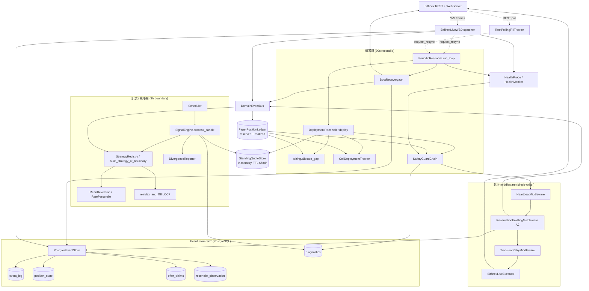
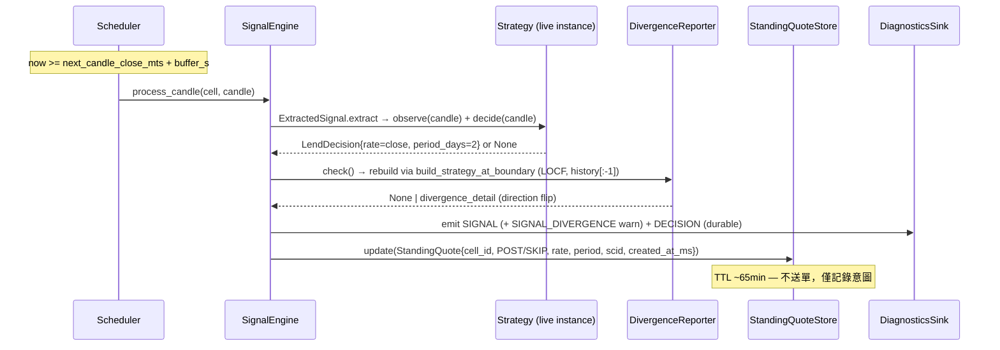
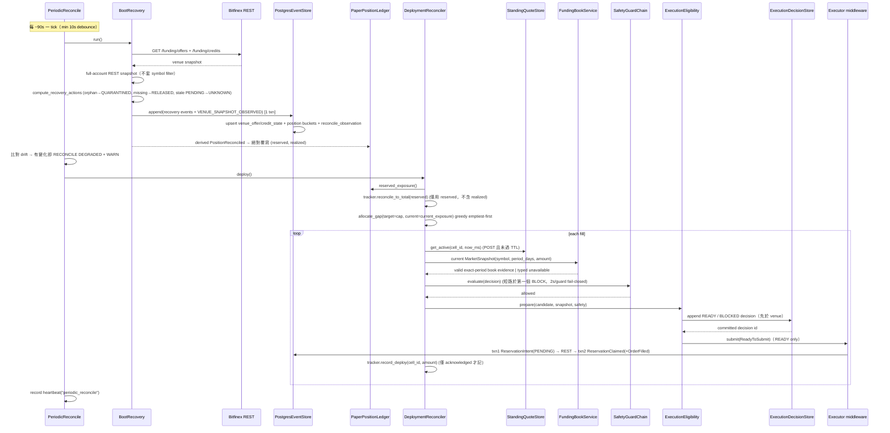

# bfx-funding-bot 後端架構（Python / backend_py）

> Bitfinex 自動放貸 bot 的現行後端（`backend_py/`，Python 3.13）。本文件描述的是 **事件溯源（event-sourced）的長駐 daemon**：以 PostgreSQL event log 為單一真相源（SoT），透過 standing-quote 解耦「訊號決策」與「資金部署」，由 DeploymentReconciler 單一寫入者控制 venue 提交，並以週期性 reconcile 對齊 venue 真相作為正確性骨幹。
>
> Go `backend/` 已封存，本文件完全不涵蓋。所有路徑相對於 `backend_py/src/bfx_funding_bot/`。

---

## 1. Overview

bfx-funding-bot 在 Bitfinex 的 funding（放貸）市場上自動掛單放貸閒置資金。系統不是「來一根 candle 就送一張單」的反應式 bot，而是把整條 pipeline 拆成兩個解耦的時間軸：

- **訊號層（signal layer）**：每小時 candle boundary 觸發一次，由策略產生「該不該放、用什麼 rate、放幾天」的 **意圖（StandingQuote）**，寫進 in-memory store，**不送單**。
- **部署層（deployment layer）**：每 ~90 秒一次，先用 REST 把 venue 真相抓回來校正 ledger，再依「目標曝險 − 目前曝險」的缺口（gap）把資金貪婪分配到各 cell，套用 safety chain 後才送單。

核心架構原則：

1. **Event-sourced execution，PG 為 SoT**：所有狀態變更（`ReservationIntent` / `ReservationClaimed` / `OrderFilled` / `ReservationReleased` / `ReservationFailed`）都 append 進不可變的 `event_log`。`position_state`、`offer_claims` 等都是可由 log 重算的投影（projection）。
2. **訊號 / 部署解耦（standing quote）**：rate 決策在 1h 尺度上穩定，資金分配在 90s 尺度上靈敏；StandingQuote 以 ~65 分鐘 TTL 橋接兩者。
3. **單一寫入者曝險（single-writer exposure）**：`DeploymentReconciler` 是 venue 提交的唯一寫入者；訊號層不送單。
4. **Reconcile 即正確性骨幹（reconcile-as-correctness-backbone）**：venue（透過 REST）是曝險真相的權威來源；90s 週期 reconcile 保證 ledger 收斂。WebSocket 只是延遲最佳化（latency optimization），不是正確性來源。

部署形態：單一長駐 daemon，以 `asyncio.TaskGroup` 並行跑多個 sub-task；全 stack 自托於 Oracle Cloud VM `oci-a1`（docker compose：`bfx-bot`/`bfx-webapi`/`bfx-postgres`(PG 18)/`bfx-redis`/`bfx-frontend`）。Koyeb/Neon/Upstash 為歷史平台（2026-05-31 Koyeb cutover、2026-06-23 Neon/Vercel 歸零）。

### Release 0 web API containment and Halt 1 identity

Release 0 沒有 self-service signup；所有 private `/api/v1` route 仍僅接受
`BFX_OPERATOR_USER_ID` 指定的 Better Auth user，且 JWT role 必須是 `admin`
（`BFX_OPERATOR_ROLE=admin`）。operator ID 缺失或空白、user ID 不符、或 role
不符時一律 fail closed；不得 fallback 到第一個 user、環境變數 realm 或 user
profile。

Halt 1 後，money-domain 的 aggregate root 是 immutable
`ExchangeAccount.id`（UUID），不是登入 user、credential row 或 process-global
realm。private account routes 必須使用
`/api/v1/exchange-accounts/{exchange_account_id}/...`，dependency 依序驗證
JWT operator、UUID path、membership/lifecycle，再進入 handler；不存在的帳號與
沒有 membership 的帳號都回 non-enumerating 404。daemon 只接受
`BFX_EXCHANGE_ACCOUNT_ID`，啟動時載入 active account、credential 與 config
draft；缺少、未知、retired 或 halted account 都 fail closed。

`account_id` text 欄位在 Halt 1 contract migration 後只保留為 immutable
legacy/audit provenance；新讀寫的 owner/filter 是 `exchange_account_id`，新
domain event 以 canonical lowercase UUID string 相容既有 event contract。credentials
的 AEAD AAD 一律是 canonical UUID，絕不使用 user id 或舊 realm。

FastAPI 的 process liveness 與 database readiness 是兩個獨立契約：

- `GET /health`：process 仍能服務 request 時永遠回 `200 {"status":"ok"}`，不做 DB probe。因此 DB 初始化失敗後 lifespan 保留 app serving，liveness 仍可用。
- `GET /ready`：僅在 `app.state.session_factory` 存在、以獨立 read-only session 成功執行 `SELECT 1`，且 `alembic_version` 的 revision set 與 image 內 `alembic.ini` migration graph 的所有 head 完全相等時回 `200 {"status":"ready","checks":{"database":"ok"}}`。factory 缺失、migration table 缺失／空值／stale／多餘 head、SQLAlchemy/timeout/socket error 或 migration graph 無法讀取，均回 `503 {"status":"not_ready","checks":{"database":"failed"}}`，不洩漏 connection string。probe session 一律關閉、不 commit application data；timeout 由 `BFX_READINESS_TIMEOUT_SECONDS` 控制，預設 2.0 秒，最大固定為 10 秒（超過時 clamp）。

---

## 2. Layered Architecture



依賴方向重點：訊號層**只寫** StandingQuoteStore；部署層**讀** quote、ledger（曝險真相）後才提交；ledger 由 venue reconcile（REST）與 WS 共同更新，但 reconcile 才是收斂保證；event store 在所有路徑下游，是唯一 durable 真相。

---

## 3. Data Flow

### 3a. 1h Boundary Path（訊號 → StandingQuote）



### 3b. 90s Deployment Path（reconcile → ledger 真相 → gap → allocate → safety → submit → intent）



### 3c. Fill Lifecycle（WS foc → OrderFilled；REST reconcile → PositionReconciled）


關鍵差異：**WS 是增量（delta）**（`reserved -= / realized +=`，floor at 0）；**REST reconcile 是絕對覆寫**（直接 set venue 真相）。即使 WS 完全靜默，90s reconcile 仍把 ledger 拉回正確值——這就是「reconcile 即正確性骨幹」的含義。

---

## 4. 放貸演算法（End-to-End Lending Algorithm）

**Capital-policy live authority（2026-09）**：live 使用已套用且 versioned 的
`CapitalPolicy`、完整且 fresh 的 canonical venue snapshot 與未反映 commitments；
`CapitalRuntime`/`CapitalBudget` 共用 Decimal authority，planner、guard、command
boundary、status 不各自重算 cap。帳戶 spendable 扣除 reserve 與 commitments；
cell_limit 為 `max(0, total_capital - reserve) ×0.70`，cell_headroom 扣除歸屬曝險及 shared unattributed credits，單筆上限取
spendable/headroom 的最小值。只有一個 active cell 也不放寬為100%。USD 明確
disabled，但所有 USD wallet/offers/credits 仍納入 full-account reconciliation。
未知/過期 snapshot、pending query、缺少 policy 全部 block，無 env/YAML fallback。
以下舊 gap/tracker 步驟僅說明 simulation helper／歷史演算法，不是 live 金額權限。

逐步流程（一個完整 decision-to-redeploy 週期）：

**訊號（每 1h candle boundary，每 cell 各一）**

1. Scheduler 在 `next_candle_close_mts + buffer_s` 觸發 `SignalEngine.process_candle`。buffer 是為了吸收 Bitfinex candle 落 DB 的延遲（否則讀到 0 列誤判 health degraded）。**buffer 不負責保證 candle 已定稿**——定稿由 `is_final` 認定（`CandleWriter` 見到更晚的 mts 才封存前一根），策略讀取路徑一律 final-only。2026-07-27 前靠 buffer 猜定稿時間（5s→30s），導致策略吃進成形中的值、live EMA 對 replay 漂移 4.1e-2（見 I-CI）。
2. `ExtractedSignal.extract` 呼叫 `strategy.observe(candle)` 更新狀態，再 `strategy.decide(candle)`：
   - **MeanReversionStrategy**：增量更新 EMA（`alpha = 2/(ema_span+1)`），`decide` 在 `close >= EMA - threshold_sigma * ratio_sigma` 時回 `LendDecision(rate=close, period_days=2)`，否則在下跌段暫停放貸。
   - **RatePercentileStrategy**：`observe` 把 `close` 推進 `deque(maxlen=lookback_hours)`，`decide` 在 window 填滿且 `close >= percentile(window, P)` 時放貸。
3. `DivergenceReporter.check()` 用 `build_strategy_at_boundary`（LOCF 重建，觀察 `history[:-1]`）重算 reference signal，與 live 比對 `signal_score` / `signal_direction` / `strategy_attributes`（含 EMA 等累加器內部 state，累加器欄位走 `_REL_TOL=1e-4` 相對容忍，其餘精確比對）。有差則 emit `SIGNAL_DIVERGENCE` warn。I-CI 之後 live 與 replay 應 byte-match，**觸發率脫離 100% 是這條修復的驗收指標**。
4. 結果寫成 `StandingQuote{cell_id, outcome=POST/SKIP, rate, period_days, signal_correlation_id, created_at_ms}` 進 `StandingQuoteStore`。**訊號層到此為止，零提交。**

**部署（每 ~90s，由 PeriodicReconcile 在 venue reconcile 完成後呼叫）**

5. `tracker.reconcile_to_total(ledger.reserved_exposure())`：把各 cell 的 in-memory 部署意圖等比例 rescale 到 **reserved（不含 realized）** 總量。
6. `allocate_gap(target=cap, current=current_exposure)`：
   - gap = cap − current_exposure（current_exposure = reserved + realized）；
   - **greedy emptiest-first**：依目前各 cell 已部署量由小到大排序，先填最空的；
   - simulation helper 每 cell 上限固定 `concentration_pct * target`，預設70%；live 則讀 canonical CapitalBudget，不使用此 target/cap helper；
   - 低於 `effective_min_usdt = ceil(150 * 1.02) = 153` USDT 的零頭（dust）丟棄；總分配 ≤ gap，全域 cap 永不超過。
7. 逐 fill：讀 `get_active(cell_id)`（須 POST 且未過 ~65min TTL，過期則跳過）→ 讀取同一 symbol、**exact `period_days`** 與所需 amount 的 `MarketSnapshot` → `SafetyGuardChain.evaluate` → `ExecutionEligibility.prepare`。scalar ticker 僅可作 telemetry，不能為 period-correct pricing 提供證據。

7b. **Reprice sweep（E1）**：allocation 前，對每個 symbol 比對 venue snapshot 的 resting offers 與現行 active quote：offer rate 高於最高 active quote rate ×(1+`BFX_REPRICE_TOLERANCE_PCT`) 且齡 ≥ `BFX_REPRICE_MIN_AGE_S` → `executor.cancel`（每 tick ≤ `BFX_REPRICE_MAX_CANCELS_PER_TICK` 筆；`BFX_REPRICE_ENABLED=false` 時僅 log `reprice_would_cancel`）。release 由 WS foc / 下次 reconcile 收斂，釋放資金下一 tick 以新 quote 重掛。無 active quote 的 symbol 不砍（resting 高價單留作 spike option）。

7c. **Execution eligibility（fail-closed）**：snapshot 必須已完成 initial snapshot、在 `BFX_BOOK_MAX_AGE_SECONDS` 內、sequence/checksum valid（或完成 REST reconcile）、symbol 相符、存在 exact period level，且該 side 的絕對 depth 足以覆蓋 amount。任一條件不足，或 model/safety/audit 不可用，皆產生 `BlockedExecution`／`NoRecommendation` 並不送單；不得重用 signal quote、ticker 值或 linear estimate。`book_guarded` 以 exact-period book 價格送單；`optimizer_shadow` 只記錄候選與評分，仍送 book-guarded rate；`optimizer_live` 僅在 empirical evidence、fee 與其餘依賴全部有效時才可選擇 optimizer rate。

7d. **Audit ordering**：每個 allocation candidate 先 append 一筆不可變 `execution_decisions`（`ready`、`blocked` 或 `no_recommendation`）。只有 READY audit commit 成功，才建立 `ReadyToSubmit` 並交給 executor；audit 失敗一律 block。成功送出的 `ReservationIntent` 帶相同 `decision_id`，但 execution audit 不是 ledger projection，也不改變 capital state。executor 的 closed outcome vocabulary 為 `acknowledged`、`rejected`、`unknown`、`not_sent`；只有 `acknowledged` 才 `tracker.record_deploy`，`unknown` 開啟 symbol-level uncertainty gate，`rejected`/`not_sent` 保持 capital-neutral。

**成交與重部署**

8. WS `foc EXECUTED` → `OrderFilled` → reserved 降、realized 升（見 3c）。credit 到期由 Bitfinex 自動觸發，**不需顯式 redeploy**：下一個 90s tick 重算 gap 時，被釋放的額度自然回到分配池。

**為什麼這樣設計（WHY）**

- **rate 慢、idle cost 連續**：策略 rate（EMA / percentile window）算起來「慢」且對 1h 尺度才有意義，但閒置資金每秒都在損失機會成本。把 rate 凍結成 ~65min TTL 的 standing quote，讓資金分配能以 90s 高頻運作而不必每次重算訊號。TTL 確保 rate regime 變動後過期的 quote 不會繼續部署。
- **greedy emptiest-first**：固定70% cell limit，不因只有一個 active cell 而放寬。各 cell 共用 account spendable，不能把各自 max_new_offer 加總當成帳戶權限。
- **per-cell intent 只用 reserved**：venue 的 realized credits 無法回溯歸屬到 cell（venue→cell attribution problem，funding credit 不帶 client cid）。若把 realized 算進 rescale factor，per-cell 意圖會被灌爆超過 `cap_per_cell` 並餓死其他 cell。因此 `CellDeploymentTracker` 只 rescale 到 reserved 總量，並對任何超過 `cap_per_cell` 的 rescale 做 hard clamp（defense-in-depth）。

**參數總覽**

| 參數 | 值 | env |
|---|---|---|
| Live capital policy | fUST all_available；fUSD disabled | DB applied revision/digest；無 YAML/env money authority |
| Live reserve | 0（明確 applied policy） | reserve_amount；不接受 legacy buffer fallback |
| Local inferred min offer | USD150 ÷ current public UST→USD FX，門檻取最小8-decimal合法數；offer金額只向下量化 | adapter versioned rule；FX從request start起≤30000ms；非venue接受保證。舊153／env floor+buffer僅歷史simulation |
| Per-cell concentration | max(0, total_capital - reserve) ×0.70；單一 active cell 仍為70% | applied max_cell_fraction；舊100% relaxation已移除 |
| Standing quote TTL | 3,900,000 ms（~65min） | `BFX_QUOTE_TTL_MS` |
| Reconcile interval | ~90s（resync debounce 10s） | `BFX_RECONCILE_INTERVAL_S`, `BFX_RESYNC_MIN_INTERVAL_S` |
| Period | 2 天（兩策略皆 `period_days=2`） | — |
| Reprice sweep（E1） | enabled（canary 2026-07-07 起）；tolerance 10%；min age 30min；≤3 cancels/tick | `BFX_REPRICE_ENABLED`、`BFX_REPRICE_TOLERANCE_PCT`、`BFX_REPRICE_MIN_AGE_S`、`BFX_REPRICE_MAX_CANCELS_PER_TICK` |
| Execution policy | `paper`、`book_guarded`、`optimizer_shadow`、`optimizer_live`；非 paper 必須設定 book freshness/reconcile/down-bound，optimizer_live 另需 empirical artifact + fee | `BFX_EXECUTION_POLICY`、`BFX_BOOK_*`、`BFX_FILL_MODEL_ARTIFACT`、`BFX_OPTIMIZER_FEE_RATE` |

---

## 5. Event Model & Source-of-Truth

`event_log` 是不可變、append-only 的財務 SoT（PK `event_seq` BigInteger auto-increment，無 UPDATE/DELETE）。所有 ledger 狀態都是它的投影；pre-trade eligibility 則另存於同樣 append-only、但不影響 ledger 的 `execution_decisions`。每筆 execution event（含 `VENUE_SNAPSHOT_OBSERVED`）必須經 `AccountEventWriter`：先取得 `(exchange_account_id, deployment_environment)` transaction advisory lock，再依 `projection_heads.last_event_seq` replay 缺口、投影目前事件並在同一 transaction 推進 cursor；任何投影錯誤都 rollback event、snapshot 與 cursor。

**Domain events（frozen dataclass）**：`ReservationIntent`（write-ahead，PENDING，不上 bus）、`ReservationClaimed`（reserved += size）、`OrderFilled`（reserved → realized）、`ReservationReleased`（cancel/expire/missing）、`ReservationFailed`（terminal，capital-neutral，不上 bus）、`ReservationUnknown`（ambiguous submit，pessimistic uncertain exposure）、`VenueOfferQuarantined`（無 provenance 的 active offer，絕不 synthetic CID/自動 cancel）、`VenueSnapshotObserved`（full-account REST truth）、`CancelRequested` / `CancelAcknowledged`（audit-only）、`PositionReconciled`（由 snapshot 導出的 bus signal，絕對覆寫）。每個 event 帶 `occurred_at_ms`（domain 時間）、`recorded_at`（wall-clock）、`event_seq`、`venue_seq`（WS dedup 用）。

**核心表與角色**

| 表 | 角色 |
|---|---|
| `event_log` | SoT，append-only。dedup unique index gate `ORDER_FILL` / `RESERVATION_RELEASED`；`VENUE_OFFER_QUARANTINED` 另以 account/env/venue object 應用層冪等。 |
| `projection_heads` | 每個 account/environment/projector 的單調 high-water mark；記錄 `last_event_seq`、`projector_version` 與更新時間，供缺口 replay 與 account-local lag。 |
| `position_state` | ledger 投影（每 account/env/symbol）：`offered_amount`、`lent_amount`、`available_amount`、`uncertain_amount`、`last_venue_snapshot_at`、`last_event_seq`。`reserved`/`realized` 僅為 staged migration 相容欄位。 |
| `offer_claims` | FSM 快照，PK `(exchange_account_id, deployment_environment, cid)`：state ∈ {PENDING, UNKNOWN, CLAIMED, RELEASED, FAILED}。投影先以原子 `INSERT ... ON CONFLICT DO NOTHING` 讓 DB 仲裁首寫者，再按 account UUID 以 CID／非空 venue offer id／非空 execution decision id 重讀唯一 canonical row。完整 identity 相同才視為冪等並推進 FSM；多筆命中或任何既有 identity 不符皆 fail closed，絕不覆寫 established identity。 |
| `venue_offer_state` / `venue_credit_state` | 以 venue object ID 為 key 的 normalized full-account entity projection；complete snapshot 缺席的舊 active object 轉 `absent` terminal，terminal 狀態單調且不受舊 snapshot 重開。 |
| `reconcile_observation` | 由 `VENUE_SNAPSHOT_OBSERVED` 導出的不可變 checkpoint：每 symbol 的 venue totals + `event_seq_fence` + counts。 |
| `execution_decisions` | 每筆 allocation candidate 的 durable eligibility audit：decision/reconcile/account/realm/cell/symbol/correlation、`ready`/`blocked`/`no_recommendation`、stable reason/dependency、signal/applied rate、amount/period、exact-period book evidence、model evidence、safety/policy、config/service hash 與 timestamps。READY 必須在 submit 前 commit。 |
| `diagnostics` | **非 SoT** forensic 軌跡（DECISION / SAFETY_TRIGGER / CANCEL_AUDIT），best-effort 寫入（失敗不擋交易），prunable 30–90d。 |

**Dedup（雙層）**：`AccountEventWriter` 以 native `event_id`（歷史 v2 則由 immutable row 推導）做 account-scoped identity，再以 venue tuple 作 `ORDER_FILL` / `RESERVATION_RELEASED` domain backstop；quarantine breadcrumb 以 account/env/venue object key 做應用層 dedup。`PostgresEventStore.append()` 及 `EventStorePersister.persist()` 傳播 dedup status。WS dispatcher 對 deduped（重連重送、同 `venue_seq`）的事件 skip publish，維持「persist 失敗就不 publish」不變式。`PaperPositionLedger` 額外有 in-memory `_processed_fills` / `_processed_releases` 防呆。

**Deterministic rebuild**：`rebuild_snapshot_from_log(account_id, environment)` 對含 `VENUE_SNAPSHOT_OBSERVED` 的 stream 從空 projection 依 `event_seq` 重放 immutable event；舊 stream 則沿用 checkpoint ⊕ tail 相容路徑。所有 venue object、position bucket、quarantine/unknown breadcrumb 均可由 event log 重建，不能讀 live API 或當前 projection 值作為輸入。

**Account/環境隔離**：每筆讀寫都帶 `deployment_environment ∈ {prod, shadow, ci}`，所有 money query 以 `(exchange_account_id, deployment_environment)` 複合過濾。legacy `account_id` 不再選擇 request/daemon scope；單一 DB 內可並行跑 shadow/canary/CI 而無 cross-account 或 cross-environment 污染。

---

## 6. Safety Model

**Guard chain（`SafetyGuardChain.evaluate`）**：依建構順序、由便宜到昂貴執行，**第一個 BLOCK 即短路**。每個 guard 套 2s timeout，timeout 或 exception 一律 **fail-closed**（`allowed=False`）並 emit `safety_trigger`（block → `level=warn`；internal error → `level=critical`）。每次 evaluate 在 `finally` 無條件記 `safety_chain` heartbeat。

評估時機：**deployment-time**——`DeploymentReconciler.deploy()` 對每一筆 fill 在 submit 前呼叫 chain。訊號層不評估 safety（它只寫 quote）。

**L1 hard guards（always-on，順序固定）**

1. `ManualKillGuard` — 讀 `BFX_KILL_SWITCH`（true/1/yes），命中即擋全部，跑最前。
2. `AuthHealthGuard` — executor health 為 `DOWN` 時擋（`DEGRADED` 為 soft warn 不擋）。
3. `HeartbeatGuard` — 只 watch `ws`（market-data liveness，own-loop），`age > threshold_seconds`（canary 為 300s，由 `safety.canary.yaml` 設定；`threshold_seconds` 為必填參數無 code default）擋。刻意**不** watch `executor`/`safety_chain`（reactive，靜市場時不跳動，誤判會造成 idle restart loop）。
4. `AllocationCapGuard` — POST 時若 `(reserved + realized) + offer > cap` 則擋；恰好 at-cap 放行，over-cap 擋；SKIP 一律放行。

**L2 calibrated guards**：`RealizedLossGuard`（24h NAV 虧損 % > threshold）、`DrawdownGuard`（peak-to-trough NAV drawdown_pct > threshold）、`DivergenceRateGuard`（無已驗證 threshold，目前 disabled）。metric 由 `ReconcileNavTracker` 提供，**per-symbol**（每幣別對自己的 24h window-high / all-time peak 計算，絕不跨幣加總——賺錢幣別不會掩蓋虧損幣別）；guard 讀 `decision.symbol` 取對應幣別 metric。canary（`safety.canary.yaml`）開 realized_loss(5%) + drawdown(10%)，單一 active 幣別（fUST）時與 pre-per-symbol 純量值相同。`enabled=True` 但 threshold 為 None 時 loader 直接 `ValueError`。

**Kill switch**：設定 `BFX_KILL_SWITCH=true` 即時擋所有新單，無須改 safety config；由目前 VM deployment 的環境組裝提供此 break-glass env。

**Canary gate（`assert_canary_guard_invariant`）**：`BFX_PHASE=canary` 啟動時強制 hard guards + `realized_loss_24h` + `drawdown_from_peak` 全開，否則 `build_daemon` 在 TaskGroup 啟動前 `ValueError`。

**Config 不可熱載**：`SafetyConfig` 啟動時讀一次（`BFX_SAFETY_CONFIG`，預設 `configs/safety.yaml`），改 threshold 需 redeploy。

**/healthz liveness**：獨立 HTTP server（port 8080）供目前 VM compose deployment 探活。Liveness（own-loop，如 `ws`）staleness 致命 → daemon restart；Activity-class（reactive，如 `executor`/`safety_chain`）只 WARN 不致命——這是 2026-05-26 idle-market restart loop 修法的核心。

**`/readyz` trading readiness**：`/healthz` 只回答 process liveness；`/readyz` 回傳 `200 {"trading_ready": true, "reason": null}` 或 `503 {"trading_ready": false, "reason": <stable reason>}`。book、model 或 audit dependency 不可用會將 `trading_ready=0`，供 operator status/metrics 告警，但不會令 liveness restart loop 啟動。

**Execution observability**：固定 structured event names 為 `funding.execution.eligibility`、`funding.execution.blocked`、`funding.execution.submitted`、`funding.book.snapshot_invalid`、`funding.fill_model.unavailable` 與 `funding.optimizer.no_recommendation`。每筆帶 decision/reconcile id、policy、outcome、reason 與 bounded evidence；不含 secret 或未界定 exception text。Prometheus 使用 `bfx_execution_decisions_total{outcome,reason,policy}`、`bfx_execution_audit_persist_failures_total`、`bfx_funding_book_snapshots_total{result}`、`bfx_funding_book_snapshot_age_seconds`、`bfx_execution_gate_duration_seconds`、`bfx_trading_ready`。cell、symbol、candidate rate、artifact hash 與完整 book evidence 僅留在 logs/audit，絕不成為 metric label。

---

## 7. DB Schema（key tables）

```
event_log              (SoT, append-only)
  PK event_seq
  exchange_account_id (UUID NOT NULL FK RESTRICT), legacy account_id (audit only),
  deployment_environment, event_type, cid,
  venue_offer_id, venue_seq, payload(JSONB),
  occurred_at_ms, recorded_at
  UNIQUE dedup(exchange_account_id, deployment_environment,
               event_type, venue_offer_id, venue_seq)

position_state         (ledger 投影, per account+env+symbol)
  PK (exchange_account_id, deployment_environment, symbol)
  offered_amount, lent_amount, available_amount, uncertain_amount,
  reserved/realized (staged compatibility aliases),
  last_updated_ms, last_event_seq,
  last_reconciled_at, n_credits

offer_claims           (FSM 快照, per-offer)
  PK (exchange_account_id, deployment_environment, cid)
  state{PENDING|UNKNOWN|CLAIMED|RELEASED|FAILED}, venue_offer_id,
  size_usdt, signal_correlation_id, execution_decision_id,
  occurred_at_ms, last_updated_ms, last_event_seq
  UNIQUE partial (exchange_account_id, deployment_environment, venue_offer_id)
    WHERE venue_offer_id IS NOT NULL
  UNIQUE partial (exchange_account_id, deployment_environment, execution_decision_id)
    WHERE execution_decision_id IS NOT NULL

reconcile_observation  (checkpoint, append-only audit)
  PK id
  exchange_account_id, legacy account_id (audit only), deployment_environment,
  reserved_usdt, realized_usdt, n_offers, n_credits,
  observed_at_ms, event_seq_fence, recorded_at

venue_offer_state / venue_credit_state (normalized venue object projections)
  PK (exchange_account_id, deployment_environment, venue object id)
  terminal state is monotonic; complete observations close absent objects;
  partial coverage preserves the prior bucket rather than writing a false zero

execution_decisions    (append-only pre-trade audit；非 ledger projection)
  decision_id, reconcile_id, exchange_account_id, deployment_environment,
  outcome, reason_code, failed_dependency, signal_rate, applied_rate,
  amount_usdt, period_days, market_snapshot_evidence, model_evidence,
  safety_result, execution_policy, service_version, config_hash,
  occurred_at_ms, recorded_at

diagnostics            (非 SoT forensic, prunable)
  exchange_account_id, deployment_environment, kind, payload(JSONB),
  occurred_at(TIMESTAMPTZ), recorded_at

funding_candles        (訊號層輸入)
  PK (symbol, timeframe, period_agg, mts)
  is_final, first_seen_at_ms, finalized_at_ms
  -- is_final=false 的列仍在成形中（venue 會用同一個 mts 反覆推送不同 close）。
  -- 只有 is_final=true 可餵策略；upsert 對已定稿列是 no-op（見 I-CI）。

funding_candle_revisions (append-only，定稿後被拒寫入的證據)
  PK (id)；索引 (symbol, timeframe, period_agg, mts)
  observed_at_ms(knowledge time), rejected_close, final_close
  -- 用來回答「venue 到底會不會修訂已收盤 bar」。長期為空 = bitemporal 層可降級。

config_regime          (非 SoT telemetry, prunable, 每次 daemon boot 一筆)
  PK (deployment_environment, exchange_account_id, recorded_at_ms)
  clamp_enabled (legacy telemetry; always false), reprice_enabled,
  git_sha
  用途：flag flip 需重啟（config boot-immutable），boot 即為 regime
  boundary；供 execution-quality（fill latency、realized APR）歸因對應
  的 flag regime，不必等 weekly window 累積。
```

**Alembic**：遷移在 `backend_py/alembic/versions/`。Halt 1 先套用 additive
revision `8a1b2c3d4e5f`，完成 `cutover_identity.py --dry-run/--apply/--verify`
後才套用 contract revision `9b2c3d4e5f6a`。一般部署仍使用
`cd backend_py && uv run alembic upgrade head`；驗證無 drift 使用
`uv run alembic check`；serialized projector 的 `c2e3f4a5b6c7` 會先為既有
event history seed cursor，writer 在此 revision 前 fail closed，避免 legacy
snapshot 被 replay double-count。contract revision 會在 DDL 前拒絕 NULL UUID、未映射
realm、孤兒 FK 或非零 legacy scaffold，且為 forward-only（rollback 使用
verified backup/PITR + venue reconcile，不使用 downgrade）。

### Projection audit cutover release boundary

操作順序與 exact CLI flags 見 [projection cutover runbook](../docs/runbooks/projection-audit-cutover.md)：
diagnose → immutable archive → independently verified archive-only restore → fresh
snapshot → atomic apply → identical repeat → independent new baseline → archive+active verify。
`cutover_projection` 只有 `diagnose/prepare/verify-archive/apply` commands；沒有
classify、snapshot、cleanup 或 resume command。Prepare CLI 會讀 vault/venue，即使
`--dry-run` 亦然；apply 只消費 digest-pinned serialized snapshot，不做 HTTP。
每次 recovery 以 `--managed-symbols` 明確宣告 scope；本輪 production recovery 使用
`--managed-symbols fUST`，prepared artifact 會 pin 該 scope。snapshot 必須完整覆蓋
scope；任何 scope 外的 active offer/credit/position 都 fail closed，不能把遺漏的幣別
默認當成零。CLI recovery default 為 fUST；library `apply_cutover` 未指定 scope 時僅
維持既有 fUST/fUSD compatibility default，production operator 仍必須明確傳入 scope。
scope 外若只剩所有 exposure/ledger buckets 與 `n_credits` 都為零的 supported-symbol
legacy scaffold，才可由同一個 atomic rebuild 清掉；任何非零值仍 fail closed。

Diagnostic/classification 使用 v2 local evidence directories（`manifest/COMPLETE/chunks`），
directories/files 為 `0700`/`0600`，拒絕 symlink、extra/incomplete content。固定 bounds：
record 1 MiB、part 4 MiB、artifact 2 GiB、4096 parts、manifest 16 MiB。
`EvidenceWriter` 串流寫入，`verify_cutover_evidence` 驗 identity/digests 與逐筆分類完整性，
runtime 只接收 compact `VerifiedCutoverEvidence`。Prepared-v1 小 envelope 維持 kind 與
archive codec，但現在 required `managed_symbols` 會 pin operator scope；舊 envelope
可供 archive verifier 讀取，不能直接作為新的 apply authority，也不能冒充新 scope。
不接受 v1 diagnostic 作為 cutover authority。Local artifact cleanup
只作用於本次產生的 exact paths，需 deadline/absence evidence，不清 immutable DB archive。

Apply 要求 caller-owned READ COMMITTED transaction；先取 account advisory lock，
再查 completed receipt，並以 SHARE ROW EXCLUSIVE table locks fence direct writers。
在同一 transaction 完成 snapshot append、genesis rebuild、event prefix/new head、
fresh DB parity、舊 archive preservation、applied archive 與 receipt。CLI 將 bounded
外部 file/evidence 驗證置於 engine/lock 前，lock_timeout=2s、statement_timeout=30s；
不宣稱整個 apply 都是 constant memory 或具有同等 global deadline。
Before-commit failure 撤銷本次 DB row writes；sequence gaps 與先前 committed prepare
archive 可保留。After-commit output failure 不撤銷 DB；相同 request 的 repeat 驗證
receipt/current state 後回原結果，可接受已過期的原 snapshot，不 append 第二次。
新 apply 的 snapshot 則必須完整且自 query start 起 ≤300 秒，包含執行耗時。

實際 runtime roles（含 reachable roles/PUBLIC/column grants/ownership）必須證明無
archive 寫入能力；superuser 是未解 operator gate。Persistent halt、controlled
Docker/systemd writers 與 DB session inventory 必須同時成立，不能將 lock 當成永久
禁止外部 admin 啟動 writer。歷史 CID cycles 的 genesis replay 不等於 strict append
可補齊落後 head；這個 source-specific seam 必須在 private rehearsal 驗證，失敗保留
halt，不改 event/head 來繞過。Production schema/grants/archive/apply 各須 explicit
operator approval；runtime identity/KEK/auth denial、fresh exposure、no uncertainty、
RPO/RTO、bounded canary/two fresh reconciles 仍是另外的 gates。

### Offsite DR source of truth

PostgreSQL WAL archive 與 base backup 以 **pgBackRest** 寫入 private Cloudflare
R2 repository；tracked config 不含 endpoint、bucket、credential 或 cipher
passphrase。`status.sh`、`preflight.sh` 與 isolated restore drill 只產生 bounded、
redacted、`measured: true|false` evidence，供 Halt 2 核對 RPO、RTO、event
head/hash 與 empty-projector replay，而不是用設定存在或檔案存在推定可恢復。

Isolated restore 的 staged boundary 固定如下：Compose 只以 `restore-data` 作為
logical volume key，由 runner 注入 generated external volume name；production
`bfx_pgdata` 永不成為 restore target。`restore-db` 先同時加入 generated internal
network 與 temporary R2 egress network，healthcheck 後須以 SQL role `bfx` 在既有
baseline DB 確認 `pg_is_in_recovery()=false`（同一 global deadline），才斷開
R2 egress，核對 membership 恰好只含 generated internal network。
runner 透過 local socket 以 OS user `postgres`、SQL admin role `bfx`
連入 existing restored database，建立 ephemeral verifier role；verifier 不取得
R2 credential、application secret 或 Bitfinex connectivity。所有 container-side
pgBackRest/psql command 都使用 `--user postgres`，production PostgreSQL 則以
`archive_timeout=60s` 確保低寫入量時仍有 bounded WAL archive latency。

Stanza 固定 `pg1-user=bfx`；health/recovery/bootstrap/schema/capture 同用 SQL
`bfx`，不靠 DR `POSTGRES_*` initialization。所有 Compose subprocess 使用 sanitized
env，移除 ambient `DR_*`、`DATABASE_URL`、`POSTGRES_*`、`BFX_*`、`COMPOSE_*`，
保留 PATH／Docker transport。Verifier container 使用 generated name，啟動 attempt
前標記 cleanup eligibility；timeout 後仍須独立清理，先於 networks，整體 cleanup
仍受獨立 30 秒 deadline 約束。

pgBackRest 2.59.1 info 的 `timestamp.start/stop` 是 strict integer epoch；
stanza/repository `status.code` 必須為 integer 0。Smoke raw stdout/stderr 只進
trap-cleaned private temp，輸出固定 markers。Backup refresh 先失效舊 evidence；
atomic persistence 遇 ENOSPC 亦須 remove/truncate 舊綠燈，wrapper 失敗不得 cat 舊報告。
Halt 1 Step 2 僅做 legacy-schema-compatible realm/count/event integrity backup/
restore；canonical UUID baseline/staged replay 延後至 migration 與 cutover verify
後的 [post-identity gate](../docs/runbooks/halt-1-exchange-account-cutover.md#post-identity-dr-gate)。

每次 measured restore 都綁定同一 backup/PITR target 的 bounded baseline，逐欄
核對 migration heads、event count/head/hash 與 account/environment/projector。
Completed projection archives 要求 schema-v2 baseline 的完整 manifest/prepared-file
references 與 verifier image pin。`restore-drill.sh --archive-only --target-run-id`
使用 v2 archive transport，驗 target 與舊 prefixes/bytes，略過舊 active parity，產生
`kind=archive_restore`；它只解除 prepare 與舊 parity 的依賴，不放寬 full DR。
Apply 後以 source 獨立建立新 baseline、配對新 backup/PITR，complete restore 不帶這兩個
flags，使用無 target 的 v1 transport 驗所有舊/applied archives 與 active replay。
不得從待驗 restored DB 或 apply receipt 倒算 expected event baseline。
backup/restore evidence 必須有 strict `observed_at_ms`，讀取時不得在未來且不得
超過 900 seconds；missing、stale、baseline mismatch、egress 未斷開或 cleanup
failure 一律是 `measured: false`，舊 green report 不得沿用。只有完成真實 R2
stanza/check/full/diff/info/verify、disposable expire 與 staged isolated restore 的
新鮮量測，才能宣告 DR ready；offline green 不代表 R2、systemd 或 production
acceptance。

Isolated restore 只量測 generated resources 上的 data integrity，不會還原
production volume，也不是 **venue rollback**。任何 restore point 之後可能發生
的 venue mutation 仍須保持 halt、fresh full-account reconcile，再依
[offsite DR operator runbook](../docs/runbooks/offsite-dr.md) 與
[venue-write rollback runbook](../docs/runbooks/rollback-after-venue-write.md)
處理 adopt、manual resolution 與 forward-fix。

---

## 8. Phases & Deployment

**現行部署 phase（`Phase` enum 另保留 legacy `canary`）**

| Phase | 性質 | Realm | Executor | 備註 |
|---|---|---|---|---|
| `paper` | 1h 模擬 | `ci` | paper | `BFX_RUN_DURATION_HOURS=1` |
| `shadow` | 模擬校準 | `shadow` | paper | 正常 profile 為 `book_guarded`；無 duration cap |
| `live` | **真錢能力；technical start 維持 halt** | `prod` | `bitfinex_live` | `live.env`／`book_guarded`；資金只由已套用 CapitalPolicy 決定：fUST all_available、reserve0、max_cell_fraction0.70，fUSD disabled；單筆 canary 與 promotion 透過人類 authenticated release session，不是切換 phase |

**歷史相容性**：舊 `canary` phase、fUST cap10000／fUSD cap0、
`BFX_BALANCE_BUFFER_USDT` 與 env-based canary profile 已退役，不是現行資金 authority。
enum／部分 simulation helpers 保留供歷史測試；不可用舊指令啟動 immutable release。

**Phase ⟷ Realm guard**（`load_config()`）：live／legacy canary 禁止 shadow realm；
production 使用 prod，ci 僅供測試。paper/shadow 禁止 prod（模擬不可污染真錢分析）。
違規 `ValueError` fail-fast；webapi 必須明確設定與 manifest 相同的 realm。

**Cells**：`cells.yaml`（shadow，多對跨 fUSD/fUST 與 p2/p30/a30）；本輪
`cells.live.yaml` 只有兩個 armed mean_reversion fUST cells（a30/p2），fUSD
保持 dark；RatePercentile 與 p30 不在 live set。`shadow-p14` 專用
`cells.experimental-p14.yaml` 鎖定 AdaptivePeriod `p_mid=7`、`p_long=14`、`t1=0.5`、
`t2=1.5`，並且 profile 固定 `BFX_PHASE=shadow`、`BFX_DEPLOYMENT_ENV=shadow`、
`optimizer_shadow`；live profile 不得選用它。單筆送單金額不在 yaml 設定——由
deployment reconciler 依 gap 動態決定。

**基礎設施**

| 服務 | 平台 |
|---|---|
| Backend daemon | VM 自托（`oci-a1`，Docker，Python 3.13 + uv；`bfx-bot`/`bfx-webapi`。Koyeb 已於 2026-05-31 cutover 至 VM） |
| Database | VM 自托 Postgres 18（`bfx-postgres`。Neon 已於 2026-06-23 棄用歸零） |
| Cache | VM 自托 Redis 7（`bfx-redis`；Better Auth session/rate-limit 用，daemon 不依賴） |
| Frontend | VM 自托（Next.js standalone，Tailscale Funnel 443→3001。Vercel 專案已刪） |

**Immutable release（`scripts.immutable_release`）**：clean tracked source archive
build once → candidate shared inventory/Python/env manifest → saved exact backend
and frontend images → owner-only schema dry-run/digest apply → bounded BootRecovery
snapshot bootstrap（初次安裝無 policy 時）→ unchanged policy conversion dry-run/digest
apply → fresh DR → same-image technical start with existing halt. Host root 由
Docker inspect 產生 root-owned RO launch proof；actual daemon module、UID1000、RO
code/Python、no writable executable mounts。新的 container 需要新的 launch proof。
v2 manifest/receipt 以 typed `image={config_digest,manifest_digest,platform}`
區分 config 與 OCI manifest content identity；backend/frontend 分開 save 並驗證完整
archive。Host resolver 只接受這兩種已驗證 digest role，核對 platform 與實際 inspect ID，
container.Image 一致才 start；receipt 額外綁定 `actual_image_id`，Halt2 沿用這個
host ID 與 restore verifier 比對。v1 不相容且 fail closed，canonical release/config
session binding 不改用 host ID；不換 Docker store、不信任 tag、不重寫舊 bundle。
既有 PG18/Redis/volumes/runtime files 不重建。`deploy-vm.sh --bundle ...` 只是 wrapper；
舊 moving-main/phase/canary-confirm/whole-stack build 指令已退役，歷史見 git。
完整 CLI、ownership、首裝順序與 recovery 見
[immutable release runbook](../docs/runbooks/immutable-release.md)。

**Application authority**：Overview 的 funding-status adapter 沿用 authenticated
account proxy/MFA，webapi 只需既有 membership/account SELECT grants，向 daemon
讀 canonical status＋dry-evaluate；不讀 auth.user、不推算另一套 budget。
缺 policy、disabled、halt 分別顯示；Decimal 保留字串，draft 不等於 applied。
ReleaseSessions 由人分開 prepare/authorize/validate/promote，expected_revision 防止
stale request；既有單一 daemon worker 與 command gate 執行，沒有另一個 executor。
靜態 admin token 不能 resume live。TOTP 真實 enrollment／production acceptance
仍是人工作業，technical start/health 不等同 activation。

**關鍵 env vars**：`BFX_PHASE`、`BFX_DEPLOYMENT_ENV`、`DATABASE_URL`、
`BFX_EXCHANGE_ACCOUNT_ID`、`BFX_VAULT_KEK`、
`BFX_EXECUTOR`、`BFX_WS_CLIENT_ENABLED`、`BFX_FILL_TRACKER_ENABLED`、
`BFX_RECONCILE_INTERVAL_S`、`BFX_QUOTE_TTL_MS`、`BFX_VENUE_FLOOR_USD`、
`BFX_MIN_OFFER_BUFFER_PCT`、`BFX_SCHEDULER_BUFFER_S`、
`BFX_KILL_SWITCH`、`BFX_SAFETY_CONFIG`、`BFX_CELLS_YAML`。
Bitfinex secret 不再從 `BFX_API_KEY`/`BFX_API_SECRET` 讀取；由 account-owned
credential vault 解密。public read model 另以明確的
`BFX_PUBLIC_EXCHANGE_ACCOUNT_ID` 綁定 UUID。

### 量測自動化（E3，2026-07-06）

- **Weekly chain**：VM systemd timer `bfx-weekly-report.timer`（Mon 04:17 UTC，unit 檔在 `deploy/vm/systemd/`）→ compose one-shot `weekly-report`（`--profile ops`）：`ingest_funding_stats`（AlwaysFRR arm 資料）→ `run_weekly_attribution`（per-cell fee-adjusted APR → `attribution_weekly` 表，全量重算 delete-then-insert）→ `run_g3_live_validation`（報告 → VM `~/bfx/reports/<date>-g3-live-validation.{md,json}`）。值得留存的報告手動 promote 進 `backend_py/docs/research/` 並 commit。
- **儀表**：webapi `GET /api/v1/exchange-accounts/{exchange_account_id}/attribution/weekly`（`bfx_webapi` 需 `GRANT SELECT ON attribution_weekly`，非 migration）→ FE `/attribution` 頁三線圖（bot net APR / always-close / AlwaysFRR）。webapi 與 weekly job 必須使用同一個 account UUID 與 `BFX_DEPLOYMENT_ENV`；不再依 process-global `BFX_ACCOUNT_ID` 選 scope。
- **歷史政策（per-symbol cap 加碼 gate，非現行 all_available authority）**：舊政策要求調高 `safety.canary.yaml` 的 `allocation_cap.caps[symbol]` 前，最新 weekly G3 verdict = PASS **且** AlwaysFRR benchmark spread 非負（`frr_benchmark` unavailable 時不加碼）。fUST 3000→10000（`aa4842c`）是在 INSUFFICIENT_DATA 上拉的；保留此失敗歷史與 G3 績效證據。現行沒有提高固定 cap 的操作，也不能把 policy conversion 或 canary 成功解讀為績效通過。
- **FRR 單位**：AlwaysFRR arm 的 rate = `funding_stats.frr × 365`（≈ ticker per-day FRR，2026-07-06 實測誤差 <0.5%；`live_attribution.FRR_ANNUALIZATION`），換算後必過 `assert_market_rate_band`。`funding_stats.frr` 原值仍非市場利率（ADR 2026-05-28 不變）。

---

## 9. Key Invariants

- **I-SW 單一寫入者曝險**：`DeploymentReconciler` 是 venue 提交的唯一寫入者；訊號層只寫 StandingQuote。所有 exposure mutation 由 account event writer 序列化；snapshot 絕對設定 `offered/lent`，lifecycle event 只做有序增量。
- **I-VTA venue 即真相**：`BootRecovery.run()` 以不帶 symbol filter 的 REST offers + credits + wallets 建立 `VENUE_SNAPSHOT_OBSERVED`；orphan 只 quarantine、missing 釋放、stale PENDING 進 UNKNOWN，並以衍生 `PositionReconciled` 絕對覆寫 ledger。WS 是延遲最佳化；90s 迴圈保證收斂。
- **I-CAP canonical capital authority**：每 account/environment/symbol 獨立計算。A=venue available，L=尚未證明反映於 snapshot 的 durable commitments，R=applied reserve，T=canonical available+offers+lent（去重），E_cell=歸屬 cell 的 offers/lent/unreflected commitments 加 shared unattributed credits。shared credits 在各 cell concentration 保守計入、在 T 只算一次；未知 attribution 不捏造 ownership。
- **I-SP spendable**：`spendable=max(0,A-L-R)`；每 tick 多 cells 共用此 pool。planner、command admission、status 共用 evaluator；同 account lock/transaction 內重查 policy revision、snapshot fence、guards 並建立 intent，不靠 in-memory tracker 授權。
- **I-CC concentration**：`cell_limit=max(0,T-R)*0.70`，`cell_headroom=max(0,cell_limit-E_cell)`，`new_offer_amount≤min(spendable,cell_headroom)`；單一 active cell 也固定70%。reserve 增加或資金下降不召回貸款，只阻擋超限新單。金額向下量化並通過 adapter minimum/precision；不足 minimum 就 block，不增加金額跨越 headroom。
- **歷史／simulation 說明**：舊 `allocate_gap`、reserved-only tracker rescale、固定 cap 與153 dust threshold 不是 live authority；`0d29fc8` 的單 active cell100% relaxation 已移除。相關歷史及 G3 未通過結果保留，不作新命令授權。
- **I-BOOK original decision validity**：READY 綁定定價所用 immutable book snapshot、symbol、sequence/checksum 與 provider freshness bound。account lock／identity hash／guard 等待完成後以 current clock 重查，adapter 在 request 前再檢查；失效落 durable NOT_SENT，保留 intent 與 consumed one-shot permit，不用另一份新 book 偷換原價格，不自動重送。
- **I-WAI write-ahead intent**：txn1 寫 `ReservationIntent`(PENDING) → REST（唯一非事務邊界）→ txn2 寫 typed outcome；crash 於中間留 PENDING，boot 時進 UNKNOWN，不得盲目重送。txn 永不跨 REST call。
- **I-IDEM idempotency**：`ORDER_FILL` / `RESERVATION_RELEASED` 以 dedup key 去重；`OfferRegistry.transition()` 純函式、原子套用、重送安全。
- **I-ES event sourcing SoT**：`event_log` append-only；snapshots 皆可由 log 重算；bus publish 為 best-effort，recovery 一律走 event_log。
- **I-EW serialized projection**：所有 live execution append 先持有 account/environment transaction advisory lock；cursor 之後的 event-log 缺口按 `event_seq` replay，event、entity snapshots 與 `projection_heads` 同 transaction commit，舊事件 dedup 不得令 cursor 倒退。Alembic-managed DB 未完成 cursor seed 時 fail closed。
- **I-UA ambiguous submit**：timeout、connection reset、5xx、malformed response 或 restart 後未完成 intent 一律 `ReservationUnknown`；不自動 retry。UNKNOWN 的 intended amount 進 `uncertain_amount`，只由 fresh full-account evidence/明確 operator resolution 移除。
- **I-OQ orphan quarantine**：active venue offer 無本地 provenance 時保存完整 object、計入 `offered_amount` 並寫 `VenueOfferQuarantined`；不合成 CID/reference、不指派 strategy、不自動 cancel，其他 symbol 繼續對帳。
- **Halt 2 clean cutover**：在 account/environment 的 persistent halt 下，preflight 必須核對 backup/isolated-restore、migration/schema、event head/hash、config/image/projector 與 snapshot fence evidence；舊 projection 只作 diagnostic，empty projection 一律由 event chain 重建。未解 `PENDING` 明確轉 `UNKNOWN`，orphan 保留 venue object 並 quarantine；任何 uncertainty、hash/diff 不一致或 coverage 缺失都不得放行。
- **Halt 2 bounded canary / rollback**：canary 僅一 account、一 symbol、一 cell、一道最小 command，必須有綁定 current halt epoch 與 exact scope 的 durable `canary_command_permit`；permit 在 venue boundary 前 commit 為 consumed，post-command evidence 由 durable attempt/event server-derived，不信任 JSON claim，所有 terminal path reassert halt。ACK/UNKNOWN 必須有 durable outcome、account-local projection hash 與 outcome 後兩個完整 reconcile cycles，報告不得 auto-ramp。after a venue write，rollback 不得把 DB restore 當作 venue rollback：維持 halt、fresh full-account reconcile、adopt 精確 match 或 manual resolution，然後 forward-fix。DB restore 只在量測證明 no later venue mutation occurred 時才可能安全；UNKNOWN 永不 automatic retry。
- **I-CI candle 不可變**：進入 `strategy.observe()` 的 candle 必須 `is_final=true`，且定稿後其值永不改變——`upsert_candles` 的 UPDATE arm 帶 `where is_final = false`，對已定稿列無論來源（WS 重送、REST 回補）皆為 no-op，差異改寫進 `funding_candle_revisions`。封存有兩條互補路徑：(a) **寫入即判定**——`mts` 早於 `now` 所屬期者落地就是 final（REST backfill 寫的全是已結算歷史，若落地為未定稿，final-only 讀取會看不到，`fetch_and_store` 的寫後讀回也會回空）；(b) **期轉換時補封**——`CandleWriter` 見到同 series 更晚的 mts 就封存前一根，處理「寫入時還開著、之後才過期」的那根。都不是等固定秒數。**兩個讀取函數必須同規則**：`get_up_to` 與 `get_candles_in_range` 皆預設 `final_only=True`——只改前者時，warmup（走後者）會吸進形成中的 candle 而 replay 不會，兩臂差一次 `observe()` 就是 `ema_span=24` 下約 0.7% 的 EMA 位移。理由：決定性重放要求輸入不可變；輸入可變時 live 增量狀態與 replay 重建必然分歧，而 `LendDecision.rate` 直接取 `candle.close`，失真值會成為實際掛單利率（2026-07-27 實測 23/132 slot 被事後改寫、最大 -35.3%，掛單價偏離達 +54.6%）。
- **Submit outcome discipline**：先 durable 寫入 `ReservationIntent` 再發送 request；local pre-transport validation 產生 `ReservationFailed`，明確拒絕才產生 `ReservationFailed`，timeout/transport ambiguity/malformed response 一律 `ReservationUnknown` 並 fail closed，不得以 exception 直接推論 venue reject 或自動重試。只有 `CLAIMED`/可稽核 accepted outcome 才 `record_deploy`。
- **fail-closed**：任何 guard timeout（2s）或 exception → `allowed=False` + `safety_trigger(critical)`。
- **TaskGroup 監督**：任何 sub-task 例外 → ExceptionGroup 傳播 → daemon 非零退出，無 silent task death。
- **I-RP reprice-down only**：sweep 只砍「高於現行 active quote 超過 tolerance 且夠老」的 offer；不砍低於 quote 的、不砍 spike 當小時的（min-age）、無 active quote 不砍。cancel 失敗 fail-safe（offer 留在 book）；`ExecutorAuthError` propagate。sweep 不直接改 ledger/tracker。
- **I-EG execution eligibility**：只有已 audit 的 `ReadyToSubmit` 能到 executor。每個 live-capable candidate 都需 fresh、symbol-matched、sequence/checksum-valid 的 exact-period book evidence；缺少 period、depth、model、safety 或 audit 時，產生 typed blocked outcome，絕不重用 signal quote、scalar ticker 或 linear estimate。

---

## 10. Related（second-brain ADRs）

技術知識頁與決策紀錄在 `~/second-brain/wiki/projects/bfx-funding-bot/`：

- `decisions/2026-05-27-reconcile-as-correctness-backbone.md` — 把週期 venue reconcile 立為正確性骨幹、WS 降為延遲最佳化的決策。
- `decisions/2026-05-29-credit-aware-reconcile-v2.md` — credit-aware reconcile v2（single-writer + `reconcile_observation` checkpoint + drift signal）。
- `decisions/2026-05-29-deployment-reconciler.md` — DeploymentReconciler 單一寫入者、訊號/部署解耦（standing quote）、greedy emptiest-first 分配的決策。
- 前置：`2026-05-23-postgres-event-store-sot-migration.md`、`2026-05-24-event-store-3a-recovery-reconcile-by-venue-id.md`、`2026-05-23-phase4.4a-bitfinex-live.md`。
