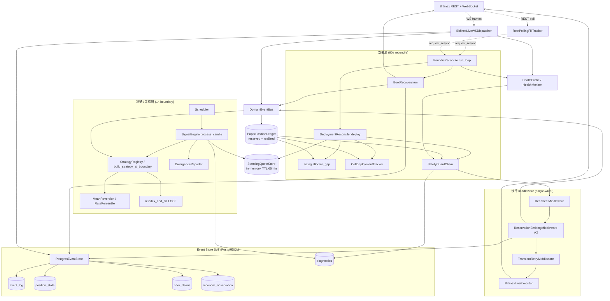
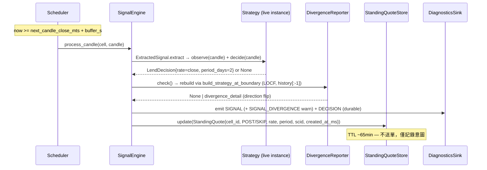
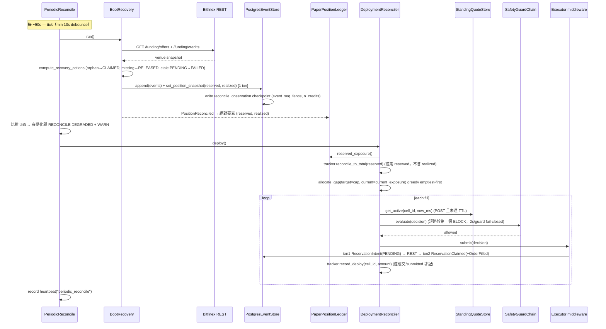
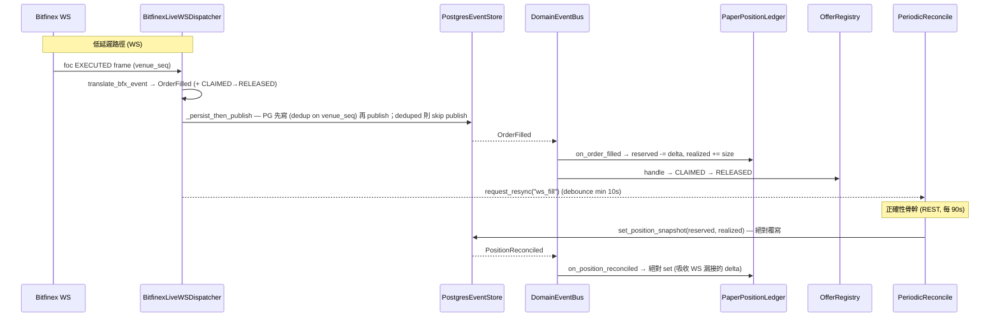

# bfx-funding-bot 後端架構（Python / backend_py）

> Bitfinex 自動放貸 bot 的現行後端（`backend_py/`，Python 3.13）。本文件描述的是 **事件溯源（event-sourced）的長駐 daemon**：以 PostgreSQL event log 為單一真相源（SoT），透過 standing-quote 解耦「訊號決策」與「資金部署」，由 DeploymentReconciler 單一寫入者控制 venue 提交，並以週期性 reconcile 對齊 venue 真相作為正確性骨幹。
>
> Go `backend/` 已封存，本文件完全不涵蓋。所有路徑相對於 `backend_py/src/bfx_funding_bot/`。

---

## 1. Overview

bfx-funding-bot 在 Bitfinex 的 funding（放貸）市場上自動掛單放貸閒置資金。系統不是「來一根 candle 就送一張單」的反應式 bot，而是把整條 pipeline 拆成兩個解耦的時間軸：

- **訊號層（signal layer）**：每小時 candle boundary 觸發一次，由策略產生「該不該放、用什麼 rate、放幾天」的 **意圖（StandingQuote）**，寫進 in-memory store，**不送單**。
- **部署層（deployment layer）**：每 ~90 秒一次，先用 REST 把 venue 真相抓回來校正 ledger，再依「目標曝險 − 目前曝險」的缺口（gap）把資金貪婪分配到各 cell，套用 safety chain 後才送單。

核心架構原則：

1. **Event-sourced execution，PG 為 SoT**：所有狀態變更（`ReservationIntent` / `ReservationClaimed` / `OrderFilled` / `ReservationReleased` / `ReservationFailed`）都 append 進不可變的 `event_log`。`position_state`、`offer_claims` 等都是可由 log 重算的投影（projection）。
2. **訊號 / 部署解耦（standing quote）**：rate 決策在 1h 尺度上穩定，資金分配在 90s 尺度上靈敏；StandingQuote 以 ~65 分鐘 TTL 橋接兩者。
3. **單一寫入者曝險（single-writer exposure）**：`DeploymentReconciler` 是 venue 提交的唯一寫入者；訊號層不送單。
4. **Reconcile 即正確性骨幹（reconcile-as-correctness-backbone）**：venue（透過 REST）是曝險真相的權威來源；90s 週期 reconcile 保證 ledger 收斂。WebSocket 只是延遲最佳化（latency optimization），不是正確性來源。

部署形態：單一長駐 daemon，以 `asyncio.TaskGroup` 並行跑多個 sub-task；DB 為 Neon（serverless PG），cache 為 Upstash（optional Redis），佈署在 Koyeb（Docker）。

---

## 2. Layered Architecture



依賴方向重點：訊號層**只寫** StandingQuoteStore；部署層**讀** quote、ledger（曝險真相）後才提交；ledger 由 venue reconcile（REST）與 WS 共同更新，但 reconcile 才是收斂保證；event store 在所有路徑下游，是唯一 durable 真相。

---

## 3. Data Flow

### 3a. 1h Boundary Path（訊號 → StandingQuote）



### 3b. 90s Deployment Path（reconcile → ledger 真相 → gap → allocate → safety → submit → intent）



### 3c. Fill Lifecycle（WS foc → OrderFilled；REST reconcile → PositionReconciled）



關鍵差異：**WS 是增量（delta）**（`reserved -= / realized +=`，floor at 0）；**REST reconcile 是絕對覆寫**（直接 set venue 真相）。即使 WS 完全靜默，90s reconcile 仍把 ledger 拉回正確值——這就是「reconcile 即正確性骨幹」的含義。

---

## 4. 放貸演算法（End-to-End Lending Algorithm）

逐步流程（一個完整 decision-to-redeploy 週期）：

**訊號（每 1h candle boundary，每 cell 各一）**

1. Scheduler 在 `next_candle_close_mts + buffer_s` 觸發 `SignalEngine.process_candle`。buffer 是為了吸收 Bitfinex candle 落 DB 的延遲（否則讀到 0 列誤判 health degraded）。
2. `ExtractedSignal.extract` 呼叫 `strategy.observe(candle)` 更新狀態，再 `strategy.decide(candle)`：
   - **MeanReversionStrategy**：增量更新 EMA（`alpha = 2/(ema_span+1)`），`decide` 在 `close >= EMA - threshold_sigma * ratio_sigma` 時回 `LendDecision(rate=close, period_days=2)`，否則在下跌段暫停放貸。
   - **RatePercentileStrategy**：`observe` 把 `close` 推進 `deque(maxlen=lookback_hours)`，`decide` 在 window 填滿且 `close >= percentile(window, P)` 時放貸。
3. `DivergenceReporter.check()` 用 `build_strategy_at_boundary`（LOCF 重建，觀察 `history[:-1]`）重算 reference signal，與 live 比對 direction。flip 則 emit `SIGNAL_DIVERGENCE` warn（目前僅偵測方向翻轉，未暴露 EMA/deque 內部 state）。
4. 結果寫成 `StandingQuote{cell_id, outcome=POST/SKIP, rate, period_days, signal_correlation_id, created_at_ms}` 進 `StandingQuoteStore`。**訊號層到此為止，零提交。**

**部署（每 ~90s，由 PeriodicReconcile 在 venue reconcile 完成後呼叫）**

5. `tracker.reconcile_to_total(ledger.reserved_exposure())`：把各 cell 的 in-memory 部署意圖等比例 rescale 到 **reserved（不含 realized）** 總量。
6. `allocate_gap(target=cap, current=current_exposure)`：
   - gap = cap − current_exposure（current_exposure = reserved + realized）；
   - **greedy emptiest-first**：依目前各 cell 已部署量由小到大排序，先填最空的；
   - 每 cell 上限 `cap_per_cell = concentration_pct * target`（預設 70%）；
   - 低於 `effective_min_usdt = ceil(150 * 1.02) = 153` USDT 的零頭（dust）丟棄；總分配 ≤ gap，全域 cap 永不超過。
7. 逐 fill：讀 `get_active(cell_id)`（須 POST 且未過 ~65min TTL，過期則跳過）→ `SafetyGuardChain.evaluate` → executor submit。executor 對 venue reject（如 10001）回 `status="failed"` 而非 raise，故 reconciler 檢查 `status`，僅 submitted 才 `tracker.record_deploy`（否則記 `deployment_submit_rejected`、不記 phantom intent）。

**成交與重部署**

8. WS `foc EXECUTED` → `OrderFilled` → reserved 降、realized 升（見 3c）。credit 到期由 Bitfinex 自動觸發，**不需顯式 redeploy**：下一個 90s tick 重算 gap 時，被釋放的額度自然回到分配池。

**為什麼這樣設計（WHY）**

- **rate 慢、idle cost 連續**：策略 rate（EMA / percentile window）算起來「慢」且對 1h 尺度才有意義，但閒置資金每秒都在損失機會成本。把 rate 凍結成 ~65min TTL 的 standing quote，讓資金分配能以 90s 高頻運作而不必每次重算訊號。TTL 確保 rate regime 變動後過期的 quote 不會繼續部署。
- **greedy emptiest-first**：在 concentration cap（70%）下儘量分散，避免單一 cell 過度集中。
- **per-cell intent 只用 reserved**：venue 的 realized credits 無法回溯歸屬到 cell（venue→cell attribution problem，funding credit 不帶 client cid）。若把 realized 算進 rescale factor，per-cell 意圖會被灌爆超過 `cap_per_cell` 並餓死其他 cell。因此 `CellDeploymentTracker` 只 rescale 到 reserved 總量，並對任何超過 `cap_per_cell` 的 rescale 做 hard clamp（defense-in-depth）。

**參數總覽**

| 參數 | 值 | env |
|---|---|---|
| Allocation cap（canary on Koyeb） | 570 USDT | `BFX_ALLOCATION_CAP_USDT`（程式預設 500） |
| Effective min offer | 153 USDT（`ceil(150 × 1.02)`） | `BFX_VENUE_FLOOR_USD`=150, `BFX_MIN_OFFER_BUFFER_PCT`=0.02 |
| Per-cell concentration | 70% of cap | `BFX_CONCENTRATION_PCT`=0.70 |
| Standing quote TTL | 3,900,000 ms（~65min） | `BFX_QUOTE_TTL_MS` |
| Reconcile interval | ~90s（resync debounce 10s） | `BFX_RECONCILE_INTERVAL_S`, `BFX_RESYNC_MIN_INTERVAL_S` |
| Period | 2 天（兩策略皆 `period_days=2`） | — |

---

## 5. Event Model & Source-of-Truth

`event_log` 是不可變、append-only 的 SoT（PK `event_seq` BigInteger auto-increment，無 UPDATE/DELETE）。所有其他狀態都是它的投影。

**Domain events（frozen dataclass）**：`ReservationIntent`（write-ahead，PENDING，不上 bus）、`ReservationClaimed`（reserved += size）、`OrderFilled`（reserved → realized）、`ReservationReleased`（cancel/expire/missing）、`ReservationFailed`（terminal，capital-neutral，不上 bus）、`CancelRequested` / `CancelAcknowledged`（audit-only）、`PositionReconciled`（bus-only，絕對覆寫）。每個 event 帶 `occurred_at_ms`（domain 時間）、`recorded_at`（wall-clock）、`event_seq`、`venue_seq`（WS dedup 用）。

**核心表與角色**

| 表 | 角色 |
|---|---|
| `event_log` | SoT，append-only。dedup unique index gate `ORDER_FILL` / `RESERVATION_RELEASED`（key 含 `venue_offer_id` + `venue_seq`）。 |
| `position_state` | ledger 投影（singleton per account+env）：`reserved_usdt`、`realized_usdt`、`last_event_seq`（high-water mark）、`last_reconciled_at`、`n_credits`。每次 `append()` 同 txn 內更新。 |
| `offer_claims` | FSM 快照，PK `(account_id, deployment_environment, cid)`：state ∈ {PENDING, CLAIMED, RELEASED, FAILED}。`upsert`（on_conflict_do_update）。 |
| `reconcile_observation` | 不可變 checkpoint：venue 快照 + `event_seq_fence`（快照當下 max event_seq）+ `n_offers` / `n_credits`。rebuild 的 base state。 |
| `diagnostics` | **非 SoT** forensic 軌跡（DECISION / SAFETY_TRIGGER / CANCEL_AUDIT），best-effort 寫入（失敗不擋交易），prunable 30–90d。 |

**Dedup（雙層）**：`PostgresEventStore.append()` 透過 unique index（durable）回傳 bool（False=deduped、True=persisted）；`EventStorePersister.persist()` 傳播此 status，WS dispatcher 對 deduped（重連重送、同 `venue_seq`）的事件 skip publish，維持「persist 失敗就不 publish」不變式。`PaperPositionLedger` 額外有 in-memory `_processed_fills` / `_processed_releases` 防呆。

**Checkpoint ⊕ tail rebuild**：`rebuild_snapshot_from_log()` 若無 checkpoint 則 seed `(0,0,0)` 重放全部；若有 checkpoint 則 seed 自最新 checkpoint，**只重放 `event_seq > fence` 的尾段**（不重複計）。fence 單調遞增，rebuild 對同一 checkpoint idempotent。

**Realm 隔離（deployment_environment）**：每筆讀寫都帶 `deployment_environment ∈ {prod, shadow, ci}`，所有查詢以 `(account_id, deployment_environment)` 複合過濾，單一 DB 內可並行跑 shadow/canary/CI 而無 cross-realm 污染。

---

## 6. Safety Model

**Guard chain（`SafetyGuardChain.evaluate`）**：依建構順序、由便宜到昂貴執行，**第一個 BLOCK 即短路**。每個 guard 套 2s timeout，timeout 或 exception 一律 **fail-closed**（`allowed=False`）並 emit `safety_trigger`（block → `level=warn`；internal error → `level=critical`）。每次 evaluate 在 `finally` 無條件記 `safety_chain` heartbeat。

評估時機：**deployment-time**——`DeploymentReconciler.deploy()` 對每一筆 fill 在 submit 前呼叫 chain。訊號層不評估 safety（它只寫 quote）。

**L1 hard guards（always-on，順序固定）**

1. `ManualKillGuard` — 讀 `BFX_KILL_SWITCH`（true/1/yes），命中即擋全部，跑最前。
2. `AuthHealthGuard` — executor health 為 `DOWN` 時擋（`DEGRADED` 為 soft warn 不擋）。
3. `HeartbeatGuard` — 只 watch `ws`（market-data liveness，own-loop），`age > threshold_seconds`（canary 為 300s，由 `safety.canary.yaml` 設定；`threshold_seconds` 為必填參數無 code default）擋。刻意**不** watch `executor`/`safety_chain`（reactive，靜市場時不跳動，誤判會造成 idle restart loop）。
4. `AllocationCapGuard` — POST 時若 `(reserved + realized) + offer > cap` 則擋；恰好 at-cap 放行，over-cap 擋；SKIP 一律放行。

**L2 calibrated guards**：`RealizedLossGuard`（24h realized 虧損 > threshold）、`DrawdownGuard`（peak-to-trough drawdown_pct > threshold）、`DivergenceRateGuard`（無已驗證 threshold，目前 disabled）。canary（`safety.canary.yaml`）開 realized_loss + drawdown（目前接 stub source 回 0，真 PnLLedger 待接）。`enabled=True` 但 threshold 為 None 時 loader 直接 `ValueError`。

**Kill switch**：翻 `BFX_KILL_SWITCH=true` 即時擋所有新單，無須改 config（`koyeb service update ... --env BFX_KILL_SWITCH=true`）。

**Canary gate（`assert_canary_guard_invariant`）**：`BFX_PHASE=canary` 啟動時強制 hard guards + `realized_loss_24h` + `drawdown_from_peak` 全開，否則 `build_daemon` 在 TaskGroup 啟動前 `ValueError`。

**Config 不可熱載**：`SafetyConfig` 啟動時讀一次（`BFX_SAFETY_CONFIG`，預設 `configs/safety.yaml`），改 threshold 需 redeploy。

**/healthz liveness**：獨立 HTTP server（port 8080）供 Koyeb 探活。Liveness（own-loop，如 `ws`）staleness 致命 → daemon restart；Activity-class（reactive，如 `executor`/`safety_chain`）只 WARN 不致命——這是 2026-05-26 idle-market restart loop 修法的核心。

---

## 7. DB Schema（key tables）

```
event_log              (SoT, append-only)
  PK event_seq
  account_id, deployment_environment, event_type, cid,
  venue_offer_id, venue_seq, payload(JSONB),
  occurred_at_ms, recorded_at
  UNIQUE dedup(account_id, deployment_environment,
               event_type, venue_offer_id, venue_seq)

position_state         (ledger 投影, singleton per account+env)
  PK (account_id, deployment_environment)
  reserved_usdt, realized_usdt,
  last_updated_ms, last_event_seq,
  last_reconciled_at, n_credits

offer_claims           (FSM 快照, per-offer)
  PK (account_id, deployment_environment, cid)
  state{PENDING|CLAIMED|RELEASED|FAILED}, venue_offer_id,
  size_usdt, signal_correlation_id,
  occurred_at_ms, last_updated_ms, last_event_seq

reconcile_observation  (checkpoint, append-only audit)
  PK id
  account_id, deployment_environment,
  reserved_usdt, realized_usdt, n_offers, n_credits,
  observed_at_ms, event_seq_fence, recorded_at

diagnostics            (非 SoT forensic, prunable)
  account_id, deployment_environment, kind, payload(JSONB),
  occurred_at(TIMESTAMPTZ), recorded_at

funding_candles        (訊號層輸入)
  PK (symbol, timeframe, period_agg, mts)
```

**Alembic**：遷移在 `backend_py/alembic/versions/`。套用一律 `cd backend_py && uv run alembic upgrade head`；驗證無 drift `uv run alembic check`。

---

## 8. Phases & Deployment

**三個 phase（`Phase` enum）**

| Phase | 性質 | Realm | Executor | 備註 |
|---|---|---|---|---|
| `paper` | 1h 模擬 | `ci` | paper | `BFX_RUN_DURATION_HOURS=1` |
| `shadow` | 模擬校準 | `shadow` | paper | 無 duration cap |
| `canary` | **真錢** | `prod` | `bitfinex_live` | 570 USDT cap，2 cells（fUST a30 + p2，mean_reversion） |

**Phase ⟷ Realm guard**（`load_config()`）：canary 只能配 prod realm（真錢不可污染校準資料），paper/shadow 只能配 shadow|ci（模擬不可污染真錢分析）。違規 `ValueError` fail-fast。

**Cells**：`cells.yaml`（shadow，多對跨 fUSD/fUST 與 p2/p30/a30）；`cells.canary.yaml`（2 對 fUST，皆 mean_reversion，RatePercentile 在 LOCF 下未 qualify；fUSD 待 per-currency 獨立分配功能再加）。單筆送單金額不在 yaml 設定——由 deployment reconciler 依 gap 動態決定。

**基礎設施**

| 服務 | 平台 |
|---|---|
| Backend daemon | Koyeb（Docker，Python 3.13 + uv） |
| Database | Neon（serverless PG） |
| Cache | Upstash（serverless Redis，optional） |
| Frontend | Vercel |

**Deploy script（`scripts/deploy-koyeb.sh`）**：idempotent、phase-aware。canary 顯式設 `BFX_DEPLOYMENT_ENV=prod`、`BFX_EXECUTOR=bitfinex_live`、`BFX_ALLOCATION_CAP_USDT=570`；翻回 paper/shadow 時以 `--env '!VAR'` 清掉 canary-only 變數（防 paper + bitfinex_live 殘留錯配）。canary 需 `BFX_CANARY_CONFIRM=yes` 或互動確認。**Koyeb 從 `origin/main` 最新 commit 建置**（`--git-sha ''`）——部署前需先 `git push origin main`（用 `Will413028` 帳號）。auto-deploy-on-push 已停用（git push 不再觸發真錢 redeploy，部署改手動跑 script）。Docker type=web（worker 不支援 health probe），`/healthz` grace 90s。

**關鍵 env vars**：`BFX_PHASE`、`BFX_DEPLOYMENT_ENV`、`DATABASE_URL`、`BFX_ALLOCATION_CAP_USDT`、`BFX_API_KEY`/`BFX_API_SECRET`、`BFX_EXECUTOR`、`BFX_WS_CLIENT_ENABLED`、`BFX_FILL_TRACKER_ENABLED`、`BFX_RECONCILE_INTERVAL_S`、`BFX_QUOTE_TTL_MS`、`BFX_VENUE_FLOOR_USD`、`BFX_MIN_OFFER_BUFFER_PCT`、`BFX_CONCENTRATION_PCT`、`BFX_SCHEDULER_BUFFER_S`、`BFX_KILL_SWITCH`、`BFX_SAFETY_CONFIG`、`BFX_CELLS_YAML`、`BFX_ACCOUNT_ID`。

---

## 9. Key Invariants

- **I-SW 單一寫入者曝險**：`DeploymentReconciler` 是 venue 提交的唯一寫入者；訊號層只寫 StandingQuote。只有 `ReservationClaimed`（executor 或 recovery orphan-claim）會增加 reserved。
- **I-VTA venue 即真相**：`BootRecovery.run()` 抓 REST offers + credits，產生 orphan-claim / missing-offer / stale-pending 修正，並以 `PositionReconciled` 絕對覆寫 ledger。WS 是延遲最佳化；90s 迴圈保證收斂。
- **I-R/R reserved/realized 分離**：`tracker.reconcile_to_total` 只用 `reserved_exposure`，不含 realized（避免 venue→cell attribution 灌爆 per-cell 意圖）。gap 仍以 `current_exposure = reserved + realized` 對 cap 計算。
- **I-AC allocation cap**：`(reserved + realized) + amount ≤ cap`；恰好 at-cap 放行，over-cap 擋；`reconcile_to_total` 對超過 `cap_per_cell` 做 hard clamp。
- **gap ≤ target**：`allocate_gap` 總分配 ≤ gap，全域 cap 永不超過；低於 153 的 dust 丟棄。
- **I-CC concentration**：每 cell ≤ `concentration_pct * cap`（70%）；跨 tick 漂移於下個 90s reconcile 自我修正。（注意：reserved-only rescale 後，集中度上限僅對 pending 資本生效，不含已成交 realized；2-cell 同幣別下無害，multi-cell scale-up 需 cid 完整歸屬。）
- **I-WAI write-ahead intent**：txn1 寫 `ReservationIntent`(PENDING) → REST（唯一非事務邊界）→ txn2 寫 outcome；crash 於中間留 PENDING，boot 時老者判 FAILED。txn 永不跨 REST call。
- **I-IDEM idempotency**：`ORDER_FILL` / `RESERVATION_RELEASED` 以 dedup key 去重；`OfferRegistry.transition()` 純函式、原子套用、重送安全。
- **I-ES event sourcing SoT**：`event_log` append-only；snapshots 皆可由 log 重算；bus publish 為 best-effort，recovery 一律走 event_log。
- **submit 成功才記 intent**：executor 對 venue reject 回 `status="failed"`（非 raise）；reconciler 僅 `status != "failed"` 才 `record_deploy`。
- **fail-closed**：任何 guard timeout（2s）或 exception → `allowed=False` + `safety_trigger(critical)`。
- **TaskGroup 監督**：任何 sub-task 例外 → ExceptionGroup 傳播 → daemon 非零退出，無 silent task death。

---

## 10. Related（second-brain ADRs）

技術知識頁與決策紀錄在 `~/second-brain/wiki/projects/bfx-funding-bot/`：

- `decisions/2026-05-27-reconcile-as-correctness-backbone.md` — 把週期 venue reconcile 立為正確性骨幹、WS 降為延遲最佳化的決策。
- `decisions/2026-05-29-credit-aware-reconcile-v2.md` — credit-aware reconcile v2（single-writer + `reconcile_observation` checkpoint + drift signal）。
- `decisions/2026-05-29-deployment-reconciler.md` — DeploymentReconciler 單一寫入者、訊號/部署解耦（standing quote）、greedy emptiest-first 分配的決策。
- 前置：`2026-05-23-postgres-event-store-sot-migration.md`、`2026-05-24-event-store-3a-recovery-reconcile-by-venue-id.md`、`2026-05-23-phase4.4a-bitfinex-live.md`。
